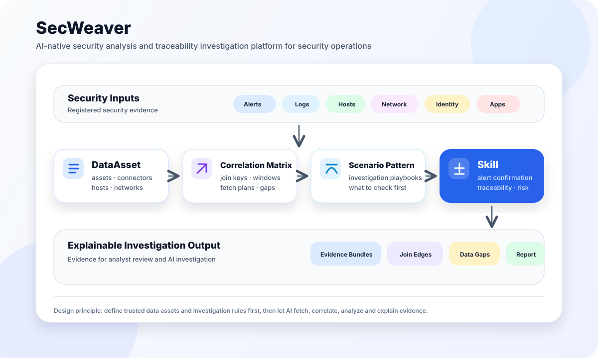

# SecWeaver

> AI-native security analysis and incident traceability for security operations.

**Languages:** English (this page) | [简体中文](README.zh-CN.md)

## Overview

SecWeaver organizes security logs, alerts, and host behavior into evidence that AI
can query, correlate, and review. People define data access and investigation rules;
AI uses those boundaries to confirm alerts, trace incidents, identify risks, and
explain its conclusions with evidence references and explicit data gaps.

## Core product philosophy

**Product philosophy:** Prepare security data as evidence that AI can understand, query,
and correlate, then let people and AI collaborate on investigations that can be reviewed.
Read [AI-Native Security Operations: Philosophy & Practice](docs_user/00-ai-native-security-operations-philosophy-and-practice.md)
for the thinking behind data preparation, evidence correlation, and human–AI collaboration.

## Core flow



SecWeaver decomposes security operations knowledge into maintainable objects:

- `DataAsset`: what security data exists, which fields it has, and how to query it.
- `Connector`: how to connect to log platforms, databases, object storage, APIs, or hosts.
- `Host / Network`: host identity, network segments, zones, and importance.
- `Correlation Matrix`: how evidence from different sources should join.
- `Scenario Pattern`: what an investigation should query first and next.
- `Skill`: reusable capabilities for alert confirmation, traceability, and risk identification.

Data contracts live in `dataasset/`, and investigation workflows live in `src/skills/`. Use [evidence-fetch](src/skills/evidence-fetch/SKILL.md) for retrieval and [prompt-risk-analysis](src/skills/prompt-risk-analysis/SKILL.md) for prompt-based triage. See the [DataAsset reference](dataasset/README.md) and [Skills index](src/skills/README.md).

**Try it:** [Offline Quick Start](docs_user/00-security-operator-quickstart.md) · **Connect logs:** [DataAsset onboarding](docs_user/03-configure-data-sources.md)
· **Collect host evidence:** [Agent installation](src/tools/secweaver-agent/README.md)
· **Find a guide:** [Documentation index](docs_user/README.md)

## Main modules

SecWeaver has four main open-source modules for data assets, investigation skills, optional visual
configuration, and host collection. For SaaS SLS access, the online SaaS enterprise workspace
provides enterprise query credentials.

| Module | Responsibility | When to use it | Entry and guides |
|---|---|---|---|
| **DataAsset** | Registers log sources, connectors, field semantics, query templates, investigation bundles, and evidence relationships so the agent knows what data exists and how to query and correlate it. | Connect your logs or maintain investigation data and rules. | [DataAsset reference](dataasset/README.md) · [Source onboarding](docs_user/03-configure-data-sources.md) |
| **Skills** | Defines workflows for fetching evidence, checking completeness, confirming alerts, identifying risks, and tracing incidents in an intelligent agent; includes analysis scripts and pure prompt skills. | Request an investigation in natural language and receive a report with evidence citations and data gaps. | [Skills index](src/skills/README.md) · [Agent setup](docs_user/38-ai-agent-host-setup.md) |
| **secweaver-agent (host collector)** | Collects command, authentication, persistence, process, and state evidence on supported Linux hosts and pilot-supported Windows hosts for shippers to send to SLS or your ES; includes preflight, signed updates, and rollback. | Install on target hosts when additional host behavior evidence is needed. | [Platform and module support](src/tools/secweaver-agent/README.md) · [Installation and upgrades](docs_user/29-secweaver-data-system-quickstart.md) |
| **DataAsset Studio UI (optional)** | Provides local forms for data sources, hosts, networks, and credential references, with onboarding previews, validation, and sample report viewing. | Manage DataAsset through forms; run `make ui` and edit `dataasset/` by default, or isolate configuration in `dataasset_my/`. | [Studio guide](dataasset-ui/README.md) · [Source onboarding](docs_user/03-configure-data-sources.md) |
| **SaaS enterprise workspace** | Provides enterprise registration and login; Owner/Admin members obtain Proxy query AK/SK under **Agent configuration** for local clients to access authorized SaaS SLS data. | Obtain enterprise credentials and confirm log resource grants when choosing SaaS SLS storage. | [Open enterprise workspace](https://sc.id-net.cn:30443/) · [SLS Proxy onboarding](docs_user/30-sls-proxy-onboarding.md) |

The modules work together: Studio maintains DataAsset, Skills use it to fetch and analyze
evidence, and SecWeaver Agent supplies host evidence to the log platform. For SaaS SLS, obtain query
credentials from the enterprise workspace, save them in the local encrypted Vault, and configure
a `sls_proxy` connector in DataAsset. Project/Logstore access remains subject to platform grants.

## What can you do with it?

| Scenario | Skill | Analysis result | Guide |
|---|---|---|---|
| Is there enough data to investigate? | [data-source-completeness](src/skills/data-source-completeness/SKILL.md) | Missing sources, blockers, and onboarding recommendations | [Data completeness](docs_user/15-data-source-completeness.md) |
| Is a WAF alert an attack or a false positive? | [alert-confirmation](src/skills/alert-confirmation/SKILL.md) | Verdict, attack outcome, and supporting evidence | [Alert confirmation](docs_user/17-alert-confirmation.md) |
| Where did an intrusion start and spread? | [traceability-analysis](src/skills/traceability-analysis/SKILL.md) | Entry, execution, lateral paths, and impact scope | [Traceability](docs_user/18-traceability-analysis.md) |
| Is a host behaving dangerously? | [risk-identification](src/skills/risk-identification/SKILL.md) | Risk levels for commands, connections, and file activity | [Risk identification](docs_user/19-risk-identification.md) |
| What happened across multiple evidence sources? | [prompt-risk-analysis](src/skills/prompt-risk-analysis/SKILL.md) (pure prompt skill) | AI risk assessment, attack narrative, evidence citations, data gaps, and follow-up recommendations | [Prompt analysis examples](examples/prompt-risk-analysis/README.md) |
| How can AI understand a new log format? | [log-format-discovery](src/skills/log-format-discovery/SKILL.md) | Format discovery, field mapping, and normalization guidance | [Log format discovery](docs_user/20-log-format-discovery.md) |

`prompt-risk-analysis` is an **analysis skill written entirely as prompts** for individual
incident investigations. The skill contains no Python analysis scripts and does not invoke
deterministic rule engines; AI follows the prompts, evidence contract, and correlation references
directly. Evidence comes from the separate [evidence-fetch](src/skills/evidence-fetch/SKILL.md)
skill or existing offline evidence. The report states the collection scope before presenting
cited judgments and hypotheses to verify; people review the conclusions.

## Quick Start

### 1. Quick Start

Try a complete investigation using bundled synthetic logs, with no ES, SLS, or
production credentials. From the repository root in a Linux/macOS POSIX terminal
with Python 3.10+ and Make installed, run:

```bash
make quickstart
```

This creates the Python environment, installs dependencies, validates DataAsset,
runs four offline demos, and generates local adapters for Codex, Cursor, Claude
Code, OpenClaw, and WorkBuddy. All adapters reference `src/skills/` without copying
Skill content. Initial dependency installation needs network access; install and
sign in to your chosen intelligent agent separately.
The four demos are initialization-time script samples; the offline assessment cases below
are investigation tasks for the agent. Native Windows PowerShell cannot use these
Make commands as written. WSL/Linux is a possible Windows route, but has not completed
project end-to-end acceptance. Client requirements differ from Agent collection support.

### 2. Offline cases

After setup, open the repository in your intelligent agent and ask:

```text
Run the SecWeaver offline showcase.
```

By default, all 27 executable assessment cases run through their corresponding Skills,
with a report for each case and a batch summary. To run only one case, append its ID
from the [case catalog](examples/ai-showcase/README.md).
For a case-by-case account of all 27 assessment inputs, prompt evidence and raw
format samples, see the [offline case catalog](examples/CASE-CATALOG.md).

Follow the [Security Operator 10-Minute Quickstart](docs_user/00-security-operator-quickstart.md)
for detailed steps.
If your agent (such as Codex) cannot discover the Skill, see [agent setup and troubleshooting](docs_user/38-ai-agent-host-setup.md).

#### View the results

Offline case JSON and agent-authored Markdown reports are saved under
`outputs/ai-showcase/`. They explain which events support the verdict, how the
evidence connects, and which questions remain unanswered.

You can inspect [bundled sample reports](examples/reports/README.md) without starting
an intelligent agent (such as Codex), or run:

```bash
make ai-showcase       # Generate JSON and readable Markdown for all assessment cases
make reports           # Generate JSON and script-rendered Markdown for four demos
```

`make ai-showcase` writes JSON, per-case Markdown and a readable batch summary under
`outputs/ai-showcase/`; `make reports` writes
JSON and script-rendered Markdown under `examples/reports/` by default. Neither command
starts an agent. Request the offline case in your agent for an agent-authored investigation
report; see the [case guide](examples/ai-showcase/README.md) for its requirements.

---

<a id="secweaver-agent-installation-and-upgrades"></a>

### 3. SecWeaver Agent installation and ingestion

Install SecWeaver Agent on your hosts to supply behavior evidence for more complete
analysis and incident tracing. The Agent collects evidence on target hosts. On supported
Linux hosts and pilot-supported Windows hosts, its modules cover audit, authentication, persistence, processes,
ports, services, identity, and kernel context, with preflight diagnostics, health signals,
signed updates, and rollback.

Choose the destination first:

| Destination | Steps | Boundary |
|---|---|---|
| **SecWeaver SaaS SLS (recommended)** | Follow the [Data Cloud customer quickstart](docs_user/29-secweaver-data-system-quickstart.md), then use the platform-issued tenant install command and upload configuration. Linux can install or reuse Logtail/LoongCollector. | The platform manages storage, field governance, and rollout; the upload address comes from the issued configuration. |
| **Self-managed Elasticsearch** | Follow the [complete Agent → self-managed ES guide](src/tools/secweaver-agent/elasticsearch/README.md) to initialize ES, install the Agent, and configure Filebeat. Then register DataAsset as described below. | The example targets Linux + ES 8.x; OpenSearch needs a compatible shipper. Your team owns storage, permissions, retention, upgrades, and rollback. |

For quick onboarding and access to your data, use **SecWeaver SaaS SLS**:

1. [Register an account](https://sc.id-net.cn:30443/).
2. If host collection is needed, obtain the one-command installer from [enterprise workspace → secweaver-agent](https://sc.id-net.cn:30443/#/downloads). Use the complete command issued for your enterprise.
3. Open [enterprise workspace → Agent configuration](https://sc.id-net.cn:30443/#/agent) to obtain your query AK and SK, and store them in the local encrypted Vault.
4. Configure a `sls_proxy` connector in DataAsset for the Project/Logstore you are authorized to query. See [SLS Proxy onboarding](docs_user/30-sls-proxy-onboarding.md).

On the **secweaver-agent** page, select the enterprise and target platform under one-command installation. Bootstrap determines the installed version and CPU architecture. Keep the enterprise enrollment token private. Query AK/SK read logs; enrollment tokens register collectors and are not interchangeable. If logs already exist, start at step 3.

<a id="dataasset-data-source-onboarding"></a>

### 4. DataAsset data source onboarding for the intelligent agent

After the Agent or another shipper writes logs, register how the intelligent agent can query them.
This step is read-only and does not install or manage storage. Follow the order
**credentials → Connector → Asset → query templates → Bundle → validation**.

The connector catalog currently lists 31 entries: 22 built-in types, 8 config-only
external types, and 1 plugin example. Built-in types have different execution modes; not all query vendor services directly. Run `.venv/bin/python src/secweaver.py connector catalog --json`
for the authoritative metadata, or see the [built-in connector list](dataasset/onboarding/README.md#built-in-connector-list).
`database_ro` is one connector type that covers MySQL, MariaDB, PostgreSQL, Oracle,
SQL Server, and SQLite through `config.engine`.

#### Choose an access method

| Data location | Guide | Register in DataAsset |
|---|---|---|
| **SaaS SLS via SLS Proxy (recommended)** | [SLS Proxy onboarding](docs_user/30-sls-proxy-onboarding.md) | `sls_proxy` Connector, issued query credentials, and authorized Project/Logstore |
| **Direct Alibaba Cloud SLS** | [Data source configuration](docs_user/03-configure-data-sources.md) | `sls` Connector, your Project/Logstore, and a read-only credential reference |
| **Your Elasticsearch/OpenSearch** | [ES onboarding](docs_user/03-configure-data-sources.md#existing-elasticsearch-one-click-onboarding) | Read-only Connector, indices, field mappings, and query templates |
| **MySQL / MariaDB** | [Database onboarding](dataasset/onboarding/README.md) | `database_ro` Connector, `config.engine=mysql` or `mariadb`, read-only credentials, and SQL templates |
| **PostgreSQL** | [Database onboarding](dataasset/onboarding/README.md) | `database_ro` Connector, `config.engine=postgresql`, read-only credentials, and SQL templates |
| **Oracle / PL/SQL** | [Credentials and database configuration](dataasset/credentials/README.md) | `database_ro` Connector, `config.engine=oracle`/`plsql`, DSN or service name; requires `oracledb` |
| **Log files over SSH** | [Data source configuration](docs_user/03-configure-data-sources.md#ssh-and-local-files) | `ssh_file` Connector, host, log paths, and read-only SSH credentials for auth.log/syslog |
| **SSH command collection** | [Onboarding guide](dataasset/onboarding/README.md) | `ssh_command` Connector with constrained read-only commands for hosts where files cannot be read directly |
| **Local log files** | [Data source configuration](docs_user/03-configure-data-sources.md#ssh-and-local-files) | `local_file` Connector for development or offline imports without SSH |

Database connections use `database_ro`; `config.engine` selects MySQL, MariaDB, PostgreSQL, Oracle,
SQL Server, or SQLite. Grant SELECT-only permissions in production. Oracle and SQL Server drivers are
optional dependencies; install them and run the connectivity check as described in the [onboarding guide](dataasset/onboarding/README.md).
SSH access is limited to registered hosts and constrained templates; never put arbitrary shell commands or private keys in DataAsset JSON.

---

## Common commands

| Command | Purpose |
|---|---|
| `make quickstart` | Set up dependencies, offline demos, and agent adapters |
| `make ai-showcase` | Run all offline assessment cases |
| `make ui` | Browse public sample configuration; select `DATAASSET_ROOT` per the guide before real onboarding |
| `make validate` | Validate DataAsset configuration |
| `make reports` | Generate demo reports |
| `make ai-setup HOST=all` | Refresh all five host adapters |
| `make help` | List all commands |

See the [CLI reference](docs_user/13-SecWeaver-CLI.md) for additional options and the contribution section below for test and release gates.

---

## Documentation

| Your goal | Start here |
|---|---|
| Try the product step by step | [10-minute quickstart](docs_user/00-security-operator-quickstart.md) |
| Find onboarding, investigation, and operations guides | [User documentation index and reading paths](docs_user/README.md) |
| Develop or extend capabilities | [Developer documentation](docs_dev/README.md) |
| Prepare a release or use real data | [Release checks, TLS, query integrity and masking](docs_user/community-release-and-data-safety.md) |
| Supply field context to AI | [AI reference material](docs_ai/README.md) |

---

## Attack Lab

[`attack_test/`](attack_test/README.md) is the reproducible Attack Lab: four
attack-chain environments that generate real process, network, and log evidence
for validating SecWeaver's analysis skills.

| Case | Environment | Entry | Entry point |
|---|---|---|---|
| 1 | SQLi + path traversal | WAF alert confirmation (true/false positive) | [`case1-sqlInjectionAlertConfirm/`](attack_test/environmentDeployment/case1-sqlInjectionAlertConfirm/) |
| 2 | Command injection | Memory WebShell C2 | [`case2-cmdInjectionC2/`](attack_test/environmentDeployment/case2-cmdInjectionC2/) |
| 3 | File upload | Fileless data exfiltration (HTTPS + DNS tunnel) | [`case3-dataExfilC2/`](attack_test/environmentDeployment/case3-dataExfilC2/) |
| 4 | File upload | Web compromise → SSH lateral movement | [`case4-webPenetrateToSSH/`](attack_test/environmentDeployment/case4-webPenetrateToSSH/) |

**Risk boundary.** Deployment scripts mutate SELinux, firewalls, Nginx, SSH,
MariaDB, and systemd, and create weak-password users. They must only run on
disposable lab hosts — never production. Every script fails closed without
`SECWEAVER_LAB_ACK=I_UNDERSTAND_THIS_IS_AN_ISOLATED_AUTHORIZED_LAB`; attack
scripts additionally require an explicit `SECWEAVER_LAB_ALLOWED_TARGETS`
allowlist, and a container deployment is preferred where available.

Deployment, verification, log collection, and ownership-aware scoped cleanup
(`teardown-lab.sh`) are documented in
[`attack_test/environmentDeployment/README.md`](attack_test/environmentDeployment/README.md).
For a guaranteed reset after running intentionally vulnerable services, destroy
and recreate the disposable VM or container; package installation and generic
service enablement are intentionally not guessed during cleanup.

---

## Repository layout

```text
.
├── README.md                         # Project entry (English)
├── README.zh-CN.md                   # Chinese README
├── docs_ai/                         # AI reference material
├── docs_dev/                         # Developer, architecture, and contribution docs
├── docs_user/                        # Operator-facing user docs
├── dataasset/                        # Assets, connectors, scenarios, schemas, and validation scripts
├── attack_test/                      # Attack Lab: reproducible attack-chain environments
├── src/skills/                       # Agent Skills (Cursor / CC / Codex / OpenClaw — canonical path)
├── src/tools/secweaver-agent/        # Open-source host evidence collector
├── examples/                         # Offline sample inputs and test data
├── src/tools/secweaver-agent/elasticsearch/ # Public Agent initialization and ES ingestion config
├── tests/                            # Unified test entry and regression tests
└── requirements-data-access.txt      # Python dependencies
```

---

## Open-source scope and security

This repository includes DataAsset contracts and examples, correlation rules, Skills,
CLI, DataAsset Studio, Agent source and tests, offline cases, and Attack Lab. Managed
server implementations, the Portable runtime, and customer-private asset catalogs are
excluded from the public archive. SaaS integration uses the public client contract.

Before contributing configuration or examples, remove real API keys, passwords,
private keys, production credentials (including SOPS ciphertext), customer logs, and
internal investigation material. Connectors store only `credentials_ref`; keep secrets
in private configuration or a local credential store. Report security issues privately
as described in [SECURITY.md](SECURITY.md).

## Contributing and releases

See [CONTRIBUTING.md](CONTRIBUTING.md) and the [new contributor quickstart](docs_dev/01-new-contributor-quickstart.md).

```bash
make ci
```

The gate covers release scans, documentation, SBOM, Agent, Attack Lab, DataAsset,
policy synchronization, tests, and demos. Commit intended changes and keep the
worktree clean before creating a public archive without internal Git history:

```bash
make open-source-export OUTPUT=/tmp/secweaver-community.tar.gz
```

The exporter validates the extracted archive. Do not push internal Git history to a public remote.

---

## License

SecWeaver Community is licensed under Apache License 2.0. See [`LICENSE`](LICENSE).

### Third-party dependencies

The public source dependency inventory is recorded in
[`THIRD_PARTY_NOTICES.md`](THIRD_PARTY_NOTICES.md) and the deterministic CycloneDX
source SBOM at [`sbom/secweaver-source.cdx.json`](sbom/secweaver-source.cdx.json).
Run `make sbom-check` after changing `requirements-data-access.txt` or the Agent
`go.mod`; the inventory covers source-declared dependencies, while a deployment
must add its platform/runtime packages separately.

See also: [`CHANGELOG.md`](CHANGELOG.md).

The private Operator repository pins the accepted Community revision, Agent version
and lifecycle suite in its checked-in `contracts/community.lock.json`. Its required
CI job clones that exact revision and runs the real Studio enroll/close/revoke
lifecycle; missing or stale locks fail. For offline acceptance, run the Operator's
`make community-contract` with absolute `SECWEAVER_COMMUNITY_ROOT` pointing to a
clean checkout at the locked commit. Python 3 and OpenSSL are required. Tests use
temporary runtime state and disable Docker, seed a device credential, and verify
profile closure preserves credentials until explicit revocation. They do not
perform a real ES deployment or Agent Gateway enrollment.

The private Agent Server compatibility gate pins a full Community commit and runs
`go run ./cmd/secweaver-agent-contract-fixture -agent-version <VERSION>` from the
Agent module. The command emits short-lived, deterministically keyed test requests
for enrollment and heartbeat signature verification. Its key is public test data;
the output is a CI protocol fixture, not an enrollment credential or production
device identity. Run it only for compatibility testing.
