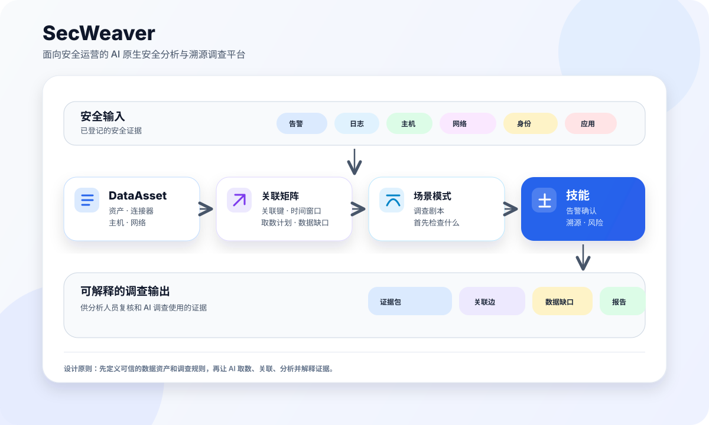

# SecWeaver

> 面向安全运营的 AI 原生安全分析与溯源调查平台。

**语言：** [English](README.md) | 简体中文（本文）

## 概要

SecWeaver 将安全日志、告警和主机行为组织成可查询、可关联、可复核的证据，让 AI
完成告警确认、攻击溯源、风险识别和数据源治理。人负责数据、权限与调查规则，AI
依据这些边界取数、分析，并给出证据引用和数据缺口。

## 产品核心理念
**产品理念：** 先把安全数据整理成 AI 能理解、调用和关联的证据，再由人和 AI 协同完成
可复核的调查。了解数据准备、证据关联与人机分工的设计思路，请阅读
[《AI 原生安全运营观与实践》](docs_user/00-ai-native-security-operations-philosophy-and-practice.zh-CN.md)。

## 核心流程



SecWeaver 的核心设计是把“安全运营经验”拆成几类可维护对象：

- `DataAsset`：告诉系统有什么安全数据、字段是什么、怎么查询。
- `Connector`：告诉系统如何连接日志平台、数据库、对象存储、API 或主机。
- `Host / Network`：告诉系统主机、网段、区域和重要性。
- `Correlation Matrix`：告诉系统不同证据之间如何关联。
- `Scenario Pattern`：告诉 AI 某类调查应该先查什么、再查什么。
- `Skill`：把告警确认、溯源分析、风险识别等任务封装成可复用能力。

数据契约以 `dataasset/` 为准，调查流程以 `src/skills/` 为准。可直接使用 [evidence-fetch](src/skills/evidence-fetch/SKILL.md) 取数，或使用 [prompt-risk-analysis](src/skills/prompt-risk-analysis/SKILL.md) 完成提示词研判。更多说明见 [DataAsset 参考](dataasset/README.zh-CN.md)和 [Skills 索引](src/skills/README.zh-CN.md)。


**先体验：** [离线快速开始](docs_user/00-security-operator-quickstart.zh-CN.md) · **接真实数据：** [DataAsset 接入](docs_user/03-configure-data-sources.zh-CN.md)
· **补充主机日志：** [Agent 安装](src/tools/secweaver-agent/README.zh-CN.md) · **查指南：** [文档索引](docs_user/README.zh-CN.md)

## 主要模块

SecWeaver 由数据资产、调查技能、主机采集和数据资产可视化配置（可选）四个主要开源模块组成；接入 SaaS SLS 时，
通过在线 SaaS 企业工作台获取企业查询凭证。

| 模块 | 主要职责 | 什么时候使用 | 入口与指南 |
|---|---|---|---|
| **DataAsset（数据资产）** | 登记日志源、连接器、字段含义、查询模板、调查资产包及证据关联关系，让 AI 知道有哪些数据、如何查询和关联。 | 接入自己的日志，或维护调查所需的数据与规则。 | [DataAsset 参考](dataasset/README.zh-CN.md) · [数据源接入](docs_user/03-configure-data-sources.zh-CN.md) |
| **Skills（调查技能）** | 定义取数、完整性检查、告警确认、风险识别和溯源的工作流，供智能体加载；包含脚本分析技能和纯提示词研判技能。 | 用自然语言发起调查，获取带证据引用和数据缺口的报告。 | [Skills 索引](src/skills/README.zh-CN.md) · [智能体配置](docs_user/38-ai-agent-host-setup.zh-CN.md) |
| **secweaver-agent（主机采集端）** | 在受支持的 Linux 主机和试点支持的 Windows 主机上采集命令、认证、持久化、进程和状态证据，配合日志输送器写入 SLS 或自建 ES；提供预检、签名升级和回滚。 | 需要补充主机侧行为数据时，在目标主机安装。 | [平台支持与模块说明](src/tools/secweaver-agent/README.zh-CN.md) · [安装与升级](docs_user/29-secweaver-data-system-quickstart.zh-CN.md) |
| **DataAsset Studio （可选）** | 在本地页面中编辑数据源、主机、网段和凭证引用，预览接入配置、运行校验并查看样例报告。 | 通过表单管理 DataAsset；执行 `make ui`，默认编辑 `dataasset/`，也可用 `dataasset_my/` 隔离。 | [Studio 说明](dataasset-ui/README.zh-CN.md) · [数据源接入](docs_user/03-configure-data-sources.zh-CN.md) |
| **SaaS 企业工作台** | 提供企业注册与登录；Owner/Admin 在“智能体配置”中获取 Proxy 查询 AK/SK，供本地客户端接入获授权的 SaaS SLS 数据。 | 选择 SaaS SLS 数据底座时，先取得企业凭证并确认日志资源授权。 | [打开企业工作台](https://sc.id-net.cn:30443/) · [SLS Proxy 接入指南](docs_user/30-sls-proxy-onboarding.zh-CN.md) |

这些模块协同完成调查：Studio 维护 DataAsset，Skills 依据 DataAsset 取数和分析，
SecWeaver Agent 为日志平台补充主机证据。接入 SaaS SLS 时，从企业工作台取得查询凭证，保存到本地加密
凭证库，再在 DataAsset 中配置 `sls_proxy` 连接器；可查询的 Project/Logstore 仍以平台授权为准。

## 你可以用它做什么？

| 场景 | 对应 Skill | 分析结果 | 操作指南 |
|---|---|---|---|
| 数据是否足够支持调查 | [data-source-completeness](src/skills/data-source-completeness/SKILL.md) | 缺失数据源、阻断项与补充建议 | [数据完整性](docs_user/15-data-source-completeness.zh-CN.md) |
| WAF 告警是真攻击还是误报 | [alert-confirmation](src/skills/alert-confirmation/SKILL.md) | 攻击判定、成功与否及支撑证据 | [告警确认](docs_user/17-alert-confirmation.zh-CN.md) |
| 攻击从哪里进入、影响到哪里 | [traceability-analysis](src/skills/traceability-analysis/SKILL.md) | 入口、执行、横向路径与影响范围 | [溯源分析](docs_user/18-traceability-analysis.zh-CN.md) |
| 主机是否出现危险行为 | [risk-identification](src/skills/risk-identification/SKILL.md) | 命令、外连与文件行为的风险分级 | [风险识别](docs_user/19-risk-identification.zh-CN.md) |
| 希望 AI 综合研判多源证据，解释发生了什么 | [prompt-risk-analysis](src/skills/prompt-risk-analysis/SKILL.md)（纯提示词技能） | 风险判断、攻击叙事、证据引用、数据缺口与后续调查建议 | [提示词研判样例](examples/prompt-risk-analysis/README.zh-CN.md) |
| 新日志如何被 AI 理解 | [log-format-discovery](src/skills/log-format-discovery/SKILL.md) | 格式发现、字段映射与归一化建议 | [日志格式发现](docs_user/20-log-format-discovery.zh-CN.md) |

`prompt-risk-analysis` 是**完全由提示词编写的研判技能**，适合单次事件调查。技能本身不包含
Python 研判脚本，也不调用确定性规则引擎；智能体直接遵循提示词、证据契约和关联参考完成分析。
证据由独立的 [evidence-fetch](src/skills/evidence-fetch/SKILL.md) 技能获取，也可使用已有离线证据。
报告先说明取数范围，再给出有证据引用的判断与待验证假设，结论由人复核。

## 快速上手

### 一：Quick Start

先用仓库自带的合成日志体验完整调查流程，无需接入 ES、SLS 或生产凭证。
在 Linux/macOS 的 POSIX 终端中，准备 Python 3.10+ 和 Make，进入仓库根目录执行：

```bash
make quickstart
```

该命令创建 Python 环境、安装依赖、校验 DataAsset、运行四个离线 demo，并生成
Codex、Cursor、Claude Code、OpenClaw、WorkBuddy 的本地适配器。适配器统一引用
`src/skills/`，不复制 Skill 内容。首次安装依赖需要联网；智能体需自行安装并登录。
这里的“四个 demo”是初始化时运行的脚本样例；下方 27 个离线评估案例是供智能体运行的调查任务。
原生 Windows PowerShell 不适用这些 Make 命令；Windows 可考虑 WSL/Linux 环境，
但本项目尚未完成该路径的端到端验收。客户端环境要求不等同于 Agent 的采集平台支持。

### 二：离线案例
完成后，在智能体中打开当前仓库，输入：

```text
运行 SecWeaver 离线案例
```

默认运行全部 27 个可执行评估案例，由对应 Skill 逐例生成报告，并提供批次汇总。
只运行一个案例时，在提示词后附上[案例 ID](examples/ai-showcase/README.zh-CN.md)。
全部 27 份评估样例、提示词取证样本和格式发现日志的逐例说明见[离线样例目录](examples/CASE-CATALOG.zh-CN.md)。

完整步骤见[安全运营 10 分钟快速上手](docs_user/00-security-operator-quickstart.zh-CN.md)。
智能体（Codex 等）无法识别 Skill 时，参考 [智能体配置与排错](docs_user/38-ai-agent-host-setup.zh-CN.md)。

#### 查看分析结果

智能体离线案例的 JSON 和智能体撰写的 Markdown 报告保存在 `outputs/ai-showcase/`。
结果会说明结论由哪些事件支撑、哪些证据能够关联，以及哪些问题仍无法确认。

无需启动智能体（Codex 等）也可查看[随仓库提供的样例报告](examples/reports/README.zh-CN.md)，或运行：

```bash
make ai-showcase       # 默认生成全部评估案例的 JSON 与可读 Markdown 报告
make reports           # 生成四类 demo 的 JSON 与脚本版 Markdown 报告
```

`make ai-showcase` 默认在 `outputs/ai-showcase/` 写入 JSON、逐例 Markdown 和可读汇总；
`make reports` 默认写入
`examples/reports/` 的 JSON 和脚本版 Markdown。两条命令都不会启动智能体。
需要智能体调查报告时，在智能体中发起上面的离线案例任务；具体要求见[案例说明](examples/ai-showcase/README.zh-CN.md)。

---

### 三：SecWeaver Agent 安装与数据入库

为了获得更完整的分析与溯源证据，可以在主机上安装 SecWeaver Agent。Agent 只负责在目标主机采集行为证据；
采集端支持 Linux 主机，Windows 当前为试点支持，可提供审计、认证、持久化、
进程、端口、服务、身份和内核上下文证据，以及预检、健康信号、签名升级和回滚能力。

按下面的路径选择日志去向：

| 日志去向 | 操作步骤 | 适用边界 |
|---|---|---|
| **SecWeaver SaaS SLS（推荐）** | 阅读 [Data Cloud 客户快速上手](docs_user/29-secweaver-data-system-quickstart.zh-CN.md)，使用平台签发的企业安装命令和上传配置；Linux 可安装或复用 Logtail/LoongCollector。 | 平台负责存储、字段治理和版本灰度；Agent 上传地址以安装配置为准。 |
| **自建 Elasticsearch** | 按 [Agent → 自建 ES 完整指南](src/tools/secweaver-agent/elasticsearch/README.zh-CN.md) 初始化 ES，安装 Agent，并配置 Filebeat；完成后继续阅读下一节登记 DataAsset。 | 示例针对 Linux + ES 8.x；OpenSearch 需另选兼容输送器。客户负责存储、权限、保留和升级回滚。 |

使用 **SecWeaver SaaS SLS** 时，按以下步骤操作：

1. 在[企业工作台](https://sc.id-net.cn:30443/)注册并登录。
2. 需要采集主机日志时，进入[企业工作台 → secweaver-agent](https://sc.id-net.cn:30443/#/downloads)，在“一键安装”中选择企业和目标平台，复制安装命令。安装版本和 CPU 架构由 Bootstrap 安装器决定；命令包含企业安装令牌，不要公开分享。
3. 进入[企业工作台 → 智能体配置](https://sc.id-net.cn:30443/#/agent)，取得查询 AK/SK，并保存到本地加密凭证库。
4. 在 DataAsset 中配置 `sls_proxy` Connector，登记获授权的 Project/Logstore。详见 [SLS Proxy 用户接入](docs_user/30-sls-proxy-onboarding.zh-CN.md)。

查询凭证用于读取日志，企业安装令牌用于注册采集端，两者不能互换。已有日志可直接从第 3 步开始。


### 四：智能体 DataAsset 数据源接入

Agent 或其他日志输送器把数据写入存储后，再在本地登记“如何查询这些数据”。建议按 **凭证 → Connector → Asset → 查询模板 → Bundle → 验证** 的顺序操作。

Connector 能力目录包含 22 个内置类型、8 个配置型外部类型和 1 个插件示例。内置类型也有不同运行方式，并非全部能够直接查询厂商服务；请运行 `.venv/bin/python src/secweaver.py connector catalog --json` 查看当前元数据，或阅读[连接器能力与依赖说明](dataasset/onboarding/README.zh-CN.md#内置-connector-清单)。
`database_ro` 是一个 Connector 类型，通过 `config.engine` 区分 MySQL、MariaDB、PostgreSQL、Oracle、SQL Server 和 SQLite。

#### 选择接入方式

| 数据位置 | 入口文档 | DataAsset 中登记的内容 |
|---|---|---|
| **SaaS SLS Proxy（推荐）** | [SLS Proxy 用户接入](docs_user/30-sls-proxy-onboarding.zh-CN.md) | `sls_proxy` Connector、平台签发的查询凭证、获授权的 Project/Logstore |
| **直连阿里云 SLS** | [配置数据源](docs_user/03-configure-data-sources.zh-CN.md) | `sls` Connector、自有 Project/Logstore 和只读凭证引用 |
| **自有 Elasticsearch/OpenSearch** | [ES 接入](docs_user/03-configure-data-sources.zh-CN.md#已有-elasticsearch使用一键接入) | 只读 Connector、索引、字段映射和查询模板 |
| **MySQL / MariaDB** | [数据库接入说明](dataasset/onboarding/README.zh-CN.md) | `database_ro` Connector，`config.engine=mysql` 或 `mariadb`，只读账号和 SQL 查询模板 |
| **PostgreSQL** | [数据库接入说明](dataasset/onboarding/README.zh-CN.md) | `database_ro` Connector，`config.engine=postgresql`，只读账号和 SQL 查询模板 |
| **Oracle / PL/SQL** | [凭证与数据库配置](dataasset/credentials/README.zh-CN.md) | `database_ro` Connector，`config.engine=oracle`/`plsql`，DSN 或服务名；需额外安装 `oracledb` |
| **SSH 上的日志文件** | [SSH 文件接入](docs_user/03-configure-data-sources.zh-CN.md#ssh-and-local-files) | `ssh_file` Connector，主机、日志路径和只读 SSH 凭证；适合 `auth.log`、syslog 等文本日志 |
| **SSH 命令采集** | [接入向导](dataasset/onboarding/README.zh-CN.md) | `ssh_command` Connector，仅执行受约束的只读命令；适合无法直接读取文件的主机 |
| **本地日志文件** | [本地文件接入](docs_user/03-configure-data-sources.zh-CN.md#ssh-and-local-files) | `local_file` Connector；适合开发机或离线导入，不经过 SSH |

数据库连接类型统一使用 `database_ro`，通过 `config.engine` 区分 MySQL、MariaDB、PostgreSQL、Oracle、SQL Server 或 SQLite；生产环境只授予 SELECT 权限。Oracle/SQL Server 驱动属于可选依赖，首次接入前
请按[接入向导的依赖说明](dataasset/onboarding/README.zh-CN.md)安装并做连接性校验。

---

## 常用命令

| 命令 | 用途 |
|---|---|
| `make quickstart` | 初始化环境、离线 demo 和 智能体适配器 |
| `make ai-showcase` | 运行全部离线评估案例 |
| `make ui` | 浏览公开样例配置；真实接入前按指南指定 `DATAASSET_ROOT` |
| `make validate` | 校验 DataAsset 配置 |
| `make reports` | 生成 demo 报告 |
| `make ai-setup HOST=all` | 刷新五种智能体适配器 |
| `make help` | 查看完整命令清单 |

更多参数见 [CLI 参考](docs_user/13-SecWeaver-CLI.zh-CN.md)；测试和发布门禁见下方贡献说明。

---

## 文档入口

| 你要做什么 | 从这里开始 |
|---|---|
| 按步骤体验产品 | [10 分钟快速上手](docs_user/00-security-operator-quickstart.zh-CN.md) |
| 查找接入、调查与运维指南 | [用户文档索引与快速导读](docs_user/README.zh-CN.md) |
| 开发或扩展能力 | [开发者文档](docs_dev/README.zh-CN.md) |
| 准备发布或使用真实数据 | [发布检查、TLS、取数完整性与脱敏](docs_user/community-release-and-data-safety.zh-CN.md) |
| 为智能体提供字段参考 | [智能体参考资料](docs_ai/README.zh-CN.md) |

---

## Attack Lab（攻击演练环境）

[`attack_test/`](attack_test/README.md) 提供四个可复现的攻击链环境，在隔离靶机上产生真实的进程、网络与日志证据，用于验证 SecWeaver 的分析能力：

| Case | 环境 | 入口漏洞 | 场景入口 |
|---|---|---|---|
| 1 | SQL 注入 + 路径穿越 | WAF 告警确认（真/误报研判） | [`case1-sqlInjectionAlertConfirm/`](attack_test/environmentDeployment/case1-sqlInjectionAlertConfirm/) |
| 2 | 命令注入 | 内存马 C2 | [`case2-cmdInjectionC2/`](attack_test/environmentDeployment/case2-cmdInjectionC2/) |
| 3 | 文件上传 | 无文件化数据外泄（HTTPS + DNS 隧道） | [`case3-dataExfilC2/`](attack_test/environmentDeployment/case3-dataExfilC2/) |
| 4 | 文件上传 | Web 挂马 → SSH 横向移动 | [`case4-webPenetrateToSSH/`](attack_test/environmentDeployment/case4-webPenetrateToSSH/) |

**风险边界（必读）。** 部署脚本会修改 SELinux、防火墙、Nginx、SSH、MariaDB 和 systemd 配置，并创建弱口令用户——**只能在一次性实验靶机上运行，禁止用于生产主机**。所有脚本 fail-closed：未设置 `SECWEAVER_LAB_ACK=I_UNDERSTAND_THIS_IS_AN_ISOLATED_AUTHORIZED_LAB` 直接退出；攻击脚本额外要求 `SECWEAVER_LAB_ALLOWED_TARGETS` 目标白名单；有容器环境时优先使用容器部署。

部署、验证、日志采集与基于资源所有权的范围化清理（`teardown-lab.sh`）见 [`attack_test/environmentDeployment/README.md`](attack_test/environmentDeployment/README.md)。该脚本不会猜测回滚软件包安装和通用服务启用状态；运行过故意脆弱的服务后，如需保证环境完全复原，应销毁并重建一次性虚机或容器。

---

## 核心目录

```text
.
├── README.md                         # 当前文件：项目入口
├── docs_ai/                         # AI reference material
├── docs_dev/                         # 开发、架构、贡献文档
├── docs_user/                        # 面向普通运营同学的用户文档
├── dataasset/                        # 数据资产、连接器、场景、schema 与校验脚本
├── attack_test/                      # Attack Lab：可复现的攻击链演练环境
├── src/skills/                       # Agent Skills（Cursor / CC / Codex / OpenClaw 通用，唯一 canonical 路径）
├── src/tools/secweaver-agent/        # 开源主机行为证据采集端
├── examples/                         # 离线样例输入与测试数据
├── src/tools/secweaver-agent/elasticsearch/ # 公开的 Agent 自建 ES 初始化与接入配置
├── tests/                            # 统一测试入口与 CLI/demo 回归
└── requirements-data-access.txt      # 本地数据访问与校验依赖
```

---

## 开源范围与安全

本仓库提供 DataAsset 规范与示例、关联规则、Skills、CLI、DataAsset Studio、Agent
源码与测试，以及离线案例和 Attack Lab。托管服务端实现、Portable 运行环境和客户私有
资产目录不包含在公开归档中。SaaS 接入使用公开客户端契约。

提交配置或样例前，请移除真实 API Key、密码、私钥、生产凭证（包括 SOPS 密文）、
客户日志及内部调查资料。Connector 中只保存 `credentials_ref`，密钥保存在私有配置
或本地凭证存储中。安全问题请按 [SECURITY.zh-CN.md](SECURITY.zh-CN.md) 私下报告。

## 贡献与发布

贡献流程见 [CONTRIBUTING.zh-CN.md](CONTRIBUTING.zh-CN.md) 和[新贡献者快速开始](docs_dev/01-new-contributor-quickstart.zh-CN.md)。

```bash
make ci
```

门禁包含发布扫描、文档、SBOM、Agent、Attack Lab、DataAsset、规则同步、测试和 demo。
发布前提交预期改动并保持工作区干净，然后生成不含内部 Git 历史的公开归档：

```bash
make open-source-export OUTPUT=/tmp/secweaver-community.tar.gz
```

导出器会验证解压后的归档；不要向公开远程仓库推送内部 Git 历史。

---

## 许可证

SecWeaver Community 使用 Apache License 2.0。详见 [`LICENSE`](LICENSE)。

### 第三方依赖

公开源码依赖清单见 [`THIRD_PARTY_NOTICES.md`](THIRD_PARTY_NOTICES.md)，确定性的
CycloneDX 源码 SBOM 见 [`sbom/secweaver-source.cdx.json`](sbom/secweaver-source.cdx.json)。
修改 `requirements-data-access.txt` 或 Agent `go.mod` 后运行 `make sbom-check`；该清单覆盖
源码声明的依赖，具体部署仍需另外纳入平台和运行时软件包。

版本记录见：[`CHANGELOG.md`](CHANGELOG.md)。
