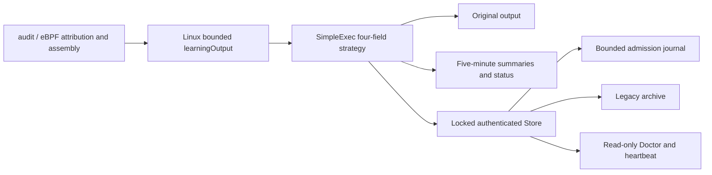
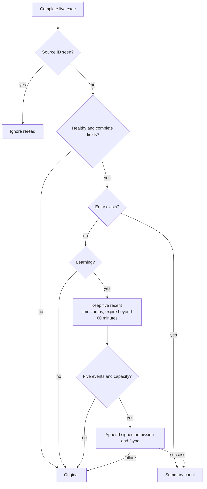

# Simplified Agent Exec Learning Architecture

**Languages:** English (this page) | [简体中文](33-agent-simple-exec-learning-architecture.zh-CN.md)

2026-10-08. Implements the user-approved [requirements](32-agent-simple-exec-learning-requirements.md):
Linux exec exact four fields, five occurrences in a rolling hour, filtering from the fifth.
Reuse Go, the single bounded worker, file locks, HMAC and JSON checkpoints; no database.

Versions: Agent 0.3.81, Agent Server 0.6.0-rc.72, workspace 0.6.0-rc.112.
Deploy both servers before the Agent. Heartbeat validation permits learning with
filtering_active=true without adding required fields; omitted legacy telemetry,
inactive learning and active enforcement remain compatible.

Linux DecodeExec selects the strategy without a new required configuration flag;
disabled configurations remain disabled. The Linux adapter stops using Verifier.
Engine simple_exec.go handles this policy; existing Windows execution/operation/risk
paths retain their contracts. Old occurrence/hour/span/expiry fields remain parseable
but do not gate Linux matching. Device/policy partition structured four-field HMACs.

Keep the first four originals without recounting them as suppressed. No recurring
hour-rate, image or credential gate after admission. Learning can report filtering_active=true.
One healthy day freezes only new admissions. Empty completion is enforcing with
baseline_empty, not degradation. Shadow retains originals. Current source health
is required; the simple policy has no initial/clean-restart ten-minute delay.
Known loss still degrades, stale health leases pause learning/filtering.

Bound candidates, entries and hashed one-hour source-ID dedup by count and conservative
byte budgets. Candidates keep at most five timestamps; periodic reclamation avoids
hot-path table scans. Checkpoint every minute and summarize every five minutes.
Admission appends authenticated journal records with fsync rather than rewriting all
candidates. Commit checkpoint before resetting journal; crash replay is idempotent.
Invalid journal/state retains originals, never grants filtering. Sink failures are
reported; originals that cannot be written are not claimed as delivered.
Counters aggregate in memory, so a crash may lose counts since the last summary.
The journal durably records admissions, not every original event. Detected faults
stop future filtering; they cannot recover originals already suppressed.

Mark new states with linux_exec_four_fields_v1. Automatically migrate only authenticated
legacy state for the same device/generation and matching legacy policy: archive
legacy-state.json, create a new baseline ID and relearn, never reuse old entries.
Expose simple_exec_policy_migrated. Other policy changes require increased generation;
unclean restart still requires explicit relearning. Corrupt/foreign state is not erased.
Restore the archive or disable learning before rolling back to a legacy Agent.

Verify boundaries, retries, field changes, immediate admission, shadow, freeze/empty,
Store/journal recovery and migration failures, full EXECVE versus short PROCTITLE,
and missing/truncated evidence. Retain Windows regressions, run Go tests/race,
cross-platform builds, documentation checks and hot-path benchmark. Local checks
do not claim a real-host day-long or SLS/ES acceptance run; deployment is out of scope.

2026-10-08 local results: Agent `make check` passed format, vet, full tests, race and
Linux/Windows amd64 cross-builds. Agent Server controlplane/agentinstall race tests
with required PostgreSQL and the real old Agent 0.3.36 signed contract passed.
Workspace type check, build, state tests and 1440/390 browser regressions passed,
including active learning, empty completion, legacy degradation and stale status.
Documentation checks passed in all three repositories. On Apple M1,
BenchmarkSimpleExecKnown measured 2549 ns/op, 1880 B/op and 40 allocs/op: known-entry
matching only, excluding collection, initial admission fsync, upload or real-host CPU.
