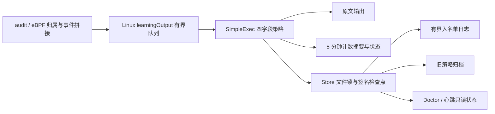
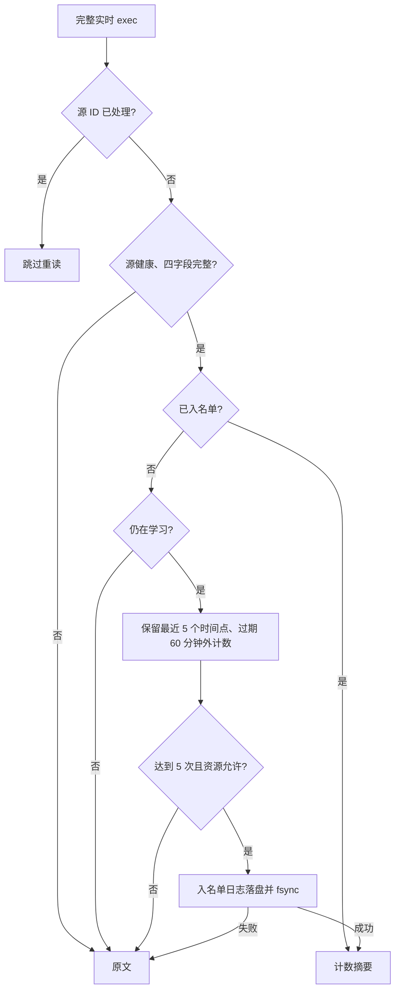

# Agent 简化 exec 学习模块设计

**语言：** [English](33-agent-simple-exec-learning-architecture.md) | 简体中文（本文）

2026-10-08。本次实施依据用户确认的[简化需求](32-agent-simple-exec-learning-requirements.zh-CN.md)：
Linux exec 四字段精确匹配，滚动一小时 5 次，第 5 次立即过滤。
技术栈沿用 Go、现有单 worker、文件锁、HMAC 和 JSON 检查点；不使用数据库。

配套版本：Agent 0.3.81、Agent Server 0.6.0-rc.72、工作台 0.6.0-rc.112。
先部署两个服务端再部署 Agent。心跳仅扩展允许 learning + filtering_active=true 的组合，
不新增必填字段；旧版省略学习状态、learning 未过滤、enforcing 已过滤均继续接受。

## 模块边界

采集与监听归属不变；Linux 适配器不再创建 Verifier 或为学习反查 /proc。
Engine 的独立 simple_exec.go 处理新策略；Windows exec/operation/risk 继续使用原路径。
配置选择由 Linux DecodeExec 明确完成，不新增必须手填的开关；旧配置 enabled=false 仍关闭。
旧 MinHours/MinSpan/MinOccurrences/ExpiryDays 保留解析兼容，新 Linux 策略固定 5 次/3600 秒，
不把这些旧参数作为匹配门槛。device/policy 用于分区，四字段用结构化编码生成 HMAC。

## 状态与决策

前 4 次原文不删除，也不计入过滤摘要。入名单后不再重新检查小时频率、镜像或权限。
学习中允许 filtering_active=true；一天有效学习结束仅冻结新增；空名单进入 enforcing，
reason=baseline_empty，表示正常完成而非故障。shadow 不过滤。
学习时间只累计健康的短 Tick 间隔；源 lease 失效暂停计时/过滤，明确丢事件仍降级。
新策略不要求初始/正常重启 10 分钟等待，当前源必须先报告健康。

## 存储、性能和迁移

候选最多保存 5 个时间点；源 ID 以本地 HMAC 后保存，去重保留一小时。
候选、名单、去重同时受条数和保守字节预算约束；热路径不扫全表。
周期 Tick 清理过期候选/去重，60 秒写签名检查点；摘要仍默认 300 秒。
入名单使用追加签名 journal + fsync，避免每个新条目重写所有候选。
检查点先原子提交再清空 journal；中间崩溃可幂等重放，损坏日志不能启用过滤。
输出/源故障恢复原文；无法写出原文仍向 stderr 报实际错误，不声称采集成功。
摘要计数在内存中合并，进程崩溃可能丢失最后一次摘要之后的计数；入名单日志只保证
名单持久性，不是完整原文重放队列。发现故障后停止过滤，不宣称恢复此前未写出的原文。

新 state 标记 strategy=linux_exec_four_fields_v1。仅同设备、同 generation、旧策略 hash
匹配且状态可认证时自动迁移：先归档 legacy-state.json，再创建新的 baseline_id 并重新学习，
不复用旧 entries。记录 simple_exec_policy_migrated 原因并输出迁移说明。
其他策略变更仍要求 generation 增加；损坏/陌生状态不自动清空；非正常退出仍需显式 relearn。
回滚旧 Agent 前恢复备份或禁用学习，旧客户端无法解释新策略 hash 时保留原文。

## 验证范围

受控时钟验证窗口边界、同事件重读、四字段变更、立即过滤、shadow、冻结/空名单。
真实 Store 验证 checkpoint/journal 重放、清理顺序、迁移和故障不丢原文；
采集器测试验证完整 EXECVE 优先于短 PROCTITLE、缺失/截断不可训练。
保留 Windows 既有测试，运行 Go 测试、race、跨平台构建、文档检查及热路径 benchmark。
本地验证不能替代真实主机一日学习及 SLS/ES 上传验收；本任务不部署。

2026-10-08 本地结果：Agent `make check` 通过（格式、vet、全量测试、race、Linux/Windows
amd64 交叉构建）；Agent Server 开启必需 PostgreSQL 的 controlplane/agentinstall race
测试及真实旧 Agent 0.3.36 签名契约通过。工作台类型检查、构建、状态测试及 1440/390
视口浏览器回归通过，覆盖学习中已过滤、空名单、旧降级与状态过期。
三个仓库文档检查通过。Apple M1 上 BenchmarkSimpleExecKnown 为 2549 ns/op、1880 B/op、
40 allocs/op，仅衡量已入名单匹配，不包含源采集、首次入名单 fsync、上传或实际主机 CPU。
