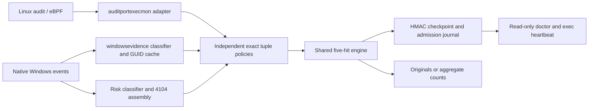
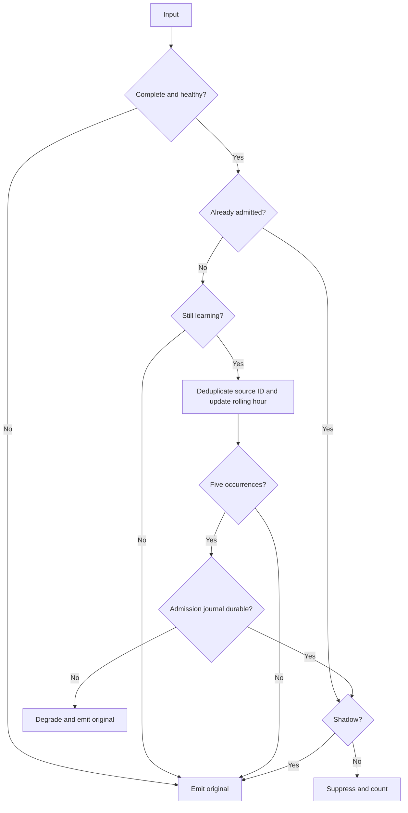

# Agent Unified Simple Learning Architecture

**Language:** English | [简体中文](37-agent-unified-simple-learning-architecture.zh-CN.md)

Version 0.3.83 implements the [unified requirements](36-agent-unified-simple-learning-requirements.md)
using existing Go modules, HMAC state and synchronous/bounded asynchronous output.
No database or new dependency is introduced.

## Responsibilities and Ordering

- behaviorlearning/simple_policy.go defines Windows exec/network/script policies and tuple completeness.
  simple_file.go retains Linux exec/file identities and reuses the rolling counter in simple_exec.go.
- Windows Sysmon 1/4688 exec drops identity profiling. File/network share one
  1024-entry/4 MiB host+ProcessGuid command cache without parent replay or live-PID
  lookup. Learning.mu owns cache, write counts, health and cursor barriers;
  Engine.mu owns each baseline. Sink callbacks only use atomic Fault to avoid recursive locks.
- PowerShell retains bounded assembly and high-risk classification while removing
  CDXML eligibility heuristics. Whole-script SHA-256 and origin form an exact
  HMAC key; script text stays in the bounded assembly buffer, never baseline state.
- Independent engines/state/counts share existing output paths. Engine checkpoints
  and evidence/summary fsync precede EventRecordID commits. Shutdown joins the
  ticker before persisting clean state.
- The historical generic engine branch remains only for old-contract compatibility
  and migration regressions. Every current installed adapter explicitly selects
  a simple policy; no live stream mixes old/new counters. No database is used;
  schema_version=1 remains readable.

## State and Compatibility

Strategy identities are windows_exec_four_fields_v1, windows_connect_seven_fields_v1
and windows_script_exact_v1. They participate in policy_hash so a state cannot be
reinterpreted under another rule. Only matching legacy policy/device/generation
with valid HMAC may be archived as legacy-state.json and replaced by new learning.
Exec retains its directory, network-operations is a new child, and file-operations
retains its existing identity. Clean compatible restarts reuse state; corruption
or policy conflicts retain originals and report instead of silently resetting.

Store.Commit compacts admission journals only for recognized simple strategies,
after checkpoint publication. New strategies register there to bound journal
growth. Fingerprint version 4 covers new Windows exec/network/script; Linux exec
remains 2 and file 3. Status and aggregate summaries include SourceEventType and
readers select summaries by baseline_id. The server heartbeat contract is unchanged:
exec remains the primary progress view, while doctor reports independent streams.

## Performance and Verification

Each event performs tuple validation, structured HMAC, one-key lookup and at most
five timestamp updates. Dedup/cache cleanup is periodic. Admission writes one
journal record; minute checkpoints compact it. Shared Windows command caching
replaces duplicate identity/command caches. Engine budgets remain independent;
see the operating guide. State/summary failures restore original output.

Real Store tests with controlled clocks validate boundaries. Native-shaped
Windows records exercise classification, correlation and output, including
migration, fragments, field changes and faults. Full make check includes race and
Linux/Windows builds. Unit tests do not replace native 24-hour or cloud acceptance.

Source acceptance on 2026-10-09: Agent `make check` passed (format, vet, full unit
suite, race detection and Linux/Windows amd64 builds), along with Linux/Windows
arm64 builds, `make docs-check` and `git diff --check`. PowerShell is unavailable
on this workstation, so the updated installer-summary integration fixture was
not executed locally. No package, deployment or native Windows/cloud acceptance
was performed.
