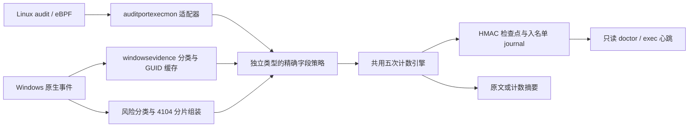
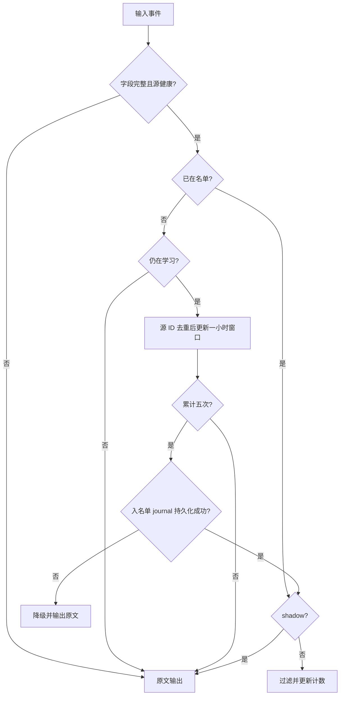

# Agent 统一简化学习架构

**语言：** [English](37-agent-unified-simple-learning-architecture.md) | 简体中文

版本：0.3.83。实现[统一需求](36-agent-unified-simple-learning-requirements.zh-CN.md)，
复用原有 Go 模块、HMAC 状态和同步/有界异步输出结构，不引入数据库或新依赖。

## 职责与顺序

- behaviorlearning/simple_policy.go 定义 Windows exec/network/script 策略和完整字段契约。
  simple_file.go 保持 Linux exec/file 的既有策略身份，复用 simple_exec.go 的滚动窗口。
- Windows exec 原生 Sysmon 1/4688 不再做身份画像。file/network 共用 1024 项/4 MiB
  host+ProcessGuid 缓存；仅补齐完整命令，不恢复父链、不反查 PID。Learning.mu 同步保护
  缓存、写入计数、健康状态和游标屏障；Engine.mu 保护独立名单，回调只用原子 Fault，避免递归锁。
- PowerShell 保留有界分片组装与原有高危分类，删去 CDXML 资格启发式。完整脚本
  SHA-256 连同来源组成精确 HMAC 键；正文仅留在本次有界拼装缓冲，不写名单。
- 每类独立引擎/状态/计数，共用输出路径。engine.Checkpoint、原文/摘要 fsync 完成后才
  提交 EventRecordID；正常停止先 join ticker，再持久化 clean 标记。
- 历史通用 Engine 分支仅保留旧契约兼容与迁移回归；所有当前安装适配器显式选用简化策略，
  不在同一条实时链路混用旧计数器。无数据库；持久化格式保持 schema_version=1。

## 状态与兼容

Windows exec 使用 windows_exec_four_fields_v1，network 使用 windows_connect_seven_fields_v1，
PowerShell 使用 windows_script_exact_v1。策略身份参加 policy_hash，避免相同文件解释成不同规则。
只有旧策略/设备/generation 全部匹配且 HMAC 有效时才能归档 legacy-state.json 并新建基线。
exec 原目录继续承载主状态，network-operations 是新子目录，file-operations 身份保持不变。
同策略重启复用基线，损坏或策略冲突保留原文并报告，不静默清空状态。

Store.Commit 仅对已知简化策略在检查点提交后压缩入名单 journal；新策略必须同步注册，
避免 journal 无限增长。指纹版本 4 标识本次 Windows exec/network/script，Linux exec=2、file=3。
SourceEventType 在状态与计数摘要都显式输出；状态读取必须按 baseline_id 选择对应摘要。
现有服务端心跳字段不扩展，Windows exec 仍是主进度，doctor 补充其他独立基线。

## 性能与验证

每个事件只做字段验证、结构化 HMAC、单键查找和最多五个时间点更新。缓存/去重每分钟清理；
入名单写一次 journal，检查点按分钟压缩。共享 Windows 缓存消除原来两套身份/命令缓存。
每个引擎独立资源预算，详见使用指南；状态存储和摘要失败统一恢复原文。

测试使用真实 Store 和受控时钟验证边界，原生形状 Windows 数据验证分类、关联与输出链路，
同时覆盖迁移、分片、字段变化和故障。全量 make check 包含竞态及 Linux/Windows 构建；
真实 Windows 24 小时学习和云端上传不以单元测试替代。

2026-10-09 源码验收：Agent `make check` 通过（格式、vet、全量单元测试、竞态及
Linux/Windows amd64 构建），另通过 Linux/Windows arm64 构建、`make docs-check`
和 `git diff --check`。本机未安装 PowerShell，更新的安装提示集成用例未在本机执行；
未生成安装包、部署或执行真实 Windows/云端验收。
