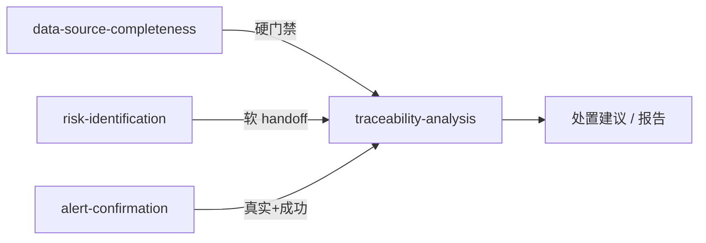

**语言：** [English](16-traceability-analysis-architecture-evaluation.md) | 简体中文（本文）

# traceability-analysis 技能架构评估

当前实现说明（2026-09-16）：下文保留原评估日期的历史记录。
`bundle-trace-oss-demo` 属历史描述，当前未发布；默认包为
`bundle-incident-trace-default`。输入适配与共用 Skill 调用已放在
[_shared/skill_runtime](../../src/skills/_shared/skill_runtime/README.zh-CN.md)，场景
证据计划/取数位于 `data-access/scenario_fetch.py`。原 `skill_input.py` 导入继续兼容。

> **评估对象**：`src/skills/traceability-analysis/` 及关联共享层
> **关联文档**：[溯源分析技能设计](../15-traceability-analysis-skill-design.zh-CN.md) | [correlation-matrix 设计评估](22-correlation-matrix-design-evaluation.zh-CN.md)
> **评估日期**：2026-07-02
> **历史实现状态（2026-07-02，v1.1 对齐）**：traceability 单测已纳入 `tests/run_tests.py`（CI `make test`）；当时使用的 OSS 与运营 bundle 已拆分；场景优先级统一为 `anchor-patterns.json` → `scenario_priority`；Join→stage 经 `correlation-matrix.json` → `trace_stage_map` + `get_join_trace_stage()`；攻击叙事复用 `risk-identification/rules/chain-patterns.json`（`attack-patterns.json` 已弃用）；源适配器与 `heuristic-rules.json` 已引入。历史 OSS bundle 当前不随仓库发布。
> **公开运营流程**：[溯源分析运营配置指南](../../docs_user/25-traceability-analysis-ops-config-guide.zh-CN.md)

---

## 结论摘要

| 维度 | 评分 | 一句话 |
|------|------|--------|
| **架构清晰度** | ★★★★☆ | matrix-first 三层流水线，`correlation_source` 可审计 |
| **扩展性** | ★★★☆☆ | Join/场景易扩展；阶段/heuristic/verdict 难扩展 |
| **灵活性** | ★★★★☆ | 多运行模式 + heuristic 补洞强；阈值/报告定制弱 |
| **运营/开放分离** | ★★★★☆ | 公开 hosts/fixtures 已合成化；凭证和环境 overlay 保持在 Community 归档外 |
| **可测试性 / CI** | ★★★★☆ | traceability 单测已纳入 `tests/run_tests.py`；`bfs_lateral` / verdict 等仍缺专项用例 |
| **跨 Skill 协作** | ★★★★☆ | completeness 硬门禁好；risk 衔接偏软 |

**总体判断**：概念分层清晰、matrix 合同设计正确，但实现上「配置驱动」与「代码硬编码」并存，运营数据与开源框架尚未完全解耦。双主机合成场景已证明 heuristic 补洞必要且有效。

---

## 一、总体架构

### 1.1 三层流水线

```text
┌─────────────────────────────────────────────────────────────┐
│  L0 编排 / 取数（skill_input.py）                              │
│  completeness 门禁 → anchor 解析 → matrix fetch → hosts 注入   │
└───────────────────────────┬─────────────────────────────────┘
                            ▼
┌─────────────────────────────────────────────────────────────┐
│  L1 关联合同（correlation_trace.py + correlation_engine.py）   │
│  scenarios → anchor-patterns → recommended_chain → join_edges  │
└───────────────────────────┬─────────────────────────────────┘
                            ▼
┌─────────────────────────────────────────────────────────────┐
│  L2 叙事 / 补全（traceability_analysis/* + host_normalize.py） │
│  matrix 阶段 → heuristic 补洞 → verdict / timeline / graph     │
└─────────────────────────────────────────────────────────────┘
```

### 1.2 目录与模块

| 路径 | 职责 |
|------|------|
| `src/skills/traceability-analysis/scripts/correlate.py` | 薄 CLI 入口和兼容导出 |
| `src/skills/traceability-analysis/scripts/traceability_analysis/engine.py` | 编排器：门禁 → 归一化 → matrix 关联 → heuristic → verdict JSON |
| `src/skills/traceability-analysis/scripts/traceability_analysis/initial_access.py` | 初始入口和受害主机反查 |
| `src/skills/traceability-analysis/scripts/traceability_analysis/execution.py` | 主机执行链阶段识别 |
| `src/skills/traceability-analysis/scripts/traceability_analysis/lateral.py` | SSH 横向识别和 BFS 图 |
| `src/skills/traceability-analysis/scripts/traceability_analysis/result.py` | 门禁、verdict、置信度、blocked 结果、报告 wrapper |
| `src/skills/traceability-analysis/scripts/correlation_trace.py` | 溯源合同：场景→anchor、join→stage、merge 逻辑 |
| `src/skills/traceability-analysis/scripts/host_normalize.py` | 主机标识（TigerSec localhost→IP）、hosts 注入、SSH 解析 |
| `src/skills/_shared/data-access/correlation_engine.py` | 通用 Join 引擎 |
| `src/skills/_shared/data-access/skill_input.py` | `build_traceability_payload`、CLI `--from-bundle`、fetch |
| `dataasset/scenarios/anchor-patterns.json` | S1–S7 → `recommended_chain`、调查窗、bundle |
| `dataasset/assets/correlation-matrix.json` | Join 定义、时间窗、`fetch_plan` |
| `dataasset/hosts/` | 轻量 CMDB（注入为 `asset_inventory`） |
| `risk-identification/rules/chain-patterns.json` | 跨阶段攻击叙事、`matched_pattern`（与 risk 共用） |
| `traceability-analysis/heuristic-rules.json` | TigerSec heuristic 阈值（syslog/目标机 exec 互证等） |
| ~~`attack-patterns.json`~~ | **已弃用**（stub 指向 chain-patterns） |

### 1.3 设计原则（matrix 合同）

来自 `correlation-matrix.json` 的 `design_intent`：

- 关联规则集中维护：跨源 Join 只在 matrix 定义
- 字段归一与关联解耦：`field_aliases` vs `join_keys`
- 查询编排与 Join 语义解耦：`fetch_plan` vs `join_keys`
- 时间窗显式化：由 `time_windows` + anchor `investigation_window` 引用

**实现一致性**：文档与 `analyze()` 主路径一致 — matrix 优先，heuristic 仅补 gap，并通过 `correlation_source` 标注来源。

### 1.4 运行时主路径（`analyze()`）

```text
payload
  → gate_precheck（completeness）
  → resolve_trace_contract（anchor-patterns）
  → inject_registered_hosts（dataasset/hosts → asset_inventory）
  → normalize_bundles_for_trace（localhost 修复）
  → correlate_for_trace（matrix joins）
  → build_stages_from_join_edges
  → heuristic：exec_inferred initial / lateral_from_exec / syslog_lateral / target_exec_lateral / BFS ssh_auth
  → enrich_impacted_with_registry
  → JSON 报告
```

---

## 二、扩展性评估

### 2.1 扩展面（数据驱动，成本低）

| 扩展点 | 机制 | 成本 |
|--------|------|------|
| 新增跨源 Join | 编辑 `correlation-matrix.json` + query template | 低 |
| 新增调查场景 | `anchor-patterns.json` + `recommended_chain` | 低 |
| 取数编排 | matrix `fetch_plan.param_map` | 低 |
| 多场景合并链 | S1+S3 合并多条 anchor `recommended_chain` | 已实现 |
| 主机 CMDB enrich | `inject_registered_hosts` + `host_to_cmdb` | 已实现 |
| 跨 Skill 复用 | 同一 matrix 供 alert / risk / trace | 高价值 |

Join 引擎（`run_recommended_chain`）是平台级扩展中心：按 anchor 链逐 join 匹配，产出 `join_edges` + `data_gaps`。

### 2.2 扩展瓶颈（需改 Python）

#### ① Join → 攻击阶段映射（已数据化，heuristic join 需双配置）

**当前实现**（`correlation_engine.py` + `correlation_trace.py`）：

```python
# matrix：join.trace_stage 或 trace_stage_map[join_id]
stage = get_join_trace_stage(join_id, matrix)

# 按阶段枚举 matrix join
exec_joins = join_ids_for_trace_stage("execution")
lateral_joins = join_ids_for_trace_stage("lateral_movement") | _heuristic_lateral_joins()
# _heuristic_lateral_joins() ← heuristic-rules.json → lateral_join_ids
```

| 扩展方式 | 操作 |
|----------|------|
| 新增 **matrix join** 并出现在 attack_chain | 在 `correlation-matrix.json` 增加 join，并在 `trace_stage_map` 或 join 上设 `trace_stage` |
| 新增 **heuristic-only** lateral（无 matrix join） | 改 `heuristic-rules.json` → `lateral_join_ids`，并确保 `trace_stage_map` 含对应 id |

**残留**：`build_stages_from_join_edges` 内仍有少量 join 特例分支；heuristic-only 的 `lateral_from_syslog` / `lateral_from_target_exec` 须在 `lateral_join_ids` 注册（改 matrix `joins[]` 无效）。

#### ② Heuristic 分层（部分配置化）

| 模块 | 配置化 | 说明 |
|------|--------|------|
| `heuristic-rules.json` + `heuristic_rules.py` | ✅ | syslog 横向、目标机 exec 互证、`lateral_from_exec`、置信度加成 |
| `source_adapters/tigersec*.py` | 代码 | TigerSec 入口识别、syslog 修复、目标机 impact |
| `traceability_analysis/lateral.py`、`execution.py`、`result.py` | ❌ | 仍无插件/registry；公开配置边界见[溯源分析运营配置指南](../../docs_user/25-traceability-analysis-ops-config-guide.zh-CN.md) |

#### ③ 攻击叙事（已迁至 risk-identification）

- **单一来源**：`risk-identification/rules/chain-patterns.json`
- **加载**：`risk_rules_bridge.load_trace_patterns()`、`resolve_matched_pattern()`
- **字面量派生**：WebShell URL、下载/横向工具来自 `exec-rules.json`，不再维护 `attack-patterns.json`
- **残留**：`risk_rules_bridge._stage_text_hits_rules` 仍有 rule_id→字面量兼容 fallback。

#### ④ 场景优先级（已统一）

`correlation_engine.load_scenario_priority()` 与 `correlation_trace.anchor_patterns_for_trace()` **均读取** `anchor-patterns.json` → `scenario_priority`。双轨列表已移除。

#### ⑤ 无正式 Python 包结构

脚本通过 `sys.path.insert` 挂载 `_shared/data-access`，不利于独立发布或第三方扩展。

### 2.3 扩展性总评：★★★☆☆

- **数据层**（matrix / anchor / templates）：扩展性好
- **行为层**（阶段映射 / heuristic / verdict）：扩展性一般
- **输出层**（Markdown / 自定义报告）：无插件

---

## 三、灵活性评估

### 3.1 运行模式

| 模式 | 支持 | 说明 |
|------|------|------|
| 离线 JSON | ✅ | `correlate.py -i input.json` |
| `--from-bundle --fetch` | ✅ | 完整性预检 + matrix fetch |
| 跳过完整性 | ✅ | `--skip-completeness`，confidence 封顶 |
| 覆盖 anchor | ✅ | `--anchor-pattern` |
| dry-run fetch | ✅ | 只看 fetch plan |
| 上游 handoff | ✅ | 直接传 `evidence_bundles` |
| risk-identification 衔接 | ⚠️ | 文档约定，无代码级 pipeline |

### 3.2 关联策略双轨（matrix + heuristic）

```text
matrix 命中  → correlation_source: matrix
matrix 未命中 → exec_inferred / heuristic_fallback / BFS
两者皆有     → matrix+heuristic / matrix+exec_inferred
```

**双主机合成场景验证**：无 WAF/WEB 时 matrix 无法给 `initial_access`，`exec_inferred` 补洞后链才完整。
**代价**：置信度规则分散在代码常数（0.82–0.95），难以按客户调参。

### 3.3 时间窗 / 规则

| 来源 | 可配置性 |
|------|----------|
| matrix `time_windows` | ✅ 数据驱动 |
| anchor `investigation_window` | ✅ 数据驱动 |
| `heuristic-rules.json`（syslog / target_exec / lateral_from_exec） | ✅ 引用 matrix `time_window` id（默认 `lateral_movement`） |
| `traceability_analysis/execution.py` 执行链邻近窗 | ✅ 读取 `heuristic-rules.json` → `policy.execution_chain` 与 matrix 时间窗 |
| `traceability_analysis/lateral.py` BFS、`result.py` verdict 状态机 | ✅ 阈值读取 `heuristic-rules.json` → `policy.bfs_lateral` / `policy.verdict_rules` |

### 3.4 输出与叙事

- **JSON**：字段丰富（`join_coverage`、`correlation_contract`、`hypotheses`、`lateral_findings` 三级分类）；`correlation_contract` 内仓库自带 anchor/matrix 路径使用仓库相对路径，公开报告可跨检出目录复用
- **Markdown**：SKILL 模板 + Agent 生成；`correlate.py` 不直接出报告
- **verdict**：5 档 + 硬约束（无 exec 不得 confirmed 等）

### 3.5 灵活性总评：★★★★☆

输入/部署模式灵活；缺源时 heuristic 补洞强；规则阈值与报告格式定制弱。

---

## 四、运营 / 开放分离能力

### 4.1 理想分离模型

```text
开源框架（Skill + matrix + engine + 示例 fixtures）
        │  配置注入
        ▼
运营层（connectors + credentials/Vault + hosts + 客户 assets/bundles）
        │  证据归一化
        ▼
确定性 analyze() → Agent 叙事
```

Skill 只消费归一化 `evidence_bundles`，不碰 secret — 边界正确。

### 4.2 实际分离情况

| 层级 | 开放部分 | 运营部分 | 分离度 |
|------|----------|----------|--------|
| 关联引擎 | `correlation_engine.py` | — | ✅ |
| matrix / anchor | 随 repo 发布 | 客户可 fork | ✅ |
| Skill 脚本 | correlate / correlation_trace | TigerSec heuristic 在核心路径 | ⚠️ |
| 默认 bundle | 当前使用 `bundle-incident-trace-default` | 历史 `bundle-trace-oss-demo` 不再发布 | ✅ |
| `hosts/` | README + 合成示例 | 真实主机放私有 overlay | ✅ |
| 测试 | 引擎测试在 CI | 断言合成主机 ID | ✅ |
| 凭证 | SOPS 模板 | 加密文件不进 Git | ✅ |

`inject_registered_hosts` 扫描资产根目录内全部 `active` hosts 再按调查范围过滤。公开目录仅包含文档地址和合成身份；真实主机清单应放在私有资产 overlay。

### 4.3 CMDB 与 hosts

平台内 **CMDB 类信息即 `dataasset/hosts/`**，非独立系统。`host_to_cmdb` join 期望：

```text
host_exec.host  ←→  evidence_bundles.asset_inventory.hostname/ip
```

`inject_registered_hosts()` 在 `analyze()` 前自动注入，无需手工构造 `asset_inventory`。

### 4.4 分离能力总评：★★★☆☆

引擎与凭证边界清晰；公开 hosts 与 fixtures 已合成化，真实资产、凭证和环境 bundle 保留在私有 overlay。

---

## 五、与其他 Skill 的边界



| 关系 | 类型 | 评价 |
|------|------|------|
| completeness → trace | 硬依赖（`gate_precheck`） | 边界清晰 |
| risk → trace | 文档约定，无 import | 灵活但易断链 |
| 共用 matrix | 平台级复用 | 架构正确 |
| trace 不做判险/误报 | SKILL 禁止事项 | 职责分离好 |

---

## 六、测试与可维护性

| 测试集 | 位置 | CI（`make test`） |
|--------|------|-------------------|
| correlation_engine | `_shared/data-access/tests` | ✅ |
| traceability（correlation_trace、heuristic、adapter、bridge 等） | `traceability-analysis/scripts/tests/test_*.py` | ✅（`tests/run_tests.py` L20） |
| demo traceability | `secweaver.py demo traceability` | ✅（冒烟） |

**覆盖缺口**：`bfs_lateral`、`determine_verdict` 边界、completeness gate blocking、Vault `--from-bundle --fetch` 集成测试。

---

## 七、关键抽象

| 抽象 | 位置 | 用途 |
|------|------|------|
| `join_edge` | `correlation_engine.make_join_edge` | matrix 匹配产物 |
| `attack_chain` stage | `correlate.analyze` | 含 `join_ids`、`correlation_source` |
| `correlation_source` | merge 逻辑 | `matrix` \| `heuristic_fallback` \| `exec_inferred` |
| `resolve_trace_contract` | `correlation_trace` | 审计用合同快照 |
| `victim_host_from_event` | `host_normalize` | 跨源统一主机标识 |
| `completeness_precheck` | payload | confidence 上限 + block 门禁 |

---

## 八、优势与风险

### 8.1 优势

1. **matrix-primary + heuristic-gap-fill**，带来源标注
2. **Join 合同中心化**，alert / risk / trace 复用
3. **fetch 与 join 对齐**（`correlation_fetch_plan`）
4. **host 归一化**解决 TigerSec `localhost` 问题
5. **hosts 自动注入**，CMDB join 无需单独 fetch
6. **离线优先**，无 Vault 可跑 fixtures

### 8.2 风险（2026-07-02 更新）

| # | 风险 | 状态 |
|---|------|------|
| 1 | traceability 单测未进 CI | ✅ 已纳入 `tests/run_tests.py` |
| 2 | Join→stage 硬编码 | ⚠️ 已 `trace_stage_map`；heuristic join 与少量特例仍须双配置 |
| 3 | 场景优先级双轨 | ✅ 已统一 `scenario_priority` |
| 4 | `attack-patterns.patterns[]` 未接入 | ✅ 已迁 `chain-patterns.json` |
| 5 | heuristic 与 matrix 时间窗两套规则 | ✅ heuristic 分钟数已统一读 matrix `time_windows`；`find_execution_chain` 仍硬编码 |
| 6 | 运营 hosts/bundle 渗入开源默认路径 | ⚠️ demo bundle 已拆；hosts 分层待做 |
| 7 | heuristic-only lateral join | ⚠️ 须在 `heuristic-rules.lateral_join_ids` 注册 |
| 8 | Markdown 报告非 correlate 内置输出 | ⚠️ 仍由 Agent/SKILL 模板生成 |
| 9 | BFS / verdict / 执行链阈值硬编码 | ⚠️ 仍需继续配置化 |

---

## 九、优先改进建议

### 已完成（原 P0 / 部分 P1）

1. ~~traceability 单测纳入 `tests/run_tests.py`~~ ✅
2. ~~公开 fixtures 与运营 bundle 分离~~；历史 `bundle-trace-oss-demo` 当前不再发布 ✅
3. ~~统一场景优先级~~ → `anchor-patterns.json` `scenario_priority` ✅
4. ~~Join → stage 数据化（matrix 层）~~ → `trace_stage_map` + `get_join_trace_stage` ✅
5. ~~攻击叙事~~ → `chain-patterns.json` + `risk_rules_bridge`；`attack-patterns.json` 弃用 ✅
6. ~~TigerSec adapter 化~~ → `source_adapters/tigersec*.py` + `heuristic-rules.json` ✅

### 待办（按[公开运营配置边界](../../docs_user/25-traceability-analysis-ops-config-guide.zh-CN.md)推进）

**P0 — 运营可调、仍须改代码**

1. ~~编排阈值外置~~ → `heuristic-rules.json` → `policy` ✅
2. **`tigersec.py` listener** 改读 `exec-rules.json` `web_listeners`
3. **`risk_rules_bridge` fallback** 按 rule_id 读 exec/detection 规则

**P1 — 结构与文档**

4. `correlation_trace` 去掉剩余 join 特例分支
5. matrix `trace_stage_map` 补全 heuristic lateral join（与 `lateral_join_ids` 对齐）✅
6. ~~时间窗对照表~~ 已写入对应配置并纳入验证 ✅

**P2 — 产品化**

7. `correlate.py --markdown` 内置报告
8. execution 阶段去噪 / 高信号摘要
9. `hosts/examples/` vs 运营 overlay
10. risk → trace 标准 payload builder（代码级 handoff）

---

## 十、双主机合成场景验证摘要（2026-07-02）

| 指标 | 结果 |
|------|------|
| verdict | `confirmed_intrusion_chain`（confidence ~0.92） |
| `matched_pattern` | `web_shell_to_ssh_lateral`（`chain-patterns.json`） |
| initial_access | 192.0.2.91（`exec_inferred`，`has_tty=false`） |
| 目标主机横向 | `likely_lateral`（`lateral_from_target_exec` + syslog SSH 失败洪泛，无源主机到目标主机的 Accepted 事件） |
| matrix join | 2/9（两资产最小集）；heuristic 补洞为主路径 |
| hosts 注入 | `host-source-demo` / `host-target-demo` |

证明：heuristic（`target_exec_lateral`、`syslog_lateral`）+ hosts 注入对 TigerSec **必要且有效**；WAF/WEB 缺失时仍可由 exec 推断入口。

---

## 附录：相关路径

| 类型 | 路径 |
|------|------|
| Skill | `src/skills/traceability-analysis/` |
| 共享引擎 | `src/skills/_shared/data-access/correlation_engine.py` |
| 场景编排 | `dataasset/scenarios/anchor-patterns.json` |
| Join 合同 | `dataasset/assets/correlation-matrix.json` |
| 主机注册 | `dataasset/hosts/` |
| 攻击叙事 | `risk-identification/rules/chain-patterns.json` |
| Heuristic 规则 | `src/skills/traceability-analysis/heuristic-rules.json` |
| 运营 bundle | `dataasset/bundles/bundle-incident-trace-default.json` |
| 样例 fixtures | `examples/traceability/` |
| 运营配置指南 | [25-traceability-analysis-ops-config-guide.zh-CN.md](../../docs_user/25-traceability-analysis-ops-config-guide.zh-CN.md) |

---

*文档版本：v1.1 | 更新日期：2026-07-02 | 与实现对齐：chain-patterns、trace_stage_map、CI 单测、scenario_priority*
