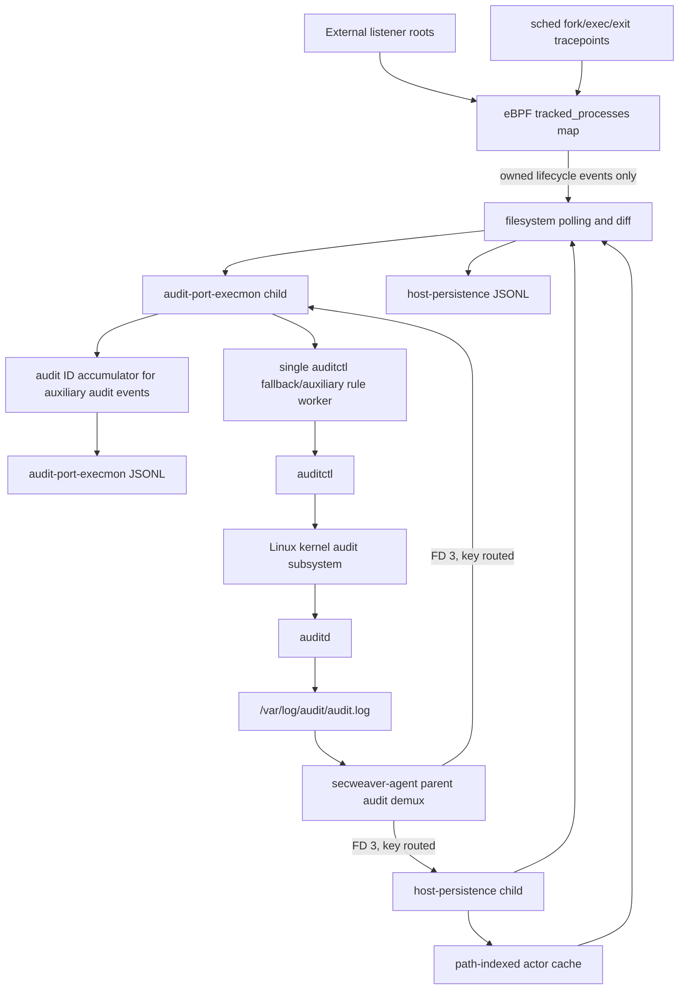
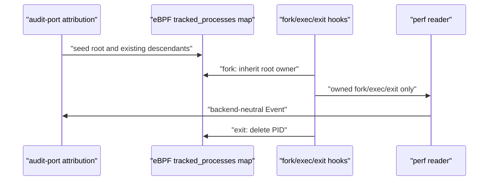

# SecWeaver Agent Linux eBPF/Audit 进程监控实现逻辑与审查指南

**语言：** [English](28-secweaver-agent-audit-design.md) | 简体中文（本文）

> **文档状态：基于 2026-08-01 工作区的历史实现评估。** 第 15 节的问题状态和待办以该次评估为限，不是当前版本已验证缺陷清单。当前运行行为以 [Agent 工程手册](../../src/tools/secweaver-agent/README.zh-CN.md)、[指标与诊断](../../src/tools/secweaver-agent/docs/metrics-and-hot-reload.zh-CN.md)和代码为准。
> 适用范围：`secweaver-agent` 在 Linux 上使用 eBPF 或 auditd 进行进程树监控，以及 audit 读取、规则、压力降级、持久化富化和清理的逻辑。  
> 文档目的：用于设计评审和问题排查，不代替用户安装手册。

**按任务阅读：** 可直接跳到需要的章节，不必从头通读。

- [2. 范围和边界](#2-范围和边界)
- [5. 默认配置与实际语义](#5-默认配置与实际语义)
- [15. 审查发现与待验证问题](#15-审查发现与待验证问题)
- [17. 运维审查清单](#17-运维审查清单)

## 1. 结论先行

当前 Linux 进程监控不是一个单纯的 `audit.log` 解析器，而是四个相互配合的控制面和数据面：

1. 默认 eBPF 后端加载固定的 fork/exec/exit CO-RE 程序，通过内核 PID map 递归传播 listener 归属，不生成动态 exec/clone audit 规则。
2. eBPF 能力、权限或 verifier 检查失败时，`auto` 模式回退到固定规则的有界 audit 后端；强制 `ebpf` 模式则启动失败而不是静默降级。
3. 父进程 audit demux 在多个子模块共用同一 `audit.log` 时只读取一次，再按 audit key 和 audit ID 分发 connect/file/sensitive 等 audit 证据。
4. `host-persistence` 仍以文件轮询差异为变更事实来源，auditd 只用来补充修改人、UID/AUID、PID/PPID、进程和命令。

eBPF 默认路径具备以下保护：

- eBPF 实现完全位于 `pkg/processtracker/ebpf`，audit 规则实现仍位于 `pkg/auditportexecmon`，两者只通过 `processtracker.Tracker` 接口交互。
- 只向用户态上报已跟踪树的 fork/exec/exit，不传输全机进程事件；线程 fork 因 TGID 相同在内核直接丢弃。
- 进程 exit 在内核 map 中同步删除；用户态每 5 分钟使用 `/proc` 修复启动竞态、listener 重启和 perf 丢样后的存活状态。
- 默认每 CPU perf buffer 为 256KB、最多 131072 个 PID；命令参数有固定上限并显式输出截断状态。

audit 回退路径继续具备以下保护：

- 默认只生成 `b64` 规则，exec 与 clone 各一条固定规则，多个 syscall 合并到同一条规则。
- 规则组安装失败时回滚，回滚失败的残留规则继续记账并重试清理。
- listener、companion 和成功 clone 的子 PID 只写入用户态归属 map，不调用 `auditctl`。
- 无关整机事件在创建 audit accumulator 前按 O(1) PID/PPID map 查询丢弃，只有归属命中才读取 `/proc` starttime 防 PID 复用。
- 固定规则和 watch 共用模块内硬上限，默认 `1024`；显式 `audit_pid` 才启用动态规则队列和 backlog/lost 分级降压。
- 正常退出、启动中途失败、子模块异常退出都会走规则清理；systemd `ExecStopPost` 再做一次全局兜底。
- 直读 `audit.log` 和共享 demux 都处理 inode 变化式日志轮转。
- 规则健康快照按 listener index 排序返回，避免 map 遍历顺序随机导致控制台和指标抖动。

默认 eBPF exec 在 syscall 入口采集 UID、PID/PPID、filename 和有界 argv；用户态在进程仍存活时从 `/proc/<pid>` 尽力补齐 AUID、TTY 和 CWD。短命进程的这些字段可能缺失，完整原始 audit 记录仍只在 audit 回退或其他 audit 证据中存在。输出时间仍是 Agent 接收时间，`audit_id` 使用 `ebpf:<ktime_ns>:<pid>` 命名空间。

## 2. 范围和边界

### 2.1 包含的代码

| 层次 | 主要代码 | 责任 |
|---|---|---|
| 父进程共享读取 | [`audit_demux.go`](../../src/tools/secweaver-agent/audit_demux.go) | 单文件 reader、按 key/ID 路由、子模块管道、重连与 backlog |
| 通用文件跟随 | [`pkg/auditstream/auditstream.go`](../../src/tools/secweaver-agent/pkg/auditstream/auditstream.go) | 初始游标、轮转、继承 FD |
| audit-port 启停 | [`pkg/auditportexecmon/main.go`](../../src/tools/secweaver-agent/pkg/auditportexecmon/main.go) | 参数、预检查、启动顺序、退出清理 |
| 进程跟踪接口 | [`pkg/processtracker/tracker.go`](../../src/tools/secweaver-agent/pkg/processtracker/tracker.go) | 后端中立的 Track/Untrack/Event 契约 |
| eBPF 后端 | [`pkg/processtracker/ebpf`](../../src/tools/secweaver-agent/pkg/processtracker/ebpf) | CO-RE 对象、能力探测、fork 继承、exec argv、exit 删除和 perf reader |
| 监听进程发现 | [`listeners.go`](../../src/tools/secweaver-agent/pkg/auditportexecmon/listeners.go) | `netstat` + `/proc/net/tcp*` 发现、进程归属 |
| 进程树与规则账本 | [`monitor_state.go`](../../src/tools/secweaver-agent/pkg/auditportexecmon/monitor_state.go)、[`monitor_worker.go`](../../src/tools/secweaver-agent/pkg/auditportexecmon/monitor_worker.go)、[`monitor_pid_rules.go`](../../src/tools/secweaver-agent/pkg/auditportexecmon/monitor_pid_rules.go) | PID/exe 目标、异步扩展、重扫、PID 复用、删除重试 |
| audit 规则 | [`audit_rules.go`](../../src/tools/secweaver-agent/pkg/auditportexecmon/audit_rules.go) | 规则生成、合并、事务、回滚、按 key 清理 |
| 压力降级 | [`audit_pressure.go`](../../src/tools/secweaver-agent/pkg/auditportexecmon/audit_pressure.go)、[`audit_pressure_state.go`](../../src/tools/secweaver-agent/pkg/auditportexecmon/audit_pressure_state.go) | backlog/lost 采样、分级、限速、延迟与恢复 |
| audit 事件解析 | [`audit_follow.go`](../../src/tools/secweaver-agent/pkg/auditportexecmon/audit_follow.go)、[`audit_event.go`](../../src/tools/secweaver-agent/pkg/auditportexecmon/audit_event.go) | 日志跟随、多行聚合、进程归属、过滤、JSON 输出 |
| 持久化富化 | [`pkg/hostpersistence/audit_rules.go`](../../src/tools/secweaver-agent/pkg/hostpersistence/audit_rules.go)、[`audit_follow.go`](../../src/tools/secweaver-agent/pkg/hostpersistence/audit_follow.go)、[`audit_event.go`](../../src/tools/secweaver-agent/pkg/hostpersistence/audit_event.go) | watch 规则、日志跟随、actor 证据缓存、文件变化关联 |
| 全局兜底清理 | [`audit_cleanup.go`](../../src/tools/secweaver-agent/audit_cleanup.go) | `audit-cleanup` 命令和 systemd 停服务兜底 |

### 2.2 不包含的能力

- Windows 不使用 Linux auditd，而是 Windows Event Log/Sysmon 独立链路。
- `syslog-risk-json` 可以解析 syslog 中的 audit/SELinux 文本，但不管理 audit 规则，也不属于本文档的 audit 事件主链。
- connect/file/sensitive 和 host-persistence 富化仍不支持从 journald/netlink 直接读取 audit 事件，依赖可读的 `/var/log/audit/audit.log`。
- Agent 不接管系统全部 audit 策略，只对 SecWeaver 自有 key 的规则记账和清理。

## 3. 进程和数据流架构



关键点：

- 父进程只在至少两个模块的 `audit_log` 路径和 `from_start` 语义一致时建立共享 demux。
- 只有一个 audit 模块时，该模块直接跟随 `audit.log`，不经父进程 demux。
- demux 只处理日志传输和路由，不理解 exec/connect/file 等业务语义。
- audit-port 的日志读取和 auditctl 规则变更使用不同 goroutine，避免 fork 高峰时阻塞原始证据读取。

## 4. audit-port-execmon 启动顺序

`auditportexecmon.Main` 当前按以下顺序启动：

1. 校验 Linux、root 权限、audit 日志目录和 `auditctl -s`。
2. 加载配置并将默认值物化，在任何规则副作用之前完成参数校验。
3. 使用 `netstat -tlnp` 和 `/proc/net/tcp*` 发现对外 TCP 监听进程。
4. 排除 secweaver-agent 父子进程分支及 Agent 自身监听端口。
5. 按 `process_tree_backend` 探测 BTF/tracepoint，并尝试加载、验证和 attach eBPF；`auto` 失败时记录原因并选择 audit。
6. 生成 exec/connect/file/sensitive/clone key，例如 `tb_external_listener_exec`。
7. 计算实际后端的初始 audit 规则估算值；`dry-run` 只探测，不 attach eBPF、不产生规则副作用。
8. 清理上次运行遗留的 SecWeaver syscall 规则。
9. 获取共享 audit FD；如果是独立读取且不回放历史，先记录当前文件 size 作为起始游标。
10. eBPF 模式把 listener、现存子孙和 companion PID 种入内核 map；有界 audit 模式先事务安装固定规则，再把同一批 PID 种入用户态 map；`audit_pid` 兼容模式才安装动态 PID/PPID 规则。
11. 启动统一对账 worker；只有 `audit_pid` 或 eBPF 动态 connect/file 规则存在时才启动 audit 压力监视器。
12. 并行消费 eBPF 生命周期事件和 audit 辅助事件。
13. 收到 SIGTERM/SIGINT 或 reader 错误后先停止 worker、清理 audit 规则，再关闭 eBPF link/map。

起始游标在安装初始规则前捕获，因此不会丢失“规则已生效，但 reader 还没开始”这个启动窗口的新事件。

## 5. 默认配置与实际语义

| 配置 | 默认值 | 实际行为 |
|---|---:|---|
| `audit.arches` | `b64` | 64 位主机不自动添加 `b32`；显式配置 `b32` 会让每组规则翻倍 |
| `audit.max_rules` | `1024` | 只统计 audit-port 在内存账本里的 syscall/watch 规则和已预留数，不是系统全局上限 |
| `exec.monitor` | `true` | 为选中 listener 监控 `execve,execveat` |
| `exec.process_tree_backend` | `auto` | 优先 eBPF，加载失败回退 audit |
| `exec.fallback_backend` | `audit` | 默认回退到固定规则；也可显式设 `audit_pid` 保留旧行为 |
| `exec.ebpf.max_tracked_processes` | `131072` | eBPF tracked PID map 上限 |
| `exec.ebpf.perf_buffer_bytes_per_cpu` | `262144` | 每 CPU 256KB，避免高核主机内存失控 |
| `exec.track_descendants` | `true` | eBPF 在内核 map 继承；有界 audit 由固定 clone 规则驱动用户态 map 继承 |
| `exec.java_monitor_mode` | `hybrid` | Java 同时使用 exe 规则和 PID 树覆盖 |
| `connect.monitor` | `false` | 默认不为 listener 进程生成 `connect` 规则 |
| `file_ops.monitor` | `false` | 默认不生成高成本的文件创建/删除 syscall 规则 |
| `sensitive_file_reads.monitor` | `true` | 默认使用 `-w /etc/shadow -p r`，输出时再校验是否属于 listener 进程树 |
| `listener_rescan_seconds` | `300` | 每 5 分钟请求一次 listener/PID 树对账，实际执行由单 worker 合并 |
| `audit.pressure.enabled` | `true` | 默认启用四级压力状态机 |
| pressure 采样 | `30s` | 仅 `audit_pid` 或 eBPF 动态辅助规则调用 `auditctl -s`；有界 audit 不采样 |
| pressure backlog | `80/90/95%` | light/medium/severe 阈值 |
| pressure lost delta | `1/5/20` | 相邻 30 秒采样之间的新增丢失数 |
| pressure cooldown | `120s` | 不允许立即降级，避免状态抖动 |
| pressure rate | `10/5/5` | light、medium/severe、recovery 每秒最大规则作业数 |

配置样例见 [`audit-port-execmon.example.json`](../../src/tools/secweaver-agent/audit-port-execmon.example.json)。

## 6. Listener 发现与监控模式

### 6.1 发现来源

Agent 使用 netstat 优先、procfs 条件兜底的两阶段发现：

- `netstat -tlnp`：提供运维人员熟悉的 PID/进程名。命令超时为 5 秒。
- `/proc/net/tcp` 和 `/proc/net/tcp6`：仅在 netstat 失败、没有结果或相关监听缺失 PID 时，以 socket inode 反查 `/proc/<pid>/fd`。

解析器先定位大小写不敏感的 `LISTEN`，再从其前方选择第一个可解析的地址字段，并在后续列搜索 PID/Program，不依赖列宽和固定偏移。支持标准 net-tools、BusyBox 的 `*:port`、`:::port`、`[::]:port`、PID `-` 或省略、厂商附加列，以及 `nginx: master`、`sshd: /usr/sbin/...` 这类被空格拆分的标签。每次命令执行分别统计 TCP LISTEN 总行数、成功解析数和拒绝数；存在拒绝行时输出兼容性诊断并强制 procfs 补全，因此“部分行解析成功”不再掩盖其他格式异常。

正常 root 服务环境中，netstat 已给出所有相关 PID 且没有拒绝行时不会打开任何 `/proc/<pid>/fd` 目录。procfs 回退每批读取 128 个 FD，批间暂停 1ms，单轮预算为 32768 个 FD；达到预算后输出诊断并等待下一次 5 分钟对账继续修复。inode 未命中只返回未解析，不再为每个未命中 socket 重复扫描整个 `/proc`。这是有意的有界降级：极端 FD 密度主机可能延迟一轮发现，不能用无限 CPU 峰值换取单轮完整性。

只选择非 loopback 的 TCP LISTEN socket，再应用单端口筛选和端口白名单。系统如果显示 systemd/init 持有 socket，会尝试通过 inode 重新定位真实进程；22 端口还有 sshd 特例兜底。

### 6.2 监控模式

| 模式 | 典型对象 | 规则方式 | 特点 |
|---|---|---|---|
| eBPF tree（默认优先） | sshd、Web listener、Java | 固定程序 + 内核 PID owner map | 归属精确，规则数不随进程树增长 |
| bounded audit（默认回退） | 无 BTF 或 attach 被拒绝 | 每 arch 固定 exec/clone 规则 + 用户态 PID map | 规则数固定；audit 流量随整机进程创建量增长 |
| audit PID tree（显式兼容） | 配置 `audit_pid` | `-F pid=N` + `-F ppid=N` | 归属精确，但规则数随树增长，不建议规模部署 |
| companion | php-fpm、uwsgi、gunicorn、puma、unicorn | 独立 PID 种子并归属 gateway | 覆盖与 Web listener 分离的后端树 |

Agent 对自身做两层排除：

1. 启动发现 listener 时排除同一 secweaver-agent 可执行文件的 supervisor/module 父子分支。
2. 动态 PID 模式按 PID/PPID 父链和 exe 排除 Agent；有界 audit 热路径只检查 Agent PID 分支、直接父进程和 exe，避免对整机事件反复遍历 `/proc`。

## 7. audit 规则模型

### 7.1 Key 划分

| Key | 用途 | 默认启用 |
|---|---|---|
| `tb_external_listener_exec` | 有界 audit 的固定 `execve,execveat`；eBPF 输出沿用该逻辑 key | audit 回退启用 |
| `tb_external_listener_clone` | 有界 audit 的固定 `clone,clone3,fork,vfork`，只驱动归属 map | audit 回退启用 |
| `tb_external_listener_connect` | `connect` | 否 |
| `tb_external_listener_file` | 创建、打开、重命名、链接、删除等 syscall | 否 |
| `tb_external_listener_sensitive` | 敏感路径 read watch | 是，默认 `/etc/shadow` |
| `tb_host_persistence` | 持久化路径 `wa` watch | 是 |

使用 `-port N` 时，audit-port key 前缀变为 `tb_port_N_*`。

### 7.2 Syscall 合并

有界 audit 每个 arch + syscall 组只生成一条无 PID filter 的规则，例如：

```bash
auditctl -a always,exit \
  -F arch=b64 \
  -S execve -S execveat \
  -k tb_external_listener_exec
```

显式 `audit_pid` 兼容模式仍使用 arch + filter 组合，例如：

```bash
auditctl -a always,exit \
  -F arch=b64 \
  -S execve -S execveat \
  -F pid=1234 \
  -k tb_external_listener_exec
```

clone 系列也合并在一条规则中，不再拆成四条。如果某个 syscall 在当前 kernel/audit userspace 不受支持：

1. 从 `auditctl` 错误文本中识别确切的未知 syscall。
2. 按 `arch:syscall` 缓存不支持状态。
3. 从组中移除它并整组重试，不退化为每 syscall 一条规则。

### 7.3 规则数公式

记：

- `A` = arch 数，默认 `1`。
- 有界 audit 的每个能力固定为 `A` 条，与 listener 和 PID 数无关。
- `audit_pid` 每个能力使用 `pid` 和 `ppid` 两个 filter，因此每能力为 `2A` 条/进程。

默认有界 audit：

```text
exec + clone = 2 x A = 2 条（默认 b64）
敏感 watch = 1 条（默认 /etc/shadow）
模块默认合计 = 3 条
```

同时开启 connect 和 file_ops 时固定增加 `2A` 条，默认 b64 合计为 5 条。规则数不随进程树增长，但 auditd 会产生整机对应 syscall 的记录；模块在主记录进入 accumulator 前按用户态 PID map 过滤无关事件。

显式 `audit_pid` 中每个进程：

```text
exec:  2 x A
clone: 2 x A
total: 4 x A = 4 条（默认 b64）
```

`audit_pid` 同时开启 connect 和 file_ops：

```text
exec + clone + connect + file = 8 x A = 8 条/进程
```

每个 sensitive watch 路径额外占一条。

重要边界：`audit.max_rules=1024` 只包含 `processTreeMonitor.rules + watchRules + reservedAuditRules`。它不包含：

- `host-persistence` 模块安装的 watch。
- 操作系统或其他产品已安装的 audit 规则。
- 内核中已存在但本进程账本不知道的 SecWeaver 残留规则。

因此它是“单模块增长上限”，不是“宿主机 audit 安全上限”。

## 8. 规则事务、账本与清理

### 8.1 安装事务

固定规则、PID 兼容规则和 watch 都按逻辑组提供 all-or-rollback 语义：

1. 在锁内检查 `installed + reserved + estimated <= max_rules`。
2. 预留整组规则名额，防止并发作业共同突破上限。
3. 释放锁后调用 `auditctl`，避免慢命令占用监控器锁。
4. 任何子规则失败，按逆序删除已成功的规则。
5. 删除失败的 residual 仍放入内存账本，继续占用规则预算并由后续对账重试。

初始 bootstrap 又是更外层的事务：某个 listener 或 sensitive watch 失败时，清理本次 session 已管理的所有 key。

### 8.2 内存账本

`processTreeMonitor` 在 `mu` 下维护：

- `rules` / `watchRules`：已成功安装或删除失败的确切规则。
- `monitored`：已监控或已预留安装权的 PID。
- `processStartTimes`：PID 对应的 `/proc` starttime。
- `pendingRuleExpansion`：已进入 worker 或等待处理的 PID。
- `pendingPIDRuleCleanup` / `pendingExeRuleCleanup`：内核删除失败，需要后续重试的所有者。
- `reservedAuditRules`：已预留但 auditctl 尚未全部成功的名额。

auditctl 命令默认有 3 秒超时，避免内核/auditd 异常时无限卡住启动、worker 或 systemd stop。

### 8.3 删除语义

- 死 PID 和移除 listener：按账本里的完整参数调用 `auditctl -d`，只从账本删除已确认成功的规则。
- session 退出：优先按 key 调用 `auditctl -D -k KEY`；如果失败，列出内核规则并构造精确删除命令。
- 下次启动：先删除当前 key，再扫描 `tb_` 前缀的 syscall 规则，清理历史版本和按端口 key。
- systemd 停止：`ExecStopPost=/opt/secweaver-agent/bin/secweaver-agent audit-cleanup -quiet` 再扫描 `tb_external_listener_*`、`tb_port_*`、`tb_host_persistence`。

`audit-cleanup` 默认是 best-effort；`--strict` 可用于卸载验证，任何清理错误会返回非 0。

## 9. 进程树实时扩展

### 9.1 eBPF 默认路径

eBPF 后端加载固定的 fork/exec/exit hook：`sched_process_fork`、`sched_process_exec`、`sched_process_exit`、`sys_enter_execve`、`sys_exit_execve`，以及成对可选的 `sys_enter_execveat`、`sys_exit_execveat`。用户态启动时调用 `Track(pid, ppid, listener_pid, descendants)` 写入根进程及现存子孙；fork hook 只在父 TGID 已存在于 map 且允许跟踪后代时复制 owner，线程因父子 TGID 相同被忽略。syscall 入口只暂存有界 argv，只有 `sched_process_exec` 确认成功后才输出；syscall 失败出口立即删除暂存参数，不会把失败命令或陈旧参数误标为成功。exit 仅在进程组 leader 退出时删除 TGID，普通线程退出不会删除整棵归属。所有 hook 都先检查 tracked map，因此不会把全机生命周期事件传给 Agent。



每 CPU perf buffer 默认 256KB，不是全机总大小；高核主机的总 perf 内存约为 `CPU 数 x 256KB`。perf 丢样会累计计数、输出告警并请求 `/proc` 对账。map 继承本身不依赖 perf 上报成功，因此 fork 事件丢样不会破坏后续内核归属，但同一窗口的用户态证据仍可能丢失。

eBPF 会话字段遵循三态语义：`/proc/<pid>/stat` 的 `tty_nr` 可读且为非零时输出 `has_tty=true`，为零时输出 `has_tty=false`；进程已退出或 procfs 不可读时省略 `has_tty`。标准 FD 指向 `/dev/pts/*`、`/dev/tty` 或 `/dev/console` 时同时输出可读的 `tty`。`/proc/<pid>/loginuid` 和 `cwd` 分别补齐 AUID 与工作目录。任何缺失都表示“未观测”，不得作为 WebShell/RCE 的否定或肯定证据。

### 9.2 audit 回退路径

```mermaid
sequenceDiagram
    participant K as "kernel/auditd"
    participant R as "audit reader"
    participant M as "processTreeMonitor"
    participant U as "userspace PID owner map"
    K->>R: "clone/fork SYSCALL, key=..._clone"
    R->>M: "observeAuditFields(fields)"
    M->>U: "O(1) resolve listener/companion ownership"
    M->>M: "read child PID from successful syscall exit"
    M->>U: "store child PID + starttime"
    K->>R: "child exec SYSCALL"
    R->>U: "match PID or PPID"
    U-->>R: "owned: accumulate; unrelated: drop"
```

具体逻辑：

1. clone/fork 记录不输出为用户 exec 事件，它是进程树控制面输入。
2. 成功 clone 的 `exit` 字段作为子 PID，用来缩小“短命子进程未进入下一次 `/proc` 扫描”的窗口。若子进程已经退出而无法读取 starttime，该临时归属只保留 5 秒且要求后续事件 PPID 与 clone 父 PID 一致，防止快速 PID 复用继承旧树。
3. listener 根、启动时现存子孙和 companion 在 bootstrap 时一次性种入用户态 map；运行期只根据已知 PID/PPID 传播，不对无关整机事件遍历父链。
4. exec/connect/file 的 SYSCALL 主记录在进入 accumulator 前先查归属；不命中直接丢弃，并记录“该 audit ID 无 accumulator”。其后无 key 的 EXECVE/PATH/CWD/PROCTITLE 辅助记录在完整字段解析前按 audit ID 快速跳过。
5. 已知 PID 命中时比较 `/proc/<pid>/stat` starttime；不同则删除旧归属，阻止 PID 复用继承 listener。
6. 每 5 分钟对账清理死 PID/PID 复用，再重新发现 listener、companion 和存活子孙，修复日志轮转或 reader 重启窗口遗漏的 clone 传播。

有界 audit 的代价是 auditd 会记录整机 exec/clone 主记录，CPU 成本从“每个 syscall 顺序匹配数百条 PID 规则”变为“固定规则匹配 + 日志吞吐”。高 churn 主机应同时观察 audit backlog/lost、共享 demux backlog 和 Agent CPU。若该吞吐仍不可接受，应修复主机 BTF/eBPF 条件或使用带 BTF 的受支持内核，而不是切回 `audit_pid`。

`audit_pid` 兼容路径仍保留原 4096 容量动态规则队列、starttime 三阶段校验、压力分级和限速恢复，仅供无法接受整机 audit 流量且进程树规模可控的部署显式选择。

## 10. 单 audit reader 与 demux

### 10.1 共享条件

父进程按 `(audit_log path, from_start)` 分组。只有同组模块数至少为 2 时建立 demux。key 只影响路由，不影响物理文件游标。

父进程为每个子模块创建 pipe，通过 `ExtraFiles` 把读端传为子进程 FD 3，并设置：

```text
SECWEAVER_AGENT_AUDIT_STREAM_FD=3
```

子模块检测到该环境变量后不再自行打开 `audit.log`。

### 10.2 路由规则

Linux audit 一个逻辑事件常由多行组成：

```text
SYSCALL    key="tb_external_listener_exec" msg=audit(...:123)
EXECVE     no key                           msg=audit(...:123)
CWD        no key                           msg=audit(...:123)
PATH       no key                           msg=audit(...:123)
PROCTITLE  no key                           msg=audit(...:123)
```

demux 的策略是：

1. 带 key 的主记录直接匹配订阅该 key 的模块。
2. 记住 `audit ID -> modules`，再把同 ID 的无 key 辅助记录送给相同模块。
3. 没有已知 ID 路由的无 key 记录直接丢弃，不广播给所有模块。
4. ID 路由在超过 30 秒后可被清理。

该逻辑依赖“带 key 的 SYSCALL 在其辅助记录之前到达”这一 audit 顺序假设。

### 10.3 背压和重放

| 对象 | 容量/周期 | 满载行为 |
|---|---:|---|
| 每模块实时队列 | 8192 行 | 退役当前 subscriber，将未投递行放入 backlog，期望子模块读到 EOF 并重启 |
| 每模块 backlog ring | 4096 行 | 覆盖最旧行，保持内存有界 |
| pipe writer buffer | 64 KiB | 减少 write syscall |
| pipe flush | 250 ms | 端到端增加最多约一个 flush 周期的传输延迟 |
| reader 失败重试 | 200 ms -> 5 s | 指数退避，只在父上下文取消时停止 |

subscribe 时先在 demux 锁下把 backlog 完整转移到新队列，再发布 subscriber，避免新实时数据超过重放数据。

pipe flush 失败时，已写入缓冲但未确认 flush 成功的数据会重新放入 backlog。这个选择提供“宁可重复，不要静默丢失”的 at-least-once 语义，下游应使用 `audit_id` 帮助去重。

## 11. audit 多行事件解析

### 11.1 聚合器

audit-port 以 audit ID 作为 accumulator key，聚合：

- `SYSCALL`：key、pid/ppid、uid/auid、comm/exe、success/exit、saddr。
- `EXECVE`：`a0..aN` 命令参数。
- `PROCTITLE`：NUL 分隔的完整 argv，当前命令解析优先使用它。
- `CWD`：工作目录。
- `PATH`：文件路径。

新 accumulator 只允许由带 key 的记录创建，避免将与 SecWeaver 无关的全机 audit 流量放入内存。

时间参数：

- audit-port 独立跟随 `audit.log` 的 EOF poll：100 ms。
- 父进程 `auditstream.FollowFile` 的 EOF poll：200 ms；子模块 pipe reader 是阻塞读取，不使用 poll ticker。
- accumulator 定时 flush：100 ms。
- exec 等待 PROCTITLE/EXECVE 完整的 settle delay：150 ms。
- 不完整 accumulator 最长保留：10 s；无法形成有效事件的主记录通常在 5 s 后丢弃。

### 11.2 输出过滤

输出 JSON 之前会过滤：

- secweaver-agent 自身及其父子进程的事件。
- 操作 SecWeaver key 的 `auditctl -a/-d/-D/-w/-W` 维护命令。普通管理员的 `auditctl -l/-s` 查询仍可保留。
- 非 IPv4/IPv6 的 connect sockaddr 和 loopback connect。
- 不属于 listener 进程树的 sensitive-file read。
- 命令为空且已超过等待窗口的 exec 记录。

输出字段包括 `audit_id`、PID/PPID、UID/AUID、comm/exe/cwd、command/command_line、listener 归属、connect 目标、file path/action 等。`has_tty` 为三态字段：audit 记录或 procfs 可确认时输出布尔值，无法观测时不输出该字段。

### 11.3 日志轮转

直读和通用 `auditstream.FollowFile` 都用 `os.SameFile` 比较当前打开 FD 与路径 inode：

- 初次打开使用启动时捕获的 offset，默认跳过历史数据。
- 发现 inode 变化后，新文件必须从 byte 0 读取，避免丢失轮转到发现之间已写入的记录。
- 短暂 `stat` 失败时继续保留旧 FD，不立即中断 reader。

## 12. audit 压力自适应

### 12.1 分级行为

| 级别 | 触发 | listener/进程树重扫 | 普通新 PID | clone 规则 | connect/file 新规则 | worker 限速 |
|---|---|---|---|---|---|---:|
| normal | 低于全部阈值 | 正常 | 立即扩展 | 全部 | 按配置 | 不限 |
| light | backlog >= 80% 或 lost delta >= 1 | 停止扩展式重扫，仍做删除重试和死 PID 清理 | 允许 | 保留 | 不为新 PID 添加 | 10/s |
| medium | backlog >= 90% 或 lost delta >= 5 | 同 light | 允许 exec | 仅 Web/sshd 关键根保留，其他记入 suppressed | 不为新 PID 添加 | 5/s |
| severe | backlog >= 95% 或 lost delta >= 20 | 同 light | 非关键 PID 进入 deferred，不安装动态规则 | 仅关键根 | 不添加 | 5/s |

所有级别都不会主动删除已存规则；降级只影响新的动态扩展和重扫。PID 复用替换、死 PID 清理等正确性作业不因压力而延迟。

### 12.2 恢复

1. 压力上升立即生效；压力下降只在 cooldown 到期后生效。
2. 回到 normal 后进入 recovery，扫描当前 listener 和 companion 的存活子孙。
3. deferred 全量扩展和 suppressed clone 以 PID + starttime 恢复。
4. 每次只向 worker 队列泵入一个作业，默认 5/s，避免恢复瞬间再次压垮 auditd。
5. 规则预算已满时记为 recovery blocked；某些规则删除成功释放名额后继续恢复。

deferred map 上限为 8192 个 PID，防止长时间 severe 压力下内存无界增长。

## 13. host-persistence 的 audit 富化

### 13.1 事实来源

host-persistence 不依赖 auditd 决定“文件是否变化”：

- 文件轮询与状态差异决定 `created/modified/deleted`、hash 和 content diff。
- auditd 为差异事件补充 actor 证据。
- auditd 不可用且 `fail_on_error=false` 时，模块仍可只依赖轮询工作，但事件没有 actor 字段。
- reader 已成功启动后又失败时，模块主动退出，让 supervisor 重启并获取新共享流，避免长期静默降级。

### 13.2 Watch 管理

默认 audit 配置：

| 配置 | 默认值 |
|---|---|
| `enabled` | `true` on Linux |
| `audit_log` | `/var/log/audit/audit.log` |
| `key` | `tb_host_persistence` |
| `perm` | `wa` |
| `manage_rules` | `true` |
| `follow_log` | `true` |
| `fail_on_error` | `false` |
| `from_start` | `false` |

启动时先按 key 删除历史规则，再仅对当前已存在的具体路径安装 watch。glob 匹配或配置路径后续出现时，每次文件扫描都会请求 `RefreshWatches`，但内核规则列表最多每 1 分钟对账一次。

### 13.3 Actor 关联

host-persistence 同样按 audit ID 聚合 SYSCALL/PATH/EXECVE/PROCTITLE，再生成 `auditChange`。缓存结构为：

```text
cleaned path -> up to 20 auditChange records
```

边界：

- retention：10 分钟。
- 最多路径数：4096。超过时驱逐最旧活动路径。
- 每路径最多记录：20。
- 全表清理最多每 1 分钟一次，当前被写入路径每次都按 retention 过滤。

当轮询发现文件变化时，以文件 path 查找缓存，在 10 分钟内选择与轮询事件时间距离最近的 auditChange，再写入：

- `user` / `uid` / `auid` / `auid_name`
- `pid` / `ppid`
- `process` / `exe` / `command`
- `audit_id` / `audit_syscall`
- `actor_source=auditd`

这是“路径 + 最近时间”的近似关联，不是文件差异和 audit syscall 的一对一事务绑定。

## 14. 并发与故障语义

### 14.1 并发所有权

| 对象 | 所有者/锁 | 规则 |
|---|---|---|
| demux subscribers/routes/backlogs | `auditDemux.mu` | 锁内不做 pipe write 和外部回调 |
| 单 subscriber pipe writer | `writeSubscriber` goroutine | 只有它写 pipe writer |
| audit-port 规则账本和队列状态 | `processTreeMonitor.mu` | 锁内不调 `auditctl` |
| 动态 auditctl 作业 | 单 rule worker | 扩展、删除、对账串行化 |
| 高频计数器 | atomic | reader 热路径不为统计抢锁 |
| host-persistence actor cache | `auditTracker.mu` | reader 写、poller 查 |

“单 rule worker”只限于 audit-port 模块内的动态规则。host-persistence watch 对账、pressure `auditctl -s`、systemd `audit-cleanup` 是其他进程/协程，可能与它并发调用 auditctl。

### 14.2 故障处理

| 故障 | 当前行为 |
|---|---|
| eBPF BTF/tracepoint 能力缺失 | `auto` 记录原因并回退 audit；`ebpf` 强制模式启动失败 |
| eBPF verifier/attach 失败 | 关闭已加载对象和 link；`auto` 回退 audit |
| eBPF perf reader 运行时失败 | 模块退出，由 supervisor 重启并重新完成能力选择 |
| eBPF perf 丢样 | 累加 lost、告警并触发 `/proc` 对账；不破坏内核 map 的 fork 继承 |
| eBPF PID map 达到上限 | Track/fork map update 失败；用户态 Track 错误导致模块重启，内核 fork update 失败不会产生该子树事件 |
| auditctl 单次超时 | 3 秒后失败，进入回滚或删除重试 |
| 初始规则安装失败 | 回滚已安装规则，模块退出 |
| 运行时规则安装失败 | 记录 failed 统计，尝试移除该 PID 规则组 |
| 运行时规则删除失败 | 保留账本和预算占用，下次对账重试 |
| PID 复用 | 安装前后比较 starttime，不同则删除旧规则 |
| 动态队列满 | reader 不阻塞，记录 queue_full，存活进程等待对账修复 |
| 直读 audit.log 失败 | audit-port 退出，supervisor 按模块重启策略重启 |
| 父 demux reader 失败 | 父进程持续指数退避重试，子模块保持运行 |
| subscriber 队列满/pipe 失败 | 订阅退役，数据进 backlog，子模块预期通过 EOF 退出并重订阅 |
| SIGTERM/SIGINT | 停 worker 后清理 session 规则 |
| SIGKILL/断电 | 当次 defer 无法执行，依赖 ExecStopPost 或下次启动清理 |

## 15. 审查发现与待验证问题

以下项目是 2026-08-01 从当时实现调用链推导出的历史审查候选。当前指标文档已包含 backlog 覆盖计数和 reader 失败诊断，不能直接沿用 A-09/A-13 的缺失判断；处理前需重新核对各项状态。“已确认”表示代码路径本身足以证明该行为；“需压测”表示还需要真实 auditd/pipe 环境证明影响。

### A-01 已修复：默认 audit 回退不再依赖 hybrid PID 规则重建

**状态：0.3.10 默认路径已修复；仅显式 `audit_pid` 兼容模式保留原风险模型。**

调用链：

1. nginx/Java hybrid 对象在内部以 `ExeOnly=true` 保存，其 `listenerIdentity` 使用 exe + address + port，不包含 PID。这里的风险针对“exe 规则 + PID 树”的 hybrid 模式，不是指明确只需 exe 覆盖的纯 `exe_only` 模式。
2. 同一 exe/socket 换 PID 后，`reconcileListeners` 会视为已有 listener，不放入 `newIndexes`。
3. 没有 `newIndexes` 就不会再调用 `bootstrapWebGateway`/`bootstrapJava`。
4. 后续 `rescanDescendants` 对 `ExeOnly=true` 的 listener 直接 `continue`。
5. 旧 PID 规则可被 `pruneDeadPIDs` 删除，但新 master/worker 的 clone 规则没有重建。

0.3.10 的有界 audit 回退使用固定 clone 规则和用户态 PID map；listener 重扫会重新种入新 master 及现存子孙，不再依赖为新 PID 重建 exec/clone 规则。无 BTF/权限受限主机默认进入该路径。

验证方法：在 nginx/Java hybrid 运行时完整重启服务，确认 `auditctl -l` 中 SecWeaver 固定规则数量不变，并验证新 worker 触发的命令仍带 listener 归属。

### A-02 高：demux reader 读错误重连可能跳过窗口数据

**状态：代码行为已确认。**

demux 在某次 `FollowFile` 已投递过任意数据后，将下次重连参数设为 `fromStart=false, startOffset=-1`。下次打开将 seek 到当前 EOF。如果读错误到重新打开之间 auditd 已写入新记录，这些记录可能被跳过。

建议保留 inode + offset checkpoint，只有确认 inode 替换时才从新 inode byte 0 读；同 inode 读错误重开应从已确认 offset 继续。

### A-03 高：audit-port 输出写错误可被静默忽略

**状态：代码行为已确认。**

`emitOne` 使用 `fmt.Fprintln(out, ...)` 但不检查返回错误；output cleanup 也忽略 flush/close 错误。磁盘写错误、文件系统只读或旋转失败后，模块可能继续维护 audit 规则，但不再产生有效证据，supervisor 也不知道它已降级。

建议让事件写入返回 error，将持久 writer error 上报到主循环并触发可观测的模块重启。

### A-04 高：事件时间不是 audit 原始时间

**状态：代码行为已确认。**

audit ID 中的 `audit(epoch:sequence)` 已被用来提取 sequence，但 epoch 没有写入事件。`auditEvent.Time` 和 host-persistence `auditChange.Timestamp` 使用 Agent 聚合/处理时间。demux backlog 重放、子模块卡顿或从头读取时，事件时间会偏离真实发生时间。

建议同时保留 `event_time`(内核 audit 时间) 和 `ingest_time`(Agent 处理时间)。

### A-05 高：companion PID 归属未绑定 starttime

**状态：需复现确认影响。**

`pidTargets` 以纯 PID 将 php-fpm/uwsgi 等 companion 归属到 gateway，不保存 starttime。如果在压力/规则上限下该 PID 已注册但没有进入 `monitored`，`pruneDeadPIDs` 不会清理它。PID 复用后存在错误继承 gateway 归属的可能。

建议将 companion target 也改为 PID + starttime 身份，并在对账时独立清理未 monitored 的死 target。

### A-06 中：`track_descendants=false` 时 listener 重扫也被跳过

**状态：代码行为已确认。**

`rescanDescendants` 在 `trackDescendants=false` 时于 `rescanNewListeners` 之前返回。因此关闭子进程跟踪后，运行期新开放的端口或重启后的 PID listener 也不会被周期发现。listener 对账和 descendant 对账应是两个可独立开关的步骤。

### A-07 中：`audit.max_rules` 不能防止系统全局规则过多

**状态：设计边界已确认。**

该上限是模块内账本限制，不会从 `auditctl -l` 实时减去系统其他规则，也不包含 host-persistence watches。建议增加“系统总规则数软/硬阈值”或至少纳入 pressure 决策和 status 报告。

### A-08 中：demux subscriber 队列满时的退役可能被 pipe 写阻塞拖延

**状态：需慢消费者压测。**

实时队列满时代码会删除 subscriber 并 close 它的 line channel，但 writer goroutine 仍会读完 channel 缓冲并向 pipe flush。如果子模块长时间不读 pipe，writer 可能阻塞，子模块不会尽快收到 EOF。

建议对 pipe writer 增加可取消/超时的退役通道，并用不读 FD 的真实子进程压测。

### A-09 中：backlog 覆盖和 host actor cache 驱逐缺少独立可观测性

**状态：设计边界已确认。**

- demux backlog 超过 4096 行会覆盖最旧数据，当前没有独立的 overwritten 计数。
- host-persistence actor cache 超过 4096 路径或 20 条/路径时驱逐旧证据，当前没有 eviction 计数。

有界缓存本身是正确的，但证据丢失必须进入 status/doctor/指标，否则完整性无法评估。

### A-10 中：host-persistence actor 关联可能错配

**状态：设计局限已确认。**

同一路径在一次 30 秒轮询内被多个进程连续修改时，轮询只能看到最终文件状态，`Find` 会选择与轮询时间最近的 auditChange，常常是最后一个写入者。这并不能证明该 actor 独立产生了当前 diff 的所有内容。

建议在事件中增加 `actor_match=nearest` 和时间差，并在同路径候选 actor > 1 时输出 ambiguity 字段。

### A-11 中：file action 的 syscall 编号分类绑定特定架构

**状态：代码行为已确认。**

`classifyFileAction` 按硬编码 syscall number 映射 create/rename/delete，但未按 `arch` 区分 x86_64、i386、arm64 等 syscall 编号。非匹配架构上仍会输出 `syscall_N`，但 `file_action` 语义可能不准确。建议优先使用 audit 记录中可用的 syscall name，或按 arch 维护映射。

### A-12 中：启动历史清理将 `tb_` 视为保留命名空间

**状态：设计边界已确认。**

audit-port 启动时会扫描并删除 key 以 `tb_` 开头的 syscall 规则，用来兼容历史版本和 `tb_port_*`。如果用户自定义 audit 策略也使用 `tb_` 前缀，可能被 SecWeaver 删除。

建议在安装文档明确声明 `tb_` 为保留命名空间，或将启动清理收窄到可枚举的 SecWeaver key 模式。

### A-13 中：父 demux reader 长时间失败不会让子模块失败

**状态：当前故障语义已确认。**

demux reader 在父进程内无限重试，不会关闭 subscribers。这避免所有 audit 模块同时重启，但在文件权限或 auditd 持续故障时，子模块看起来仍然存活，实际已没有新 audit 数据。当前只有 stderr 重试日志，未进入持续的 status diagnostic。

建议为 demux 记录 `last_line_time`、`consecutive_failures`、`reader_state`，并在超过阈值后让 doctor/heartbeat 报告 degraded。

## 16. 现有测试覆盖

已有单元/组件测试覆盖：

- audit.log 启动 offset 和 inode 轮转。
- demux key/ID 路由、有界 ring、队列满退役、reader 失败重试。
- syscall 合并、未知 syscall 缓存和整组回滚。
- watch 正常清理、按 key 删除兼容回退、bootstrap 失败回滚。
- PID 复用、死 PID 清理、删除失败保留账本和重试。
- clone 返回子 PID、队列满、规则上限。
- light/medium/severe 分类、medium clone 压缩、severe 延迟、cooldown 恢复和恢复期 PID 复用。
- Agent 自身排除和 SecWeaver auditctl 维护事件过滤。
- host-persistence actor 富化、watch 解析、auditctl 超时、部分规则回滚和缓存路径上限。

优先建议补充的集成测试：

1. nginx/Java hybrid 原地重启换 PID，验证新 PID/clone 规则和 Web 命令证据。
2. demux 在已投递数据后注入读错误，故障期继续追加日志，验证重开后没有 gap。
3. 子模块完全不读 pipe，验证队列满后 writer 可及时退出、子模块获得 EOF 并重订阅。
4. 输出文件注入 `ENOSPC`/`EIO`/只读错误，验证状态上报和模块恢复。
5. companion PID 在规则上限/severe 期间退出并被复用，验证不错误归属到 Web gateway。
6. 两种不同架构（x86_64、arm64）的 file action 映射。
7. 真实 audit userspace 版本矩阵验证 `auditctl -D -k KEY`、组合 syscall、`clone3` 和 watch 删除语义。

## 17. 运维审查清单

对一台已部署主机建议按以下顺序审查：

```bash
# 1. audit 内核状态
auditctl -s

# 2. 规则总数和 SecWeaver 规则数
auditctl -l | wc -l
auditctl -l | grep -E 'tb_external_listener|tb_port_|tb_host_persistence' | wc -l

# 3. 按 key 分布
auditctl -l \
  | sed -n 's/.*-k \([^ ]*\).*/\1/p;s/.* key=\([^ ]*\).*/\1/p' \
  | sort | uniq -c | sort -nr

# 4. 模块和父进程
ps -ef | grep '[s]ecweaver-agent'

# 5. 运行中自诊断
secweaver-agent doctor -config /opt/secweaver-agent/etc/config.json

# 6. 停止后检查清理
systemctl stop secweaver-agent
auditctl -l | grep -E 'tb_external_listener|tb_port_|tb_host_persistence'
```

运行时需重点关注：

- `auditctl -s` 的 `backlog/backlog_limit/lost`。
- Agent stderr 中的 `audit rule expansion stats`、`queue_full`、`rule_limit_skips`、`pressure_level`、`recovery_pending`。
- `audit max rules` 与系统 `auditctl -l` 总数的差异。
- listener 服务重启后，新 PID 是否存在 exec/clone 规则。
- audit 输出日志最后写入时间是否与当前业务活动相符。

## 18. 代码阅读路线

建议按以下顺序阅读：

1. [`pkg/auditportexecmon/doc.go`](../../src/tools/secweaver-agent/pkg/auditportexecmon/doc.go)：包级设计意图。
2. [`pkg/auditportexecmon/main.go`](../../src/tools/secweaver-agent/pkg/auditportexecmon/main.go)：完整生命周期。
3. [`listeners.go`](../../src/tools/secweaver-agent/pkg/auditportexecmon/listeners.go) 和 [`companion.go`](../../src/tools/secweaver-agent/pkg/auditportexecmon/companion.go)：监控根从哪里来。
4. [`audit_rules.go`](../../src/tools/secweaver-agent/pkg/auditportexecmon/audit_rules.go)：一条规则如何生成、回滚和删除。
5. [`monitor_state.go`](../../src/tools/secweaver-agent/pkg/auditportexecmon/monitor_state.go)、[`monitor_worker.go`](../../src/tools/secweaver-agent/pkg/auditportexecmon/monitor_worker.go) 和 [`monitor_pid_rules.go`](../../src/tools/secweaver-agent/pkg/auditportexecmon/monitor_pid_rules.go)：内存状态机、PID 树、规则账本和 worker。
6. [`audit_pressure_state.go`](../../src/tools/secweaver-agent/pkg/auditportexecmon/audit_pressure_state.go)：压力降级和恢复。
7. [`audit_demux.go`](../../src/tools/secweaver-agent/audit_demux.go) 和 [`pkg/auditstream/auditstream.go`](../../src/tools/secweaver-agent/pkg/auditstream/auditstream.go)：单 reader、轮转和子模块传输。
8. [`audit_follow.go`](../../src/tools/secweaver-agent/pkg/auditportexecmon/audit_follow.go)、[`audit_event.go`](../../src/tools/secweaver-agent/pkg/auditportexecmon/audit_event.go) 和 [`audit_parse.go`](../../src/tools/secweaver-agent/pkg/auditportexecmon/audit_parse.go)：原始记录跟随、聚合和 JSON 事件生成。
9. [`pkg/hostpersistence/audit_rules.go`](../../src/tools/secweaver-agent/pkg/hostpersistence/audit_rules.go)、[`audit_follow.go`](../../src/tools/secweaver-agent/pkg/hostpersistence/audit_follow.go) 和 [`audit_tracker.go`](../../src/tools/secweaver-agent/pkg/hostpersistence/audit_tracker.go)：watch 生命周期、文件变更与 actor 的近似关联。
10. [`audit_cleanup.go`](../../src/tools/secweaver-agent/audit_cleanup.go) 和 [`packaging/secweaver-agent.service`](../../src/tools/secweaver-agent/packaging/secweaver-agent.service)：最终清理边界。

## 19. 评审决策顺序

以下是当时的建议优先级，当前排期前必须重新验证状态；历史评估不直接作为当前发布阻断清单：

1. 先处理 A-01、A-02、A-03、A-04，因为它们可直接造成 Web 命令覆盖空洞、原始日志空洞、静默输出失败或调查时间错乱。
2. 再处理 A-05、A-06、A-08，它们影响进程归属和故障恢复。
3. 然后完善 A-07、A-09、A-13 的全局预算和可观测性。
4. 最后改进 A-10、A-11、A-12 的证据置信度、跨架构语义和命名空间边界。
