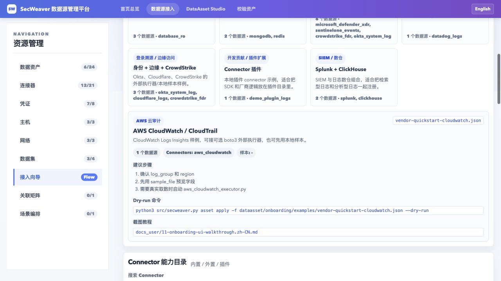

# 11. Data Source Onboarding UI Walkthrough

**Languages:** English (this page) | [简体中文](11-onboarding-ui-walkthrough.zh-CN.md)

This guide is for operators who want to onboard a data source without changing Python code.

## Start the UI

Prepare the environment from the repository root:

```bash
make quickstart
source .venv/bin/activate
export DATAASSET_ROOT=dataasset
```

Edit `dataasset/` directly by default. To isolate local configuration from the repository examples, optionally run the following before saving configuration or credentials:

```bash
if [ ! -e dataasset_my ]; then
  cp -R dataasset dataasset_my
fi
export DATAASSET_ROOT=dataasset_my
```

Preserve an existing `dataasset_my/`. When using isolation, replace configuration paths beginning with `dataasset/` below with `dataasset_my/`; do not replace the program directory `src/dataasset/`.
CLI, UI, and the AI agent must use the same asset root. In new terminals, set the selected `DATAASSET_ROOT` and activate the virtual environment again; specify the root in tasks if a desktop agent does not inherit it.
For either directory, Connector JSON stores credential references only. Do not commit real keys, private keys, encrypted credentials, or customer configuration to the public repository.

Initialize SOPS/age using the [credential guide](../dataasset/credentials/README.md) before saving credentials.

```bash
make ui
```

Open `http://127.0.0.1:8765/onboarding.html`. Run later CLI commands in another configured terminal, or stop the UI with Ctrl+C first.

## Path 0: start from Quickstart

The Quickstart dropdown lists `dataasset/onboarding/examples/*.json`. Choose one and load it to populate the config JSON; the left form mirrors the first data source.

Common examples:

| Example | Scenario |
|---|---|
| `secweaver-saas-sls-proxy-assets.json` | 8 public Logstores and 13 logical assets for SecWeaver SaaS SLS Proxy |
| `vendor-quickstart-cloudwatch.json` | AWS CloudWatch / CloudTrail |
| `vendor-quickstart-cloud-audit-siem.json` | AWS / Azure / GCP audit + Splunk ES |
| `vendor-quickstart-databases.json` | MySQL, SQL Server, and SQLite audit |
| `vendor-quickstart-document-cache.json` | MongoDB + Redis |
| `vendor-quickstart-identity-edge-edr.json` | Okta, Cloudflare, and CrowdStrike external executors |
| `vendor-quickstart-edr-identity-vendors.json` | Defender XDR, SentinelOne, CrowdStrike, Okta, Google Workspace, Entra |
| `vendor-quickstart-plugin-connector.json` | Local connector plugin |

The **Real Vendor Guide** cards are shortcuts for the same examples. Click a card to load it into the form and config editor. The detail panel below the cards shows:

- source count and connector types
- local sample path
- suggested next steps
- the CLI dry-run command

For common vendor onboarding, start with these two cards:

| Card | Use it when |
|---|---|
| Cloud Audit + SIEM | You want AWS CloudTrail, Azure Activity / Entra, GCP Audit, and Splunk ES notable examples together |
| EDR + Identity Sources | You want endpoint and identity sources such as Defender XDR, SentinelOne, CrowdStrike, Okta, Google Workspace, and Entra |

Use the connector catalog search to narrow down `aws`, `splunk`, `defender`, `entra`, or `plugin`. The source filter separates built-in connectors, config-only external connectors, and plugins.

## Path A: built-in connector

Use this for `sls`, `es`, `ssh_file`, `database_ro`, `http_api`, `splunk`, `clickhouse`, and other registered types.

1. Choose `Connector Type`.
2. The page shows only the relevant connection fields for that connector.
3. Fill credentials, such as `vault://sls/security-readonly`.
4. Fill connection parameters, such as project/logstore, url/index, or database/collection.
5. Choose `Asset Type`.
6. Fill parser, fields, aliases, and coverage.
7. Fill template params and query.
8. Generate config.
9. Preview the three-file kit.
10. Write DataAsset files.

CLI equivalent:

```bash
python3 src/secweaver.py asset apply --output-dir "$DATAASSET_ROOT" \
  -f dataasset/onboarding/examples/data-sources.sample.json \
  --dry-run
```

## Path B: CloudWatch external executor

Use the `AWS CloudWatch / CloudTrail` card first. It shows the suggested steps, sample path, and dry-run command. After loading the example, the form switches to `aws_cloudwatch`.

When `aws_cloudwatch` is selected, the connector guide shows:

- runtime: built-in fetch / optional external executor; this section demonstrates the external executor, which is not needed for built-in queries
- query key: `cloudwatch_query`
- optional executor: `examples/executors/aws_cloudwatch_executor.py`



Run the optional executor:

```bash
python3 -m pip install boto3
python3 examples/executors/aws_cloudwatch_executor.py --port 8788
```

Then set:

| Field | Example |
|---|---|
| Endpoint | `http://127.0.0.1:8788/fetch` |
| Region | `ap-southeast-1` |
| CloudWatch Log Group | `/aws/cloudtrail/organization` |
| Credentials Ref | `vault://aws/security-readonly` |
| Template Query | `cloudwatch_query` |

Copyable config:

```bash
python3 src/secweaver.py asset apply --output-dir "$DATAASSET_ROOT" \
  -f dataasset/onboarding/examples/vendor-quickstart-cloudwatch.json \
  --dry-run
```

## Path C: config-only connector type

Register the connector type in:

```text
dataasset/configure/external-connectors.json
```

Then refresh the UI. If the type has no dedicated onboarding directory, SecWeaver uses the generic external template.

Example:

```bash
python3 src/secweaver.py asset apply --output-dir "$DATAASSET_ROOT" \
  -f dataasset/onboarding/examples/vendor-quickstart-external-connector.json \
  --dry-run
```

## Path D: connector plugin

Use this when the connector needs local code or SDKs but should stay outside core dependencies. Add a plugin directory under:

```text
src/dataasset/plugins/connectors/<plugin_name>/
```

The demo `demo_plugin_logs` plugin is already available and appears in the Connector Type dropdown after the UI is refreshed. Preview it with:

```bash
python3 src/secweaver.py asset apply --output-dir "$DATAASSET_ROOT" \
  -f dataasset/onboarding/examples/vendor-quickstart-plugin-connector.json \
  --dry-run
```

See [`docs_dev/04-connector-plugins.md`](../docs_dev/04-connector-plugins.md) for the manifest and stdio-json protocol.

## After writing

```bash
python3 src/dataasset/validate.py --json --only-active
python3 src/dataasset/test_connector.py YOUR_ASSET_ID --by-asset --plan --dry-run
```

For a new log format, keep `status: discovery` and run format discovery before promoting to active.

```bash
python3 src/skills/log-format-discovery/scripts/discover.py \
  --asset-id YOUR_ASSET_ID \
  -i examples/your-sample.jsonl \
  --apply --apply-dry-run
```

## Common errors

| Symptom | Action |
|---|---|
| Your connector type is absent from the dropdown | Check its registration in `external-connectors.json` or the plugin's `plugin.json`, then refresh the page |
| Preview reports an unknown field | Put connector-specific values under `connector.config`, or add a supported field to `data-sources.schema.json` |
| The query key is rejected | Follow the field hint shown by the UI; CloudWatch, for example, uses `cloudwatch_query` |
| Active validation fails | Keep a new source in `discovery` or `draft` until field and connectivity checks pass |
| An external executor returns no records | Validate its fields and template with `sample_file` before connecting a live endpoint |
