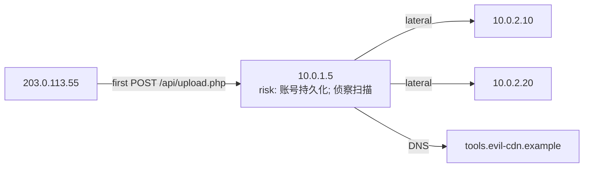
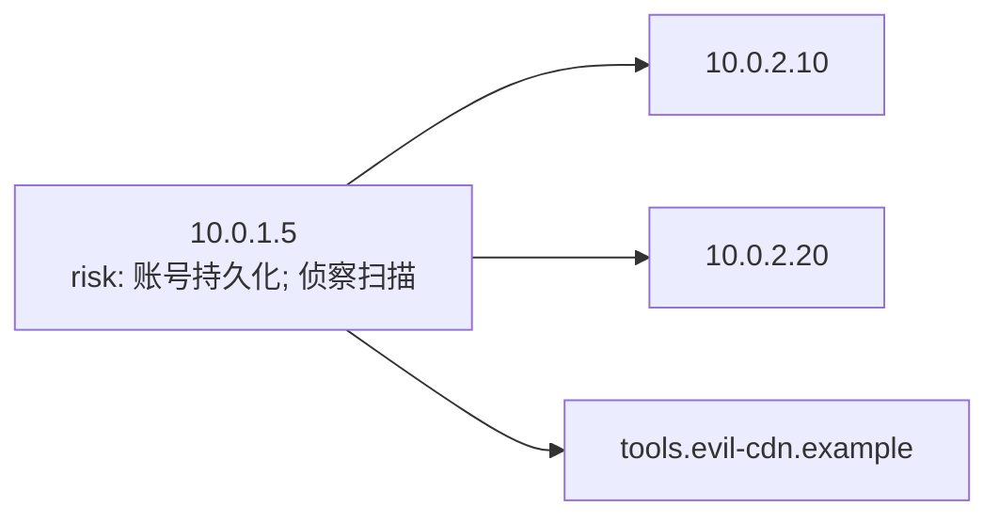

## Traceability Analysis Report

**Scenario**: S1 + S2 + S3
**Verdict**: Confirmed intrusion chain (confidence 0.88, ceiling 0.88)

### Attack narrative

攻击者 203.0.113.55 于 2026-06-22T09:07:55 命中 10.0.1.5；在 10.0.1.5 上发现 4 条执行/下载行为；发现 1 条 DNS/C2/外传域名证据；至少横向至 10.0.2.10, 10.0.2.20；matrix 关联覆盖 5/11 条 join。

### Initial entry (first breach point)

- **Host**: 10.0.1.5
- **Time**: 2026-06-22T09:07:55+08:00
- **URL**: http://10.0.1.5/api/upload.php
- **Vector**: webshell
- **Entry role**: observed_control_point
- **Compromise point status**: unresolved
- **First observed control URL**: http://10.0.1.5/api/upload.php
- **Attacker IP**: 203.0.113.55
- **Primary evidence**: web-001
- **Supporting evidence**: exec-001, waf-001, web-002, web-003, waf-002

### Attacker IP profile

- **IP**: 203.0.113.55
- **Scope**: private
- **Summary**: 内网地址

- **Evidence**: waf-001, waf-002, web-001, web-002, web-003

### Attack path graph

### Attack timeline

> The attack timeline is a wide Markdown table; detailed URLs/commands remain in JSON timeline[].raw_behavior and can be reviewed by evidence ID.
> Source columns: ✓ = evidence present in that source; ✗ = not visible.
| Time | Stage | Host | Description | ATT&CK | Evidence | WAF | Gateway | Host Exec | Host Connect | File Op | SSH Auth | Firewall | DNS | Inventory |
| --- | --- | --- | --- | --- | --- | --- | --- | --- | --- | --- | --- | --- | --- | --- |
| 2026-06-22T09:07:55+08:00 | web_attack | 10.0.1.5 | WEB请求 POST /api/upload.php status=200 | T1190 | web-001 | ✗ | ✓ | ✗ | ✗ | ✗ | ✗ | ✗ | ✗ | ✗ |
| 2026-06-22T09:07:55+08:00 | initial_access | 10.0.1.5 | 初始入口命中 /api/upload.php（webshell） | T1190 | web-001, exec-001, waf-001, web-002, web-003, waf-002 | ✓ | ✓ | ✓ | ✗ | ✗ | ✗ | ✗ | ✗ | ✗ |
| 2026-06-22T09:07:58+08:00 | web_attack | 10.0.1.5 | WEB请求 POST /api/upload.php action=logged rule=PHP | T1190 | waf-002 | ✓ | ✗ | ✗ | ✗ | ✗ | ✗ | ✗ | ✗ | ✗ |
| 2026-06-22T09:08:02+08:00 | web_attack | 10.0.1.5 | WEB请求 GET /api/upload.php?cmd=whoami status=200 | T1190 | web-002 | ✗ | ✓ | ✗ | ✗ | ✗ | ✗ | ✗ | ✗ | ✗ |
| 2026-06-22T09:08:05+08:00 | web_attack | 10.0.1.5 | WEB请求 POST /api/upload.php?cmd=whoami action=block rule=SQL | T1190 | waf-001 | ✓ | ✗ | ✗ | ✗ | ✗ | ✗ | ✗ | ✗ | ✗ |
| 2026-06-22T09:10:08+08:00 | web_attack | 10.0.1.5 | WEB请求 POST /upload/shell.php status=200 | T1190 | web-003 | ✗ | ✓ | ✗ | ✗ | ✗ | ✗ | ✗ | ✗ | ✗ |
| 2026-06-22T09:10:45+08:00 | execution | 10.0.1.5 | matrix join d2_exec_file_same_host: host_file_op @ 10.0.1.5 | T1059 | exec-001, file-001, exec-002, exec-003, exec-004 | ✗ | ✗ | ✓ | ✗ | ✓ | ✗ | ✗ | ✗ | ✗ |
| 2026-06-22T09:12:28+08:00 | exfiltration | 10.0.1.5 | DNS 查询 tools.evil-cdn.example，type=A，answer=198.51.100.5 | T1048 | dns-001 | ✗ | ✗ | ✗ | ✗ | ✗ | ✗ | ✗ | ✓ | ✗ |
| 2026-06-22T09:12:28+08:00 | exfiltration | 10.0.1.5 | matrix join host_connect_to_dns: 10.0.1.5 resolved tools.evil-cdn.example near egress 198.51.... | T1048 | connect-001, dns-001 | ✗ | ✗ | ✗ | ✓ | ✗ | ✗ | ✗ | ✓ | ✗ |
| 2026-06-22T09:12:30+08:00 | execution | 10.0.1.5 | matrix join d2_exec_connect_same_listener: host_connect @ 10.0.1.5 | T1059 | exec-001, connect-001, exec-002, exec-003, exec-004 | ✗ | ✗ | ✓ | ✓ | ✗ | ✗ | ✗ | ✗ | ✗ |
| 2026-06-22T09:12:35+08:00 | execution | 10.0.1.5 | matrix join d2_exec_file_same_host: host_file_op @ 10.0.1.5 | T1059 | exec-001, file-002, exec-002, exec-003, exec-004 | ✗ | ✗ | ✓ | ✗ | ✓ | ✗ | ✗ | ✗ | ✗ |
| 2026-06-22T09:19:08+08:00 | execution | 10.0.1.5 | matrix join d2_exec_connect_same_listener: host_connect @ 10.0.1.5 | T1059 | exec-004, connect-002 | ✗ | ✗ | ✓ | ✓ | ✗ | ✗ | ✗ | ✗ | ✗ |
| 2026-06-22T09:19:15+08:00 | lateral_movement | 10.0.2.10 | SSH 横向登录确认 2026-06-22T09:19:15+08:00 | T1021.004 | exec-001, ssh-002, exec-002, exec-003, exec-004 | ✗ | ✗ | ✓ | ✗ | ✗ | ✓ | ✗ | ✗ | ✗ |
| 2026-06-22T09:22:40+08:00 | lateral_movement | 10.0.2.20 | SSH 横向登录确认 2026-06-22T09:22:40+08:00 | T1021.004 | exec-001, ssh-003, exec-002, exec-003, exec-004 | ✗ | ✗ | ✓ | ✗ | ✗ | ✓ | ✗ | ✗ | ✗ |
### MITRE ATT&CK
- **Techniques**: T1190 (Exploit Public-Facing Application); T1059; T1048 (Exfiltration Over Alternative Protocol); T1021.004 (SSH); T1082 (System Information Discovery); +7
- **Tactics**: TA0001, TA0010, TA0008, TA0007, TA0002, TA0011, TA0005, TA0003, TA0006

### Lateral movement

**Confirmed lateral:**
- login confirmed 2026-06-22T09:19:15+08:00 | 10.0.2.10: matrix join host_ip_to_ssh_auth_lateral: SSH 10.0.1.5 → 10.0.2.10 用户 root
- login confirmed 2026-06-22T09:22:40+08:00 | 10.0.2.20: matrix join host_ip_to_ssh_auth_lateral: SSH 10.0.1.5 → 10.0.2.20 用户 deploy

### Impact scope

| Host | Role | Priority | Notes |
| --- | --- | --- | --- |
| 10.0.1.5 | initial_compromise | P0 |  |
| 10.0.2.10 | lateral_target | P0 |  |
| 10.0.2.20 | lateral_target | P0 |  |

### Recommended actions

1. 立即隔离初始受害主机: 10.0.1.5
2. 排查并隔离横向目标（至少）: 10.0.2.10, 10.0.2.20
3. 保全 WEB 与 SSH 相关日志，冻结当前时间窗证据
4. 重置横向涉及主机上的可疑账号密码，检查 SSH 密钥

### Data gap impact

- no_match:web_access_to_host_exec (WEB 请求落到主机命令执行（攻击是否成功）)
- no_match:attacker_ip_to_ssh_auth (外网攻击 IP 是否尝试/成功 SSH 登录)
- no_match:victim_host_to_waf_by_target_ip (已知受害 host_ip（params.target_ip），反查 WAF 告警（upstream_addr→target_ip）并还原攻击源 src_ip)
- no_match:victim_host_to_web_access_by_target_ip (已知受害 host_ip，反查网关 access（upstream_addr→target_ip）并关联 web_access_to_host_exec)
- no_match:ssh_auth_to_host_exec_same_host (SSH 登录成功后主机上的命令执行)
- no_match:host_to_cmdb (主机行为映射到资产清单（区域、负责人、服务）)
- 横向结论基于部分 SSH 覆盖，需标注「至少」

### Open questions / hypotheses

- 关联缺口：no_match:web_access_to_host_exec (WEB 请求落到主机命令执行（攻击是否成功）) (confidence 0.45)
- 关联缺口：no_match:attacker_ip_to_ssh_auth (外网攻击 IP 是否尝试/成功 SSH 登录) (confidence 0.45)
- 关联缺口：no_match:victim_host_to_waf_by_target_ip (已知受害 host_ip（params.target_ip），反查 WAF 告警（upstream_addr→target_ip）并还原攻击源 src_ip) (confidence 0.45)
- 关联缺口：no_match:victim_host_to_web_access_by_target_ip (已知受害 host_ip，反查网关 access（upstream_addr→target_ip）并关联 web_access_to_host_exec) (confidence 0.45)
- 关联缺口：no_match:ssh_auth_to_host_exec_same_host (SSH 登录成功后主机上的命令执行) (confidence 0.45)
- 关联缺口：no_match:host_to_cmdb (主机行为映射到资产清单（区域、负责人、服务）) (confidence 0.45)

### Evidence fetch

## 数据取数统计

- **取数模式**: — / —
- **时间窗**: 2026-06-22T08:00:00+08:00 ~ 2026-06-22T12:00:00+08:00
- **攻击源 IP**: 203.0.113.55
- **锚定告警时间**: 2026-06-22T09:08:05+08:00
- **该 IP 日志时间范围**: 2026-06-22T09:07:55+08:00 ~ 2026-06-22T09:10:08+08:00 （匹配 5 条，带时间戳 5 条，来源 `waf_alert`, `web_access_log`）
- **总事件数（最终保留）**: 22
- **非 connector 拉取证据**: 22 （`asset_inventory`: 3, `dns_log`: 1, `firewall_log`: 2, `host_connect`: 2, `host_exec`: 4, `host_file_op`: 2, `ssh_auth`: 3, `waf_alert`: 2, `web_access_log`: 3；例如资产注册表注入）

### 按 asset_type

- `host_exec`: 4
- `asset_inventory`: 3
- `ssh_auth`: 3
- `web_access_log`: 3
- `firewall_log`: 2
- `host_connect`: 2
- `host_file_op`: 2
- `waf_alert`: 2
- `dns_log`: 1

- **Matched pattern**: web_shell_to_ssh_lateral
