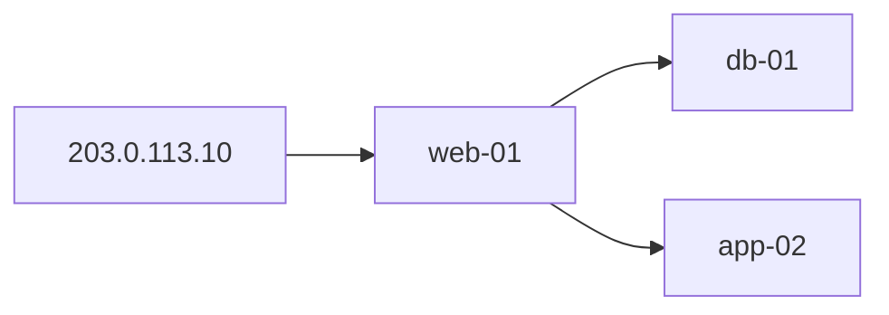

# Traceability Analysis

SecWeaver Skill: after minimum data requirements are met, **reconstruct attack chains across sources** — initial entry, lateral paths, and impact scope.

**Role:** Completeness answers “can we investigate?”; **risk-identification** lists **per-event anomalies**; this Skill answers “**how do they connect into an attack chain?**”

Machine-readable output contract: [`output-schema.json`](output-schema.json). Blocked and
successful analyses use the same versioned envelope and expose evidence gaps explicitly.

## Upstream: risk-identification

Use **after** [risk-identification](../risk-identification/SKILL.md) when:

- `risk_items[]` contain P0/P1 on multiple hosts, or lateral hints (sshpass, SSH brute src→dst)
- User asks for the first breach point, a source-to-target host narrative, multi-round drill interpretation, or a timeline across sources

| risk-identification output | traceability-analysis use |
|---|---|
| `risk_items[]` + `evidence_refs` | Seed nodes and anchor times |
| `top_incidents[]` | Priority investigation queue |
| `params.hosts` / time window | Scope BFS and correlation |
| `evidence_bundles` (refetch or pass-through) | Cross-source join (exec + ssh_auth + web + file_op) |

**Do not** duplicate P0/P1 triage here — consume upstream anomalies and **add correlation only**.

## Behavior Learning Evidence

When host exec/network/file records contain learning metadata, also query available host_behavior_summary assets
for the same host/time. Report learning_state, suppressed_count, counter_complete and gaps.
Deduplicate summary_id; aggregate counts are not individual executions and carry no PID edges.
context_only events are replayed evidence with their original event_id/time, not additional executions.
Missing raw exec during suppression is not evidence that no command ran. If summary coverage is absent,
explicitly mark that evidence gap; do not substitute summaries for raw host_exec completeness.
Group aggregate counts by source_event_type. Legacy nonempty summaries without this field
describe exec; network/file summaries cannot satisfy raw connection/file evidence or be added
to execution counts. Missing originals of any suppressed type do not establish absence of activity.

## Preconditions (hard gate)

Check `completeness_precheck` before start:

| Condition | Otherwise |
|---|---|
| `next_skill_blocked = false` | Output `insufficient_evidence`; no confirmed conclusions |
| `overall_verdict` ∈ `full_traceable`, `partial_traceable` | Abort or label very low confidence |

If user skips precheck: recommend **data-source-completeness** Skill first, or set `confidence_ceiling ≤ 0.7` and label “no completeness precheck.”

## When to use

- Known external attack IP — find **first breach point** and **lateral scope**
- **Victim host only** (`target_ip` / `hosts`) with unknown attacker — **must** auto-fetch D1 (WAF + gateway access) to resolve external IP (see **D1 attacker IP bootstrap** below)
- After WEB breach — reconstruct WebShell → tool download → SSH lateral chain
- After alert confirmation judged “real attack and success” — extend full attack chain
- Upstream completeness recommends `next_skill: traceability_analysis`
- **risk-identification** returned P0/P1 with multi-host or lateral indicators (`recommended_next_skills`)

## Input

```json
{
  "investigation_intent": "Alert time A, hacker IP A — find first breach point and lateral scope",
  "scenarios": ["S1", "S3"],
  "params": {
    "attacker_ip": "203.0.113.10",
    "alert_time": "2026-06-21T10:00:00+08:00",
    "time_start": "2026-06-21T08:00:00+08:00",
    "time_end": "2026-06-21T20:00:00+08:00",
    "host_ips": {"web-01": "10.0.1.5"},
    "seed_hosts": []
  },
  "completeness_precheck": {
    "overall_verdict": "full_traceable",
    "confidence": 0.88,
    "next_skill_blocked": false,
    "data_gaps": []
  },
  "evidence_bundles": {
    "waf_alert": [],
    "web_access_log": [],
    "host_exec": [],
    "host_connect": [],
    "host_file_op": [],
    "ssh_auth": [],
    "firewall_log": [],
    "dns_log": [],
    "asset_inventory": []
  }
}
```

- `evidence_bundles`: **retrieved real events** — analyze only existing evidence; **do not fabricate**
- Events may carry `evidence_id` as `evidence_refs`
- Platform may call `scripts/correlate.py` for attack_chain skeleton; AI agent adds summary and hypotheses

## Assessment workflow

Execute in order; do not skip:

```text
Step 0  Gate: read completeness_precheck; if blocked, abort
Step 1  Anchor: attacker_ip / alert_time; first events from waf_alert, web_access_log
Step 2  Entry: determine initial_access (WebShell URL, vector, host)
Step 3  Host behavior: on entry host correlate exec → connect → file_op (time windows in rules.md)
Step 4  Lateral: host_ips[entry] as src; BFS ssh_auth Accepted + firewall :22
Step 5  Graph: attack_chain + lateral_movement_graph + timeline
Step 6  Conclusion: overall_verdict, confidence (capped by ceiling), actions, data_gaps_impact
Step 7  Output JSON (`correlate.py --no-markdown-report --no-notify`)
Step 8  Agent writes Markdown investigation report per template below (default path; no simplified hand-written tables)
```

Optional: run `python3 src/skills/traceability-analysis/scripts/correlate.py ...` for JSON skeleton first.

**Deterministic vs Agent division**

| Step | Owner | Notes |
|---|---|---|
| Fetch / matrix join / verdict skeleton | `correlate.py` | Repeatable, auditable |
| `attack_chain` / `timeline` / `evidence_refs` | `correlate.py` | Source of truth; Agent must not alter facts |
| **Markdown report (human-readable)** | **Agent (Cursor)** | Organize narrative per this Skill template |
| Script `markdown_report` | `trace_report_markdown.py` | Optional; CI / webhook fallback; **off by default in Agent chat** |

## Scenarios (reuse S1–S8)

| ID | Traceability focus |
|---|---|
| S1 | Entry host, first breach, lateral list |
| S2 | WebShell path, dropped files |
| S3 | Jump graph, SSH login sequence |
| S5 | Extend from exec anomaly to trigger source and follow-on egress |
| S6/S7 | Account compromise chain, exfil path |
| S8 | C2 callback process, domain, and network-session path |

Primary scenario **public S1/S3 traceability scenarios**: S1 + S3 (external IP → WEB → SSH lateral).

## D1 attacker IP bootstrap (mandatory)

When params include a **victim host** (`target_ip`, `hosts`, `seed_hosts`) but **no** `attacker_ip` / `attacker_ips`, `--fetch` and evidence-fetch **must** run D1 bootstrap **before** correlation fetch — do not only note missing WAF/web_access without pulling data.

| Item | Detail |
|---|---|
| Trigger | `target_ip` or `hosts[0]` + `time_start` set, no `attacker_ip` |
| Opt-out | `resolve_attacker_ip: false` |
| Default D1 assets | `asset-waf-prod-01`, `asset-secweaver-gateway-access` (private registries may resolve a legacy compatibility alias) |
| Phase 1 | `web_access_by_target_ip_time` + `waf_gateway_plugin_by_time` (time window; avoids missing upstream_addr index) |
| Phase 2 | `waf_gateway_plugin_by_ip_time` for resolved external IPs |
| Victim match | `upstream_addr` with port (e.g. `192.0.2.91:80`) |
| Output | `attacker_ip_resolution` (`method`: `d1_reverse_lookup` / `params` / heuristic) |
| IP profile | When `attacker_ip` is resolved, auto-fill `attacker_ip_profile` (evidence geo + VirusTotal / ipwho.is / ip-api online attributes) |

When an explicit asset-list fetch uses `waf_gateway_plugin_by_target_ip_time` and the indexed
`upstream_addr` query fails or returns no rows, the fetch must degrade in two bounded steps:
first retry `waf_gateway_plugin_by_ip_time` for source IPs already correlated from gateway access;
if no source IP is available, retry `waf_gateway_plugin_by_time` and filter the candidate rows in
the application by `target_ip`, gateway host, and normalized path. The output must expose
`data_access.waf_target_fallback` with the reason, fallback mode, candidate count, matched count,
and fallback templates. A zero result after both retries means no correlated WAF evidence, not an
unexecuted or unavailable WAF asset.

After resolving an external attacker IP, `correlate.py` **automatically** builds `attacker_ip_profile`:

1. **Evidence geo** (preferred): aggregate `country` / `province` / `city` from WAF / gateway access
2. **Online enrichment** (default on): read `dataasset/configure/ip-intel.json`; in `auto` mode, use VirusTotal IP report first when `virustotal.credentials_ref` resolves, then fall back to ipwho.is and finally legacy ip-api.com according to config
3. Output `attributes[]` and `summary` for the Agent **Attacker IP profile** section

| Opt-out | Effect |
|---|---|
| `--no-ip-intel` | Skip entire `attacker_ip_profile` |
| `"ip_intel_online": false` in params | Evidence geo only, no online API |
| `"resolve_attacker_ip_profile": false` | Same as `--no-ip-intel` |

| Config / temporary parameter | Effect |
|---|---|
| `dataasset/configure/ip-intel.json` | Main config file for `default_provider`, provider URL, timeout, fallback, and `credentials_ref` |
| `providers.virustotal.credentials_ref` | Default `vault://threat-intel/virustotal`; the real token lives in the SOPS Vault |
| `"ip_intel_provider": "auto"` | Temporary override; prefer VirusTotal when credentials resolve, then fall back to ipwho.is and legacy ip-api.com according to config |
| `"ip_intel_provider": "virustotal"` | Temporarily force VirusTotal; missing credentials returns `config_missing` and does not fall back |
| `"ip_intel_provider": "ipwhois"` | Temporarily force ipwho.is no-key lookup |
| `"ip_intel_provider": "ip-api"` | Temporarily force the legacy ip-api.com lookup |
| `"virustotal_api_key"` / `"vt_api_key"` | Debug-only override; production must not put keys in params, shell history, or result files |

Reports should reference `attacker_ip_profile.online_lookup.provider` and `attributes[]`; for `virustotal`, prefer VT detection stats, reputation, ASN/owner, and network.

### Attacker IP normalization

WAF, gateway, and other D1 source fields pass through the shared `normalize_ip()` before entering the evidence index:

- trim whitespace and single/double quotes left by CSV-like exports;
- normalize IPv4 `ip:port` values to the bare IP;
- exclude `-`, `null`, `none`, `unknown`, and invalid values from attacker-IP joins;
- use the same canonical value for `initial_access.attacker_ip`, the WAF/gateway `waf_to_web_access_by_ip` join, attacker first/last log timestamps, and IP intelligence.

Raw events remain available in the evidence archive; only canonical fields and correlation keys use the cleaned IP so export formatting cannot split one attacker into multiple identities.

## Default attacker observation window convergence (mandatory)

When params include `attacker_ip` / `src_ip` and first-pass WAF / gateway access evidence establishes `first_seen` / `last_seen`, `--fetch` narrows downstream impact collection to `first_seen - padding` through `last_seen + padding` by default. This keeps same-day earlier operational or suspicious events out of the primary chain.

| Item | Behavior |
|---|---|
| Default padding | 300 seconds before and after |
| Applies to | D1 evidence pruning, matrix host fetch, second-hop impact fetch, and missing-asset fetch for `--full-impact-fetch` |
| Output | `data_access.attacker_ip_window_narrowing`; when evidence is pruned, `evidence_filter.dropped_by_asset_type` and `dropped_by_asset_id` record the drops |
| Opt-out | `"auto_narrow_attacker_window": false` |
| Tuning | `"attacker_window_before_seconds"` / `"attacker_window_after_seconds"` |

Within a converged window, query planning must also collapse semantically redundant work:

- For one host-persistence asset, host, and time window, prefer one `host_ip` query over separate host/host_ip aliases.
- For syslog risk, drop an external-IP SSH query when complementary source-host, host-text, and `__source__` queries cover the trace and the external query is redundant. Keep all three complementary host-side queries because SLS meta-field coverage is not equivalent to an OR over ordinary fields.
- Record every suppressed task in `data_access.reused_correlation_tasks`; do not hide it from audit metadata.

Configure the real VT key:

```bash
# Run from the repository root; change DATAASSET_ROOT for an isolated catalog.
DATAASSET_ROOT=dataasset src/dataasset/credentials/sops-vault.sh edit vault://threat-intel/virustotal
```

Implementation: `src/skills/_shared/data-access/trace_d1_bootstrap.py`, invoked from `fetch_scenario_evidence()` and asset-list fetch; `enriched_params.attacker_ip` is merged back into `params` for matrix joins.

**Asset-list mode auto-appends D1 assets** even when the bundle only lists exec/syslog assets.

Asset-list mode must also run the lateral two-phase fetch. First query the SSH-auth
view by each source host (`ssh_auth_by_src_ip_time`) within the active time window to
discover successful logins and their victim hosts. Then query each discovered target
with `ssh_auth_by_host_ip_time` and fetch target-side `host_exec`, `host_connect`, and
`host_file_op` evidence. When a `syslog_risk_alert` asset declares
`covers_asset_types=["ssh_auth"]`, force the SSH-auth templates for these phases;
`syslog_risk_by_host_ip_time` alone is not sufficient for lateral verification.

The resulting `data_access.second_hop_impact_fetch` records discovery queries, target
queries, and target hosts. This prevents a successful `event_type=ssh_login_success`
on a second host from being reported as missing merely because the initial asset-list
query was scoped to the entry host.

```bash
# Asset-list mode (no --from-bundle): D1 bootstrap on by default
python3 src/skills/traceability-analysis/scripts/correlate.py \
  --asset-id asset-secweaver-host-exec \
  --asset-id asset-secweaver-sys-risk-alert \
  --fetch --no-notify \
  --params '{"target_ip":"192.0.2.91","hosts":["192.0.2.91"],"time_start":"2026-07-06T07:25:00+08:00","time_end":"2026-07-06T07:27:34+08:00"}'

python3 src/skills/traceability-analysis/scripts/correlate.py \
  --from-bundle --bundle bundle-alert-confirm-min \
  --fetch --no-notify \
  --params '{"target_ip":"192.0.2.91","hosts":["192.0.2.91"],"time_start":"2026-07-05T21:30:00+08:00","time_end":"2026-07-05T21:40:34+08:00"}'
```

## overall_verdict

| verdict | Meaning |
|---|---|
| `confirmed_intrusion_chain` | Entry + execution + lateral all have direct evidence |
| `likely_intrusion_chain` | Highly suspected; some steps indirect |
| `initial_access_only` | Breach evidence; no SSH Accepted |
| `scanning_or_attempt_only` | WAF/scan only; no host_exec |
| `insufficient_evidence` | Precheck blocked or insufficient evidence |

### Hard constraints

- No `host_exec` → no `confirmed_intrusion_chain`
- No SSH Accepted → lateral at most `likely`; wording must not be “confirmed lateral to N hosts” without “at least”
- SSH coverage partial → `impacted_assets` must include `note: may be incomplete`
- Every `attack_chain` entry must have `evidence_refs`

## Output JSON

```json
{
  "alert_type": "traceability_analysis",
  "fetch_summary": {
    "total_events": 120,
    "total_deduplicated_events": 12,
    "total_window_filtered_events": 8,
    "by_asset_type": {"host_exec": 80, "ssh_auth": 40},
    "fetch_mode": "live",
    "time_window": {"time_start": "...", "time_end": "..."}
  },
  "scenario": ["S1", "S3"],
  "overall_verdict": "confirmed_intrusion_chain",
  "confidence": 0.86,
  "confidence_ceiling": 0.88,
  "summary": "Executive summary",
  "attacker_ip_resolution": {
    "resolved": true,
    "attacker_ip": "39.144.124.99",
    "attacker_ips": ["39.144.124.99"],
    "target_ip": "192.0.2.91",
    "method": "d1_reverse_lookup",
    "d1_assets": ["asset-waf-prod-01", "asset-secweaver-gateway-access"],
    "web_access_event_count": 47,
    "waf_event_count": 1
  },
  "initial_access": {},
  "attack_chain": [],
  "lateral_movement_graph": {"nodes": [], "edges": []},
  "impacted_assets": [],
  "lateral_findings": {"confirmed": [], "suspected": [], "unknown": []},
  "timeline": [],
  "timeline_source_types": ["waf_alert", "web_access_log", "host_exec"],
  "hypotheses": [],
  "data_gaps_impact": [],
  "recommended_actions": [],
  "matched_pattern": "web_shell_to_ssh_lateral",
  "mitre_attack": {
    "techniques": [{"id": "T1190", "name": "Exploit Public-Facing Application", "tactic": "initial_access", "tactic_id": "TA0001"}],
    "tactics": [{"id": "TA0001", "name": "initial_access"}],
    "technique_ids": ["T1190", "T1505.003", "T1021.004"],
    "tactic_ids": ["TA0001", "TA0003", "TA0008"]
  },
  "mitre_attack_by_stage": [],
  "top_mitre_techniques": "T1190 (Exploit Public-Facing Application); T1505.003 (Web Shell); +2",
  "evidence_index": {}
}
```

`mitre_attack` is populated by `correlate.py` using shared [attck-map.json](../risk-identification/rules/attck-map.json): stage `mitre_id` plus evidence keyword signals (shadow, webshell, sshpass, etc.) → `matched_rules` / `policy_rules`.

`timeline[]` must carry `mitre_id` (same as `attack_chain`) and `raw_behavior` (raw URL, command, connection target, or log behavior).

**Report modes**

| `report_mode` | Trigger | Meaning |
|---|---|---|
| `agent` (default in chat) | `--no-markdown-report` | JSON only; Agent writes report per template |
| `script` | default CLI (no flag) | includes `markdown_report` (CI / webhook) |

Recommended Agent invoke: keep the completeness precheck enabled by default; do not add `--skip-completeness`.

```bash
python3 src/skills/traceability-analysis/scripts/correlate.py \
  --asset-id asset-secweaver-host-exec \
  --fetch --no-notify --no-markdown-report \
  --params '{"target_ip":"192.0.2.91","hosts":["192.0.2.91"],"time_start":"...","time_end":"..."}' \
  -o /tmp/trace.json
```

## Markdown investigation report (Agent required)

After `correlate.py`, the **Agent must** read JSON (`overall_verdict`, `attack_chain`, `timeline`, `impacted_assets`, `hypotheses`, `data_gaps_impact`, …) and output Markdown per the template below. Do **not** skip correlate or invent events. Do **not** paste a simplified custom table.

**Agent writing rules**

1. **Facts only** from JSON and `evidence_refs`
2. **Verdict ceiling**: do not exceed JSON `overall_verdict` / `confidence_ceiling`
3. **Lateral wording**: per table below; no “confirmed lateral to N hosts” without SSH Accepted
4. **Attack timeline**: must include WEB-layer attack actions (matched WAF / gateway access URL requests, `stage=web_attack`); merge low-value repetitive exec (ping/date heartbeats); keep **8–15** high-signal rows; each row needs `evidence_refs`
5. **Do not put raw behavior in the table**: keep `timeline[].raw_behavior` in JSON for evidence review, but the human-readable attack timeline must **not** display a `Raw behavior` column. Summarize long URLs / detailed commands in `Description` with only the key path, command category, or target address so Markdown table layout remains readable.
6. **Wide table display**: render the attack timeline as a Markdown pipe table (GFM table) so it keeps table structure; width mainly comes from source columns and can be inspected by horizontal scroll. **Do not output HTML `<div>` / `<table>`**, because the current UI shows raw HTML literally; **do not use fenced `text` code blocks**, because they scroll but are not table structure.
7. **Source columns**: use `timeline[].source_coverage` or `timeline_source_types` for ✓/✗
8. **Ignore** `markdown_report` when `report_mode=agent` or `--no-markdown-report`
9. **Attacker IP profile**: if `attacker_ip_profile` exists, include **Attacker IP profile** section from JSON; do not invent ISP/ASN was used
10. **Attack path graph is mandatory**: include an **Attack path graph** Mermaid block. Even without lateral movement, show `attacker_ip → initial_access.host/target_ip`. If WAF / gateway access or a full URL identifies the gateway address, render the entry path as `attacker_ip → WAF/Gateway(domain:port or IP) → initial_access.host/target_ip`, and label the attacker-to-gateway edge with the first WEB attack packet (method + path/query summary). The lateral section must only describe lateral movement, not replace the entry graph. If any host has malicious/high-risk command evidence in `host_high_risk_summary`, `lateral_findings[].high_risk_summary`, or attributable `timeline[].raw_behavior`, include a concise summary in that host node label, e.g. `192.0.2.92<br/>risk: steal credential files; sudo/priv esc; discovery/scan`.
11. **Initial URL completeness**: prefer a full `scheme://host/path` `initial_access.url`; if the raw WAF/access row only has a path but includes `http_host` / Host header, reconstruct the full URL.
12. **Per-asset fetch statistics are mandatory**: render every row in `fetch_summary.asset_fetch_stats[]` with request count, actual query count, cache hits, successful/failed count, cumulative fetched events, final retained events, `deduplicated_count`, and `window_filtered_count`. Cumulative fetched events must sum successful connector query responses only; cache reuse must not be counted again. Do not substitute deduplicated `by_asset_type` counts, and keep failed queries visible. `duplicate_or_filtered_count` remains compatibility-only and must not replace the two explicit columns.
13. **Initial evidence groups**: `initial_access.primary_evidence_refs` contains the decisive entry event(s); correlation expansion belongs in `supporting_evidence_refs`. Keep `evidence_refs` as their compatibility union.
14. **Lateral timestamps**: an exec-derived SSH attempt upgraded by Accepted evidence must retain both `attempt_timestamp` and `confirmed_timestamp`; do not present the attempt time as the login-success time.
15. **Remote execution target**: SSH/sshpass execution stages must carry `execution_target_host` (and `execution_target_hosts` when multiple) while `host` remains the command-origin host.
16. **First compromise point semantics**: for external WEB attacks, prefer a successful exploit trigger (`web_exploit:rce` / `web_exploit:sqli`) over a request to an already-present WebShell. Record the latter separately as `first_observed_control_url`. If only WebShell control is observed, set `first_compromise_point_status=unresolved`; do not claim the WebShell URL is the original breach vector.

Script fallback (`trace_report_markdown.py`) when no Agent is available; Agent-authored narrative is preferred.

```markdown
## Traceability Analysis Report

**Scenario**: {S1 + S3, etc.}
**Verdict**: {verdict} (confidence {confidence}, ceiling {confidence_ceiling})

### Attack narrative
{4-8 sentences}

### Initial entry (first breach point)
- Host / time / URL / vector / evidence ID

### Attack path graph
```mermaid
graph LR
  attacker["{attacker_ip or unknown source}"] -->|first {method path?query}| waf["WAF/Gateway<br/>{gateway_host:port or gateway_ip}"]
  waf -->|hit {initial path?query}| initial["{initial_access.host or target_ip}<br/>risk: {initial host high-risk command summary, optional}"]
  initial --> lateral["{lateral host}<br/>risk: {lateral target malicious command summary, e.g. steal credential files; sudo/priv esc}"]
```

### Attack timeline
> The attack timeline is a wide Markdown table; detailed URLs/commands remain in JSON `timeline[].raw_behavior` and can be reviewed by evidence ID.

| Time | Stage | Host | Description | ATT&CK | Evidence | {source columns: ✓/✗ per data source} |
|---|---|---|---|---|---|---|---|
| {timestamp} | {stage} | {host} | {description} | {mitre_id} | {evidence_refs} | {source_coverage} |

Source columns list each fetched `asset_type` (e.g. WAF, Gateway, Host Exec). **✓** = at least one `evidence_ref` on that row comes from that source; **✗** = not visible in that source.

### Evidence fetch

| Data asset | asset_type | Requests / queries / cache | Success / failed | Cumulative fetched (including repeats) | Final retained | Deduplicated | Window filtered |
|---|---|---:|---:|---:|---:|---:|---:|
| {asset_id} | {asset_type} | {request_count} / {query_count} / {cache_hit_count} | {successful_query_count} / {failed_query_count} | {cumulative_fetched_events} | {final_event_count} | {deduplicated_count} | {window_filtered_count} |

The table must cover every queried data asset. `Cumulative fetched` shows whether query volume and repeated pulls are reasonable; `Final retained` is the post-deduplication and attacker-window event count used for analysis. `Deduplicated` and `Window filtered` must remain separate so operators can distinguish repeated retrieval from scope convergence.

### MITRE ATT&CK
- **Techniques**: {top_mitre_techniques or expand mitre_attack.technique_ids}
- **Tactics**: {mitre_attack.tactic_ids}
- **By stage**: {mitre_attack_by_stage table, optional}

### Lateral movement
{if lateral edges exist, render a lateral mermaid graph LR or list; distinguish confirmed / suspected; otherwise state that no lateral movement was found}

### Impact scope
| Host | Role | Priority | Notes |

### Recommended actions
1. ...

### Data gap impact
{if partial_traceable}

### Open questions / hypotheses
{hypotheses}
```

### mermaid lateral graph example



The chart shows which high-risk commands were executed on each host, just a summary.

## Lateral movement wording

| lateral_class | Wording |
|---|---|
| confirmed_lateral | Lateral to {host} |
| suspected_lateral | Suspected lateral attempt to {host} |
| SSH partial | **At least** lateral to {hosts}; may be incomplete |

## Upstream / downstream Skills

| Upstream | Downstream |
|---|---|
| data-source-completeness (not blocked) | This Skill |
| **risk-identification** (anomaly list + evidence_refs) | This Skill |
| alert_confirmation (real + success) | This Skill (extend chain) |
| external-listener-cmd-risk | Clues → fill evidence_bundles |

This Skill **does not** perform WAF FP triage (→ alert confirmation).

## Prohibited

1. No `evidence_refs` → do not write attack_chain
2. Do not fabricate events not in evidence_bundles
3. `next_skill_blocked=true` → no confirmed conclusions
4. Do not replace alert confirmation for FP/real judgment
5. Timeline must be monotonic by timestamp
6. Agent report must not raise verdict or confidence above JSON / `confidence_ceiling`
7. Agent timeline rows must cite `evidence_refs`; no ref-free summary rows
8. With `--no-markdown-report`, do not paste script `markdown_report` to the user

## dataasset / SOPS Vault

`evidence_bundles` fetched by platform via SOPS Vault; Skill consumes normalized events only.

```bash
# Built-in: completeness precheck + Vault fetch + correlation
python3 src/skills/traceability-analysis/scripts/correlate.py \
  --from-bundle --bundle bundle-incident-trace-default \
  --params '{"attacker_ip":"203.0.113.10","time_start":"2026-06-21T08:00:00+08:00","time_end":"2026-06-21T20:00:00+08:00","host":"web-01"}' \
  --fetch
```

- Default bundle: `bundle-incident-trace-default`, shipped with Community and source checkouts. It is source configuration, not offline attack logs; configure its connectors before `--fetch`, or use `examples/traceability/` for offline analysis.
- Query templates: `dataasset/query-templates/templates.json` (e.g. `waf_by_src_ip_time`)
- **Do not** include `access_key_secret` / private keys in Skill input or output

## Webhook notification (DingTalk / Feishu / WeCom)

After `correlate.py` finishes, optionally push a report summary to IM group bots.

### Setup

```bash
cp src/skills/traceability-analysis/webhook-config.example.json \
   src/skills/traceability-analysis/webhook-config.json
# Edit webhook_url / secret; set enabled: true on channels
```

`webhook-config.json` is gitignored — do not commit real webhook URLs.

### CLI

```bash
# Auto-notify when webhook-config.json exists and enabled=true
python3 src/skills/traceability-analysis/scripts/correlate.py \
  -i examples/traceability/s1-web-shell-to-ssh-lateral.json \
  -o /tmp/trace.json

# Force notify
python3 src/skills/traceability-analysis/scripts/correlate.py \
  -i input.json --notify -o /tmp/trace.json

# Custom config path / dry-run (no HTTP POST)
python3 src/skills/traceability-analysis/scripts/correlate.py \
  -i input.json --notify --webhook-config /path/to/webhook.json --notify-dry-run

# Skip notification
python3 src/skills/traceability-analysis/scripts/correlate.py \
  -i input.json --no-notify
```

### Config fields

| Field | Meaning |
|---|---|
| `enabled` | Master switch |
| `title_prefix` | Message title prefix |
| `min_confidence` | Skip notify when below threshold |
| `notify_on` | Verdict allowlist (`confirmed_intrusion_chain`, etc.) |
| `channels[]` | Per-channel: `type` (`dingtalk`/`feishu`/`wecom`), `webhook_url`, optional `secret` (DingTalk/Feishu sign), `enabled` |

### Inline payload override

```json
{
  "notification": {
    "enabled": true,
    "channels": [
      {"type": "wecom", "enabled": true, "webhook_url": "https://qyapi.weixin.qq.com/cgi-bin/webhook/send?key=..."}
    ]
  }
}
```

Output includes `notification` with per-channel delivery status.

## Additional resources

- Design: [docs_dev/15-traceability-analysis-skill-design.md](../../../docs_dev/15-traceability-analysis-skill-design.md)
- Platform docs: [docs_user/18-traceability-analysis.md](../../../docs_user/18-traceability-analysis.md)
- Rules: [rules.md](rules.md)
- Attack narratives: [risk-identification/rules/chain-patterns.json](../risk-identification/rules/chain-patterns.json)
- Heuristic rules: [heuristic-rules.json](heuristic-rules.json) and [operations guide](heuristic-rules.md)
- Public operations configuration: [docs_user/25-traceability-analysis-ops-config-guide.md](../../../docs_user/25-traceability-analysis-ops-config-guide.md) | [简体中文](../../../docs_user/25-traceability-analysis-ops-config-guide.zh-CN.md)
- Correlation script: [scripts/correlate.py](scripts/correlate.py) (outputs `join_edges`, calls `correlation_engine`)
- Data access layer: [../_shared/data-access/fetch.py](../_shared/data-access/fetch.py) | [correlation_engine.py](../_shared/data-access/correlation_engine.py)
- Cross-source correlation: [docs_user/21-cross-source-field-correlation.md](../../../docs_user/21-cross-source-field-correlation.md) | [correlation-matrix.json](../../../dataasset/assets/correlation-matrix.json)
- Examples: [examples.md](examples.md) | Test data: [examples/](../../../examples/)
