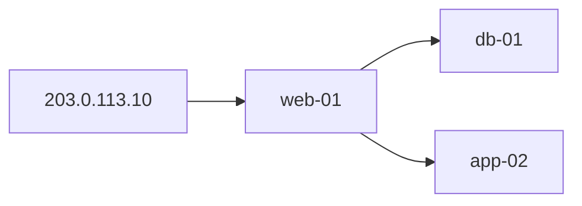

# 溯源分析

SecWeaver Skill：在数据源满足最低要求后，**跨多源日志还原攻击链**，定位初始入口、横向路径与影响范围。

**定位**：完整性分析回答「能不能查」；**风险识别**给出「**每条日志的异常点**」；本 Skill 回答「**这些异常如何跨源串成攻击链**」。

机器可读输出契约见 [`output-schema.json`](output-schema.json)。被阻断和正常完成的
分析使用同一版本化 envelope，并明确输出证据缺口。

## 上游：risk-identification

在 [风险识别](../risk-identification/SKILL.zh-CN.md) 之后使用，当：

- `risk_items[]` 含多主机 P0/P1，或横向线索（sshpass、SSH 暴力 src→dst）
- 用户需要第一个攻破点、源主机到目标主机的叙事、多轮演练解读、跨源时间线

| 风险识别输出 | 溯源分析用途 |
|---|---|
| `risk_items[]` + `evidence_refs` | 锚点事件与时间 |
| `top_incidents[]` | 优先调查队列 |
| `params.hosts` / 时间窗 | 关联范围 |
| `evidence_bundles` | 跨源 join（exec + ssh_auth + web + file_op） |

**不要**在本 Skill 重复 P0/P1 判险 — 消费上游异常点，**只做关联与叙事**。

## 前置条件（硬门禁）

启动前必须检查 `completeness_precheck`：

| 条件 | 否则 |
|---|---|
| `next_skill_blocked = false` | 输出 `insufficient_evidence`，不给出 confirmed 结论 |
| `overall_verdict` ∈ `full_traceable`, `partial_traceable` | 中止或标注极低置信度 |

用户跳过预检时：先建议运行 **数据源完整性分析** Skill，或设 `confidence_ceiling ≤ 0.7` 并标注「未做完整性预检」。

## 适用时机

- 已知外网攻击 IP，查**第一个攻破点**和**横向范围**
- **仅有受害主机 IP**（`target_ip` / `hosts`）而未知攻击源时 — **必须**自动拉取 D1（WAF + 网关 access）反查外网 IP（见下文「D1 外网攻击 IP 自动反查」）
- WEB 打穿后还原 WebShell → 下载工具 → SSH 横向链
- 告警确认已判定「真实攻击且成功」后扩展完整攻击链
- 上游完整性 Skill 推荐 `next_skill: traceability_analysis`
- **风险识别** 返回多主机/横向 P0/P1（`recommended_next_skills`）

## 适用输入

```json
{
  "investigation_intent": "报警时间A，黑客IP为A，查第一个攻破点和横向范围",
  "scenarios": ["S1", "S3"],
  "params": {
    "attacker_ip": "203.0.113.10",
    "alert_time": "2026-06-21T10:00:00+08:00",
    "time_start": "2026-06-21T08:00:00+08:00",
    "time_end": "2026-06-21T20:00:00+08:00",
    "host_ips": {"web-01": "10.0.1.5"},
    "seed_hosts": []
  },
  "completeness_precheck": {
    "overall_verdict": "full_traceable",
    "confidence": 0.88,
    "next_skill_blocked": false,
    "data_gaps": []
  },
  "evidence_bundles": {
    "waf_alert": [],
    "web_access_log": [],
    "host_exec": [],
    "host_connect": [],
    "host_file_op": [],
    "ssh_auth": [],
    "firewall_log": [],
    "dns_log": [],
    "asset_inventory": []
  }
}
```

- `evidence_bundles`：**已检索到的真实事件**，只分析已有证据，**不得虚构**
- 事件可带 `evidence_id` 作为 `evidence_refs`
- 平台可调用 `scripts/correlate.py` 生成 attack_chain 骨架，智能体 补充摘要与 hypotheses

## 研判流程

**关联合同优先**：跨源 Join 与取数编排以 dataasset 配置为单一事实来源，Skill 脚本只做阶段叙事与 heuristic 补全。

| 配置 | 路径 | 作用 |
|---|---|---|
| 场景编排 | `dataasset/scenarios/anchor-patterns.json` | scenarios → `recommended_chain`、调查窗、bundle |
| Join 合同 | `dataasset/assets/correlation-matrix.json` | join 键、时间窗、`fetch_plan` |
| **Heuristic 规则** | **[heuristic-rules.json](heuristic-rules.json)** · [运营说明](heuristic-rules.zh-CN.md) | syslog/目标机 exec 互证、横向分级、置信度（运营主改） |
| 攻击叙事 | [risk-identification/rules/chain-patterns.json](../risk-identification/rules/chain-patterns.json) | 跨阶段剧本、`matched_pattern`；复用 exec/attck 规则 |
| 执行规则 | [risk-identification/rules/exec-rules.json](../risk-identification/rules/exec-rules.json) | Web 监听器、命令 pattern（溯源与 risk 共用） |
| 运营配置指南 | [docs_user/25-traceability-analysis-ops-config-guide.zh-CN.md](../../../docs_user/25-traceability-analysis-ops-config-guide.zh-CN.md) | 运营同学编写/维护上述配置 |

按顺序执行，不要跳步：

```text
Step 0  门禁：读 completeness_precheck，blocked 则中止
Step 1  D1 反查（若仅有 target_ip/hosts 无 attacker_ip）：trace_d1_bootstrap — web_access + WAF → enriched_params.attacker_ip
Step 2  合同：resolve_trace_contract — scenarios → anchor_pattern(s)，填充 trace_default 时间窗
Step 3  关联：correlate_for_trace — 跑 recommended_chain，产出 join_edges + join_coverage + data_gaps
Step 4  阶段：build_stages_from_join_edges — matrix 驱动 initial_access / execution / lateral
Step 5  补全：heuristic（chain-patterns + BFS）仅填补 matrix 未命中环节，标注 correlation_source
Step 6  构图：attack_chain + lateral_movement_graph + timeline（每阶段含 join_ids）
Step 7  结论：overall_verdict、confidence（matrix 覆盖 ≥2 join 可微调）、data_gaps_impact、attacker_ip_resolution
Step 8  输出 JSON（correlate.py --no-markdown-report --no-notify）
Step 9  Agent 按下方 Markdown 模板撰写调查报告（默认路径；禁止手写简化版）
```

S1+S3 等多场景会 **合并** 多个 anchor pattern 的 recommended_chain（非只取最高优先级一条）。

**确定性 vs Agent 分工**

| 环节 | 执行者 | 说明 |
|---|---|---|
| 取数 / matrix join / verdict 骨架 | `correlate.py` | 可重复、可审计 |
| `attack_chain` / `timeline` / `evidence_refs` | `correlate.py` | 事实源，Agent 不得篡改 |
| **Markdown 调查报告（给人读）** | **Agent（Cursor）** | 按本 Skill 模板组织叙事 |
| 脚本 `markdown_report` | `trace_report_markdown.py` | 可选；CI / webhook fallback；**Agent 对话默认关闭** |

可选：先运行 `python3 src/skills/traceability-analysis/scripts/correlate.py ...` 获取 JSON 骨架。

## 场景（复用 S1-S8）

| ID | 溯源侧重点 |
|---|---|
| S1 | 入口主机、首次打穿、横向清单 |
| S2 | WebShell 路径、落地文件 |
| S3 | 跳板图、SSH 登录序列 |
| S5 | 从 exec 异常扩展触发源与后续外连 |
| S6/S7 | 账号失陷链、外传路径 |
| S8 | C2 回连进程、域名与网络会话路径 |

主场景 **S1/S3 公开溯源场景**：S1 + S3（外网 IP → WEB → SSH 横向）。

## D1 外网攻击 IP 自动反查（强制）

当调查参数含 **受害主机**（`target_ip`、`hosts`、`seed_hosts`）且 **未提供** `attacker_ip` / `attacker_ips` 时，`--fetch` 与 evidence-fetch **必须**在关联取数之前执行 D1 bootstrap，**不得**仅标注「缺少 WAF/web_access」而不拉数。

| 项 | 说明 |
|---|---|
| 触发条件 | `target_ip` 或 `hosts[0]` 已知 + `time_start` 已知 + 无 `attacker_ip` |
| 关闭开关 | `resolve_attacker_ip: false` |
| 默认 D1 资产 | `asset-waf-prod-01`、`asset-secweaver-gateway-access`（私有 DataAsset 根可解析旧兼容别名） |
| Phase 1 | `web_access_by_target_ip_time`（按受害 IP）+ `waf_gateway_plugin_by_time`（按时间窗；避免 upstream_addr 索引缺失） |
| Phase 2 | 对解析出的外网 IP 追加 `waf_gateway_plugin_by_ip_time` |
| 受害字段匹配 | `upstream_addr` 支持带端口（如 `192.0.2.91:80`） |
| 输出字段 | `attacker_ip_resolution`（`method`: `d1_reverse_lookup` / `params` / heuristic） |
| IP 属性 | 解析出 `attacker_ip` 后自动填充 `attacker_ip_profile`（日志地理 + VirusTotal / ipwho.is / ip-api 在线属性） |

当显式资产列表先执行 `waf_gateway_plugin_by_target_ip_time`，但索引中的
`upstream_addr` 查询失败或返回 0 条时，必须执行有界降级：优先使用网关日志已经关联出的
攻击源 IP 重试 `waf_gateway_plugin_by_ip_time`；没有攻击源 IP 时，按当前时间窗重试
`waf_gateway_plugin_by_time`，再在程序侧按照 `target_ip`、网关 host 和归一化 path 过滤候选
WAF 记录。输出必须在 `data_access.waf_target_fallback` 中记录降级原因、模式、候选数、匹配数
和实际使用的模板。两次降级都没有匹配时，表示没有关联到 WAF 证据，不表示 WAF 资产没有执行
或数据源不可用。

解析出外网攻击源 IP 后，`correlate.py` **自动**查询该 IP 的网络属性：

1. **证据地理**（优先）：从 WAF / 网关 access 等 D1 日志聚合 `country` / `province` / `city` / `geo_info`
2. **在线 enrichment**（默认开启）：读取 `dataasset/configure/ip-intel.json`；`auto` 模式下若 `virustotal.credentials_ref` 可解析则优先调用 VirusTotal IP report，VT 失败时按配置回退 ipwho.is，最后再回退 legacy ip-api.com
3. 输出 `attacker_ip_profile.attributes[]` 与 `summary` 供 Agent 写入「攻击源 IP 属性」章节

## 攻击者观测窗口默认收敛（强制）

当参数包含 `attacker_ip` / `src_ip`，且首轮 WAF / 网关 access 证据能确定该 IP 的 `first_seen` / `last_seen` 时，`--fetch` 默认把后续影响面取证窗口收敛为 `first_seen - padding` 到 `last_seen + padding`，避免把同日更早的运维或可疑事件混入主链。

| 项 | 说明 |
|---|---|
| 默认 padding | 前后各 300 秒 |
| 生效范围 | D1 首轮 evidence 裁剪、Matrix 主机取证、第二跳主机影响面取证、`--full-impact-fetch` 缺失资产补拉 |
| 输出字段 | `data_access.attacker_ip_window_narrowing`；发生裁剪时由 `evidence_filter.dropped_by_asset_type` 和 `dropped_by_asset_id` 记录 |
| 关闭开关 | `"auto_narrow_attacker_window": false` |
| 调参 | `"attacker_window_before_seconds"` / `"attacker_window_after_seconds"` |

窗口收敛后还必须做语义查询收敛：

- 同一持久化资产、同一主机、同一窗口，优先执行一次 `host_ip` 查询，不再分别执行 host/host_ip 别名查询。
- Syslog 风险日志去掉可由主机侧互补查询覆盖的外部 IP SSH 查询；保留源主机、主机全文、`__source__` 三类查询，因为 SLS 元字段与普通字段 OR 查询不等价。
- 所有被抑制的任务写入 `data_access.reused_correlation_tasks`，保证取数审计可见。

## 横向目标自动扩展取证（强制）

当入口主机 / 源主机侧证据中出现疑似横向目标时，**必须在关联分析前自动追加目标机影响面取证**，不得等到 `SSH Accepted` 后才补查。

| 触发线索 | 动作 |
|---|---|
| `host_exec` / `web_access_log` / `waf_alert` 中出现 `sshpass`、`ssh user@10.x`、`scp/sftp/rsync`、WebShell URL 中的 `user@10.x` 等内部目标 IP | 自动把目标 IP 加入第二跳取证 |
| 源主机为 `192.0.2.91`，命令或 URL 中出现 `devops@192.0.2.92` | 立即追加 `192.0.2.92` 的 `host_exec` / `host_connect` / `host_file_op` / `host_persistence` |
| 后续发现 `SSH Accepted` | 用于确认 / 升级横向结论，不作为目标机取证前置条件 |

若同轮候选 IP 存在严格前缀歧义（例如截断命令产生 `192.0.2.9`，同时完整请求出现 `192.0.2.92`），优先保留更完整地址；若短地址后续有独立 SSH Accepted，仍可重新加入。

输出元数据记录在 `data_access.second_hop_impact_fetch`，其中 `source=exec_or_web_lateral_hint` 表示由源机蛛丝马迹触发，`source=accepted_ssh_lateral` 表示由成功登录日志触发。

使用 `--asset-id` 的 `asset_list` 模式也必须执行同一流程：先对当前源主机执行限定时间窗的 `ssh_auth_by_src_ip_time`，发现 `src_ip=源主机` 的成功登录及其受害主机；随后对每个目标执行 `ssh_auth_by_host_ip_time`，并补拉目标主机的 `host_exec`、`host_connect`、`host_file_op` 等资产。`syslog_risk_alert` 通过 `covers_asset_types=["ssh_auth"]` 提供认证证据时，必须使用 SSH auth 模板，不能只使用 `syslog_risk_by_host_ip_time`。

这样可以避免初始查询只返回入口主机数据时，把目标主机已经存在的 `event_type=ssh_login_success` 错误报告为“缺少 SSH Accepted”。`data_access.second_hop_impact_fetch` 会记录发现查询、目标查询和目标主机列表。

| 关闭方式 | 作用 |
|---|---|
| `--no-ip-intel` | 跳过整个 `attacker_ip_profile` |
| `"ip_intel_online": false` in params | 仅保留日志地理，不调用在线 API |
| `"resolve_attacker_ip_profile": false` | 同 `--no-ip-intel` |

| 配置项 / 临时参数 | 作用 |
|---|---|
| `dataasset/configure/ip-intel.json` | 主配置文件；配置 `default_provider`、provider URL、timeout、fallback 与 `credentials_ref` |
| `providers.virustotal.credentials_ref` | 默认 `vault://threat-intel/virustotal`，真实 token 存 SOPS Vault |
| `"ip_intel_provider": "auto"` | 临时覆盖；有 VT 凭据优先 VirusTotal，失败后按配置回退 ipwho.is 与 legacy ip-api.com |
| `"ip_intel_provider": "virustotal"` | 临时强制 VirusTotal；未配置凭据时输出 `config_missing`，不回退 |
| `"ip_intel_provider": "ipwhois"` | 临时强制 ipwho.is 免 Key 查询 |
| `"ip_intel_provider": "ip-api"` | 临时强制旧 ip-api.com 查询 |
| `"virustotal_api_key"` / `"vt_api_key"` | 仅临时调试；正式环境禁止把 Key 放 params / 命令行 / 结果文件 |

报告时需引用 `attacker_ip_profile.online_lookup.provider` 与 `attributes[]`；若 provider 为 `virustotal`，优先展示 VT 检测统计、reputation、ASN/组织与 network。

### 攻击源 IP 归一化

WAF、网关和其他 D1 数据源的攻击源字段在进入证据索引时统一经过共享 `normalize_ip()`：

- 清理首尾空格、CSV 导出残留的单/双引号；
- 将 IPv4 `ip:port` 归一化为纯 IP；
- `-`、`null`、`none`、`unknown` 和非法值不作为攻击源 Join 键；
- `initial_access.attacker_ip`、WAF/网关 `waf_to_web_access_by_ip` Join、攻击源首末日志时间和 IP 情报必须使用同一规范值。

原始事件仍保留在证据存档中；只有规范字段和关联键使用清洗后的 IP，避免同一攻击源因导出格式差异被拆成多个实体。

配置真实 VT Key：

```bash
# 从仓库根目录执行；使用隔离资产库时替换 DATAASSET_ROOT。
DATAASSET_ROOT=dataasset src/dataasset/credentials/sops-vault.sh edit vault://threat-intel/virustotal
```

实现：`src/skills/_shared/data-access/trace_d1_bootstrap.py`，由 `fetch_scenario_evidence()` 与 asset-list 取数路径调用；`enriched_params.attacker_ip` 会写回 `params` 供 matrix join 使用。

**仅 exec/syslog 资产列表时也会自动追加 D1 资产**（asset-list 模式）。

```bash
# 指定资产 + 受害主机 — 自动 D1 反查外网 IP（无需 --from-bundle）
python3 src/skills/traceability-analysis/scripts/correlate.py \
  --asset-id asset-secweaver-host-exec \
  --asset-id asset-secweaver-sys-risk-alert \
  --fetch --no-notify \
  --params '{"target_ip":"192.0.2.91","hosts":["192.0.2.91"],"time_start":"2026-07-06T07:25:00+08:00","time_end":"2026-07-06T07:27:34+08:00"}'

# 仅指定受害主机与时间窗 — bundle 模式同样自动 D1
python3 src/skills/traceability-analysis/scripts/correlate.py \
  --from-bundle --bundle bundle-alert-confirm-min \
  --fetch --no-notify \
  --params '{"target_ip":"192.0.2.91","hosts":["192.0.2.91"],"time_start":"2026-07-05T21:30:00+08:00","time_end":"2026-07-05T21:40:34+08:00"}'
```

## overall_verdict

| verdict | 含义 |
|---|---|
| `confirmed_intrusion_chain` | 入口 + 执行 + 横向均有 direct evidence |
| `likely_intrusion_chain` | 高度疑似，部分环节间接 |
| `initial_access_only` | 有打穿证据，无 SSH Accepted |
| `scanning_or_attempt_only` | 仅 WAF/扫描，无 host_exec |
| `insufficient_evidence` | 预检 blocked 或证据不足 |

### 硬约束

- 无 `host_exec` → 不得 `confirmed_intrusion_chain`
- 无 SSH Accepted → 横向最多 `likely`，措辞不得「已确认横向到 N 台」而无「至少」
- SSH coverage partial → `impacted_assets` 必须含 `note: 可能遗漏`
- 每条 `attack_chain` 必须有 `evidence_refs`

## 输出 JSON

```json
{
  "alert_type": "traceability_analysis",
  "scenario": ["S1", "S3"],
  "overall_verdict": "confirmed_intrusion_chain",
  "confidence": 0.86,
  "confidence_ceiling": 0.88,
  "summary": "中文执行摘要",
  "attacker_ip_resolution": {
    "resolved": true,
    "attacker_ip": "39.144.124.99",
    "attacker_ips": ["39.144.124.99"],
    "target_ip": "192.0.2.91",
    "method": "d1_reverse_lookup",
    "d1_assets": ["asset-waf-prod-01", "asset-secweaver-gateway-access"],
    "web_access_event_count": 47,
    "waf_event_count": 1
  },
  "attacker_ip_profile": {
    "ip": "115.193.81.185",
    "scope": "public",
    "evidence_geo": {
      "event_count": 47,
      "country": "中国",
      "province": "浙江省",
      "city": "杭州市",
      "geo_info": "30.287464,120.153577",
      "evidence_refs": ["waf-alert-xxx", "web-access-log-xxx"],
      "source_bundles": ["waf_alert", "web_access_log"]
    },
    "online_lookup": {
      "status": "success",
      "isp": "China Mobile communications corporation",
      "asn": "AS9808",
      "mobile": true,
      "proxy": false,
      "hosting": false
    },
    "attributes": ["公网地址", "日志地理: 中国 / 浙江省 / 杭州市", "移动网络", "ISP: ...", "ASN: AS9808"],
    "summary": "公网地址；日志地理: 中国 / 浙江省 / 杭州市；移动网络；..."
  },
  "correlation_anchor_pattern": "S1_external_ip_trace",
  "correlation_anchor_patterns": ["S1_external_ip_trace", "S3_lateral_movement"],
  "correlation_recommended_chain": ["waf_to_web_access_by_ip", "web_access_to_host_exec"],
  "join_edges": [],
  "join_coverage": {"matched_join_count": 2, "recommended_join_count": 5, "coverage_ratio": 0.4, "per_join": {}},
  "correlation_contract": {"matrix_version": "1.1", "anchor_patterns_path": "..."},
  "initial_access": {},
  "attack_chain": [],
  "lateral_movement_graph": {"nodes": [], "edges": []},
  "impacted_assets": [],
  "lateral_findings": {"confirmed": [], "suspected": [], "unknown": []},
  "timeline": [],
  "timeline_source_types": ["waf_alert", "web_access_log", "host_exec"],
  "hypotheses": [],
  "data_gaps_impact": [],
  "recommended_actions": [],
  "matched_pattern": "web_shell_to_ssh_lateral",
  "mitre_attack": {
    "techniques": [{"id": "T1190", "name": "Exploit Public-Facing Application", "tactic": "initial_access", "tactic_id": "TA0001"}],
    "tactics": [{"id": "TA0001", "name": "initial_access"}],
    "technique_ids": ["T1190", "T1505.003", "T1021.004"],
    "tactic_ids": ["TA0001", "TA0003", "TA0008"]
  },
  "mitre_attack_by_stage": [],
  "top_mitre_techniques": "T1190 (Exploit Public-Facing Application); T1505.003 (Web Shell); +2",
  "evidence_index": {}
}
```

`mitre_attack` 由 `correlate.py` 自动填充，映射源为 [risk-identification/rules/attck-map.json](../risk-identification/rules/attck-map.json)（与风险识别共用）：攻击链阶段 `mitre_id` + 证据关键词（shadow、webshell、sshpass 等）→ `matched_rules` / `policy_rules`。

`attack_chain[]` 每阶段应含 `join_ids`（来自 correlation-matrix）与 `correlation_source`（`matrix` | `heuristic_fallback` | `matrix+heuristic`）。`timeline[]` 须同步携带 `mitre_id`（与 attack_chain 一致）与 `raw_behavior`（原始 URL / 原始命令 / 原始连接或日志行为）。

**报告模式**

| `report_mode` | 触发 | 说明 |
|---|---|---|
| `agent`（默认，对话场景） | `--no-markdown-report` | 仅 JSON；Agent 按模板写报告 |
| `script` | 默认 CLI（无 `--no-markdown-report`） | 附带 `markdown_report`（CI / webhook） |

Agent 跑 correlate 时 **推荐默认保留完整性预检**（不要加 `--skip-completeness`）：

```bash
python3 src/skills/traceability-analysis/scripts/correlate.py \
  --asset-id asset-secweaver-host-exec \
  --asset-id asset-secweaver-sys-risk-alert \
  --fetch --no-notify --no-markdown-report \
  --params '{"target_ip":"192.0.2.91","hosts":["192.0.2.91"],"time_start":"2026-07-06T07:25:00+08:00","time_end":"2026-07-06T07:27:34+08:00"}' \
  -o /tmp/trace.json
```

## Markdown 调查报告（Agent 必出）

运行 `correlate.py` 后，**Agent 必须**读取 JSON（`overall_verdict`、`attack_chain`、`timeline`、`impacted_assets`、`hypotheses`、`data_gaps_impact` 等）并按下列模板输出。**不得**跳过 correlate 直接臆断；**不得**输出与 JSON 无关的简化表格。

**Agent 撰写规则**

1. **事实源**：仅使用 JSON 中已有字段与 `evidence_refs`；不得虚构事件
2. **结论封顶**：`overall_verdict` 与 `confidence` 不得高于 JSON 的 `overall_verdict` / `confidence_ceiling`
3. **横向措辞**：遵守本文「横向移动措辞」；无 SSH Accepted 时不得写「已确认横向到 N 台」
4. **攻击时间线**：必须包含 WEB 层攻击行为（WAF / 网关 access 中命中的 URL 请求，`stage=web_attack`）；合并低价值重复 exec（如 ping/date 内存马心跳）；保留 **8–15 条**高信号阶段；每行须有 `evidence_refs`（可合并同类阶段 refs，但不得编造 ID）
5. **原始行为不进表格**：`timeline[].raw_behavior` 仍保留在 JSON 中供证据复核，但人读报告的攻击时间线**不要展示「原始行为」列**；长 URL / 详细命令应归纳到「描述」列，只保留关键 path、命令类别或目标地址，避免 Markdown 表格排版被撑坏。
6. **宽表展示**：攻击时间线必须使用 Markdown pipe table（GFM 表格）输出，保留表格结构；宽度主要来自数据源列，可横向滚动查看。**禁止输出 HTML `<div>` / `<table>`**，当前界面会把 HTML 原样显示；**不要使用 fenced `text` 代码块**，代码块可滚但不是表结构。
7. **数据源列**：按 `timeline[].source_coverage` 或 `timeline_source_types` 填 ✓/✗
8. **忽略** JSON 中的 `markdown_report`（当 `report_mode=agent` 或使用了 `--no-markdown-report`）
9. **攻击源 IP 属性**：若存在 `attacker_ip_profile`，须输出「### 攻击源 IP 属性」节，引用 `attributes` / `summary` / `evidence_geo.evidence_refs`，不得臆造 ISP/ASN
10. **攻击路径图必出**：须输出「### 攻击路径图」Mermaid；即使未发现横向，也要展示 `attacker_ip → initial_access.host/target_ip`。若已通过 WAF / 网关 access 或完整 URL 识别出网关地址，入口路径必须展示为 `attacker_ip → WAF网关(域名:端口/IP) → initial_access.host/target_ip`，并在攻击源到 WAF 网关的边上标注第一个 WEB 攻击包（方法 + path/query 摘要）。横向章节只表达横向移动，不能用入口图代替。每个主机节点若存在 `host_high_risk_summary`、`lateral_findings[].high_risk_summary` 或 `timeline[].raw_behavior` 中可归因到该主机的恶意/高危命令，必须在节点标签中显示摘要，例如 `192.0.2.92<br/>高危: 窃取凭据文件; sudo/提权; 侦察扫描`。
11. **入口 URL 完整性**：`initial_access.url` 应优先使用带 scheme/host 的完整 URL；若原始 access/WAF 事件只有 path，但有 `http_host` / Host header，须拼成 `scheme://host/path`。
12. **资产取数统计必出**：使用 `fetch_summary.asset_fetch_stats[]` 输出每个数据资产的请求次数、真实查询次数、缓存命中、成功/失败次数、累计拉取量、最终保留量、`deduplicated_count` 和 `window_filtered_count`。累计拉取量只累加真实成功查询返回的数据，不得把缓存复用再次计入，也不得用去重后的 `by_asset_type` 数量代替；失败查询必须显示。`duplicate_or_filtered_count` 仅为兼容字段，不得替代两个拆分列。
13. **入口证据分组**：`initial_access.primary_evidence_refs` 只放决定性入口事件；关联扩展证据放入 `supporting_evidence_refs`。`evidence_refs` 继续作为两者并集兼容旧消费者。
14. **横向双时间**：exec 推断的 SSH 尝试被 Accepted 证据升级后，必须同时保留 `attempt_timestamp` 和 `confirmed_timestamp`，不得把尝试时间写成登录成功时间。
15. **远程执行目标**：SSH/sshpass execution 阶段必须输出 `execution_target_host`（多目标时同时输出 `execution_target_hosts`）；`host` 继续表示命令发起主机。
16. **第一个攻破点语义**：外部 WEB 攻击应优先选择成功的利用触发点（`web_exploit:rce` / `web_exploit:sqli`），不能把对既有 WebShell 的访问直接当作原始攻破入口；后者单独记录为 `first_observed_control_url`。只有 WebShell 控制证据时，须输出 `first_compromise_point_status=unresolved`。

脚本 fallback（`trace_report_markdown.py`）仅在没有 Agent 时使用；时间线会去重/截断，叙事质量以 Agent 版为准。

```markdown
## 溯源分析报告

**场景**：{S1 + S3 等}
**结论**：{verdict 中文}（置信度 {confidence}，上限 {confidence_ceiling}）

### 攻击叙事
{4-8 句话}

### 初始入口（第一个攻破点）
- 主机 / 时间 / URL / vector / 证据 ID

### 攻击源 IP 属性
- IP / 公网或内网 / 日志地理 / ISP / ASN / 移动·代理·托管标签 / 证据 ID

### 攻击路径图
```mermaid
graph LR
  attacker["{attacker_ip 或 未知来源}"] -->|首包 {method path?query}| waf["WAF网关<br/>{gateway_host:port 或 gateway_ip}"]
  waf -->|命中 {initial path?query}| initial["{initial_access.host 或 target_ip}<br/>高危: {初始主机高危命令摘要，可选}"]
  initial --> lateral["{lateral host}<br/>高危: {横向目标恶意命令摘要，如窃取凭据文件; sudo/提权}"]
```

### 攻击时间线
> 攻击时间线为 Markdown 表格宽表；详细 URL/命令保留在 JSON 的 `timeline[].raw_behavior`，可按证据 ID 复核。

| 时间 | 阶段 | 主机 | 描述 | ATT&CK | 证据 | {各数据源列：✅/❌} |
|---|---|---|---|---|---|---|---|
| {timestamp} | {stage} | {host} | {description} | {mitre_id} | {evidence_refs} | {source_coverage} |

数据源列对应当次取数的各 `asset_type`（如 WAF、网关Access、主机Exec）。**✅** 表示该阶段至少有一条证据来自该数据源；**❌** 表示在该数据源中不可见。

### 证据取数

| 数据资产 | asset_type | 请求 / 实查 / 缓存 | 成功 / 失败 | 累计拉取（含重复） | 最终保留 | 去重 | 窗口过滤 |
|---|---|---:|---:|---:|---:|---:|---:|
| {asset_id} | {asset_type} | {request_count} / {query_count} / {cache_hit_count} | {successful_query_count} / {failed_query_count} | {cumulative_fetched_events} | {final_event_count} | {deduplicated_count} | {window_filtered_count} |

表格必须覆盖所有实际查询的数据资产。`累计拉取` 用于判断查询量和重复拉取是否合理；`最终保留` 是去重及攻击者窗口裁剪后进入分析的事件量。`去重` 与 `窗口过滤` 必须分列，便于区分重复取数和范围收敛。

### MITRE ATT&CK
- **技术**：{top_mitre_techniques 或 mitre_attack.technique_ids 展开}
- **战术**：{mitre_attack.tactic_ids}
- **按阶段**：{mitre_attack_by_stage 表格，可选}

### 横向移动
{若存在横向边，输出横向 mermaid graph LR 或列表，区分 confirmed / suspected；若无横向，明确写未发现横向移动}

### 影响范围
| 主机 | 角色 | 优先级 | 备注 |

### 处置建议
1. ...

### 数据缺口影响
{若 partial_traceable}

### 未解答问题 / 假设
{hypotheses}
```

### mermaid 横向图示例


图上显示每台主机执行了哪些高危命令，概要就好。

## 横向移动措辞

| lateral_class | 写法 |
|---|---|
| confirmed_lateral | 横向至 {host} |
| suspected_lateral | 疑似尝试横向至 {host} |
| SSH partial | **至少**横向至 {hosts}，可能遗漏 |

## 与上下游 Skill

| 上游 | 下游 |
|---|---|
| data-source-completeness（未 blocked） | 本 Skill |
| **risk-identification**（异常点 + evidence_refs） | 本 Skill |
| alert_confirmation（真实+成功） | 本 Skill（扩展链） |
| external-listener-cmd-risk | 线索 → 填入 evidence_bundles |

本 Skill **不做** WAF 误报研判（交给告警确认）。

## 禁止事项

1. 无 `evidence_refs` 不得写入 attack_chain
2. 不得虚构 evidence_bundles 中不存在的事件
3. `next_skill_blocked=true` 时不得输出 confirmed 结论
4. 不得替代告警确认做误报/真实判定
5. 时间线须按 timestamp 单调排序
6. Agent 报告不得抬高 verdict 或 confidence（高于 JSON / ceiling）
7. Agent 时间线每行须有可追溯的 `evidence_refs`；禁止无 ref 的「总结行」
8. 使用 `--no-markdown-report` 时，禁止向用户复述或复制脚本版 `markdown_report` 字段

## 与 dataasset / SOPS Vault

`evidence_bundles` 由平台经 SOPS Vault 拉取，Skill 只消费归一化事件。

```bash
# Agent 对话（推荐）：先跑完整性预检，再生成 JSON 骨架 + Agent 写报告
python3 src/skills/traceability-analysis/scripts/correlate.py \
  --asset-id asset-secweaver-host-exec \
  --asset-id asset-secweaver-sys-risk-alert \
  --fetch --no-notify --no-markdown-report \
  --params '{"target_ip":"192.0.2.91","hosts":["192.0.2.91"],"time_start":"2026-07-06T07:25:00+08:00","time_end":"2026-07-06T07:27:34+08:00"}' \
  -o /tmp/trace.json

# 仅调试 / 上游已显式提供 completeness_precheck 时，才允许追加 --skip-completeness

# CI / webhook fallback：附带脚本 markdown_report
python3 src/skills/traceability-analysis/scripts/correlate.py \
  --from-bundle --bundle bundle-incident-trace-default \
  --params '{"attacker_ip":"203.0.113.10","alert_time":"2026-06-21T10:00:00+08:00","host_ips":{"web-01":"10.0.1.5"}}' \
  --fetch

# 覆盖 anchor pattern（默认由 scenarios 解析，S1+S3 合并多条 recommended_chain）
python3 src/skills/traceability-analysis/scripts/correlate.py \
  --from-bundle --anchor-pattern S1_external_ip_trace --dry-run --fetch
```

- 默认资产包：`bundle-incident-trace-default`，源码仓和 Community 均包含。这是数据源配置，不是离线攻击日志；使用 `--fetch` 前先配置 Connector，无外部数据源时使用 `examples/traceability/` 离线分析。
- 取数主路径：`correlation_fetch_plan`（`anchor-patterns.recommended_chain` × `correlation-matrix.fetch_plan`）
- 关联引擎：[`scripts/correlation_trace.py`](scripts/correlation_trace.py)
- **禁止**在 Skill 输入或输出中包含 `access_key_secret` / 私钥

## Webhook 通知（钉钉 / 飞书 / 企业微信）

`correlate.py` 跑完后，可将报告摘要推送到 IM 群机器人。

### 配置

```bash
cp src/skills/traceability-analysis/webhook-config.example.json \
   src/skills/traceability-analysis/webhook-config.json
# 填写 webhook_url / secret，并将对应 channel 的 enabled 设为 true
```

`webhook-config.json` 已加入 `.gitignore`，请勿提交真实 webhook 地址。

### CLI

```bash
# webhook-config.json 存在且 enabled=true 时自动通知
python3 src/skills/traceability-analysis/scripts/correlate.py \
  -i examples/traceability/s1-web-shell-to-ssh-lateral.json \
  -o /tmp/trace.json

# 强制通知
python3 src/skills/traceability-analysis/scripts/correlate.py \
  -i input.json --notify -o /tmp/trace.json

# 自定义配置 / 仅构建不发送
python3 src/skills/traceability-analysis/scripts/correlate.py \
  -i input.json --notify --webhook-config /path/to/webhook.json --notify-dry-run

# 跳过通知
python3 src/skills/traceability-analysis/scripts/correlate.py \
  -i input.json --no-notify
```

### 配置项

| 字段 | 含义 |
|---|---|
| `enabled` | 总开关 |
| `title_prefix` | 消息标题前缀 |
| `min_confidence` | 低于该置信度不通知 |
| `notify_on` | 按 verdict 过滤（如 `confirmed_intrusion_chain`） |
| `channels[]` | 每通道：`type`（`dingtalk`/`feishu`/`wecom`）、`webhook_url`、可选 `secret`（钉钉/飞书加签）、`enabled` |

### 输入 JSON 内联覆盖

```json
{
  "notification": {
    "enabled": true,
    "channels": [
      {"type": "dingtalk", "enabled": true, "webhook_url": "https://oapi.dingtalk.com/robot/send?access_token=...", "secret": "SEC..."}
    ]
  }
}
```

输出 JSON 含 `notification` 字段，记录各通道投递结果。

## 附加资源

- 设计文档：[docs_dev/15-traceability-analysis-skill-design.md](../../../docs_dev/15-traceability-analysis-skill-design.md)
- 历史架构评估：[docs_dev/history/16-traceability-analysis-architecture-evaluation.zh-CN.md](../../../docs_dev/history/16-traceability-analysis-architecture-evaluation.zh-CN.md)
- 平台文档：[docs_user/18-traceability-analysis.md](../../../docs_user/18-traceability-analysis.md)
- 规则：[rules.md](rules.md)
- 攻击叙事：[risk-identification/rules/chain-patterns.json](../risk-identification/rules/chain-patterns.json)
- 关联脚本：[scripts/correlate.py](scripts/correlate.py) | [scripts/correlation_trace.py](scripts/correlation_trace.py)
- 场景编排：[anchor-patterns.json](../../../dataasset/scenarios/anchor-patterns.json)
- 数据访问层：[../_shared/data-access/fetch.py](../_shared/data-access/fetch.py) | [correlation_engine.py](../_shared/data-access/correlation_engine.py)
- 跨源关联：[docs_user/21-cross-source-field-correlation.md](../../../docs_user/21-cross-source-field-correlation.md) | [correlation-matrix.json](../../../dataasset/assets/correlation-matrix.json)
- 样例：[examples.md](examples.md) | 测试数据：[examples/](../../../examples/)
